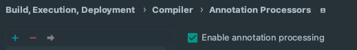
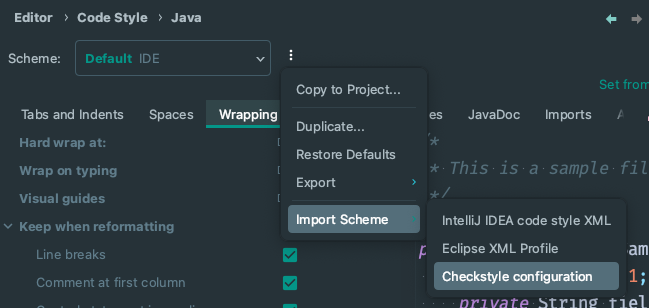

# Besu Plugins relating to tracer and sequencer functionality

A Linea tracing implementation for [Hyperledger Besu](https://github.com/hyperledger/besu) based on
an [existing implementation in Go](https://github.com/Consensys/zk-evm/).

## Quickstart - Running Besu with Linea Plugins

- compile linea-plugins `gradlew installDist`
- copy jar file to besu runtime plugins/ directory (where you will run besu from, not where you're building besu)
- add `ROLLUP` to besu config to enable the plugin RPC methods
  - rpc-http-api=\["ADMIN","ETH","NET","WEB3","ROLLUP"\]
- start besu (command line or from IDE) and you should see plugins registered at startup
- call the RPC endpoint eg

```shell
  curl --location --request POST 'http://localhost:8545' --data-raw '{
    "jsonrpc": "2.0",
    "method": "rollup_generateConflatedTracesToFileV0",
    "params": [0, 0, "6.16.0"],
    "id": 1
  }'
```

## Development Setup

### Install Java 17

```
brew install openjdk@17
```

### Install Rust

```
curl --proto '=https' --tlsv1.2 -sSf https://sh.rustup.rs | sh

# Use local git executable to fetch from repos (needed for private repos)
echo "net.git-fetch-with-cli=true" >> .cargo/config.toml
```

### Install Corset

```shell
cargo install --git ssh://git@github.com/Consensys/corset
```

### Update Constraints [Submodule](https://github.com/Consensys/zkevm-constraints/)

```shell
git submodule update --init --recursive
```

### Install [pre-commit](https://pre-commit.com/)

```shell
pip install --user pre-commit

# For macOS users.
brew install pre-commit
```

Then run `pre-commit install` to set up git hook scripts.
Used hooks can be found [here](.pre-commit-config.yaml).

______________________________________________________________________

NOTE

> `pre-commit` aids in running checks (end of file fixing,
> markdown linting, linting, runs tests, json validation, etc.)
> before you perform your git commits.

______________________________________________________________________

### Run tests

```shell
# Run all tests
./gradlew clean test

# Run only unit tests
./gradlew clean unitTests

# Run only acceptance tests
./gradlew clean acceptanceTests

# Run EVM test suite BlockchainTests
./gradlew clean referenceBlockchainTests

# Run EVM test suite GeneralStateTests
./gradlew clean referenceGeneralStateTests

# Run all EVM test suite reference tests
./gradlew clean referenceTests

# Run single reference test via gradle, e.g for net.consensys.linea.generated.blockchain.BlockchainReferenceTest_583
./gradlew :reference-tests:referenceTests --tests "net.consensys.linea.generated.blockchain.BlockchainReferenceTest_583"
```

______________________________________________________________________

NOTE

> Please be aware if the reference test code generation tasks `blockchainReferenceTests` and
> `generalStateReferenceTests` do not generate any java code, than probably you are missing the Ethereum tests
> submodule which you can clone via `git submodule update --init --recursive`.

______________________________________________________________________

## IntelliJ IDEA Setup

### Enable Annotation Processing

- Go to `Settings | Build, Execution, Deployment | Compiler | Annotation Processors` and tick the following
  checkbox:

  

______________________________________________________________________

NOTE

> This setting is required to avoid IDE compilation errors because of the [Lombok](https://projectlombok.org/features/)
> library used for code generation of boilerplate Java code such as:
>
> - Getters/Setters (via [`@Getter/@Setter`](https://projectlombok.org/features/GetterSetter))
> - Class log instances (via [`@Slf4j`](https://projectlombok.org/features/log))
> - Builder classes (via [`@Builder`](https://projectlombok.org/features/Builder))
> - Constructors (
>   via [`@NoArgsConstructor/@RequiredArgsConstructor/@AllArgsConstructor`](https://projectlombok.org/features/constructor))
> - etc.
>
> Learn more about how Java annotation processing
> works [here](https://www.baeldung.com/java-annotation-processing-builder).

______________________________________________________________________

### Set Up IDE Code Re-formatting

- Install [Checkstyle](https://plugins.jetbrains.com/plugin/1065-checkstyle-idea) plugin and set IDE code
  reformatting to comply with the project's Checkstyle configuration:

  - Go to `Settings | Editor | Code Style | Java | <hamburger menu> | Import Scheme | Checkstyle configuration`:

    

    and select `<project_root>/config/checkstyle.xml`.

### Install Optional Plugins

- Install [Spotless Gradle](https://plugins.jetbrains.com/plugin/18321-spotless-gradle) plugin to re-format through
  the IDE according to spotless configuration.

## Debugging Traces

- JSON files can be debugged with the following command:

```shell
corset check -T <JSON_FILE> -v zkevm-constraints/zkevm.bin
```
