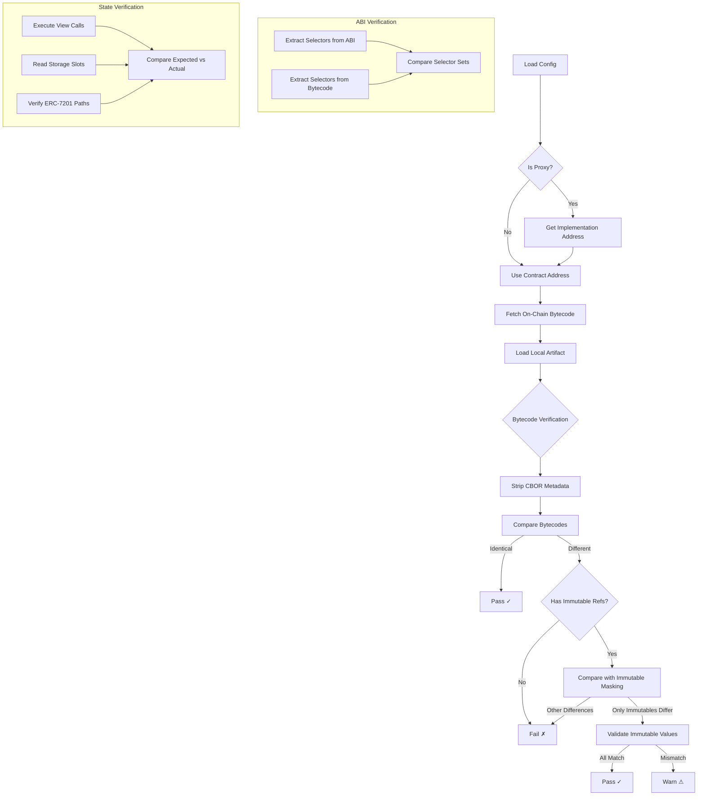

# Contract Integrity Verifier - Architecture Guide

This document provides a detailed technical overview of the Contract Integrity Verifier architecture, including immutable references, artifact enrichment, schema generation, and dynamic configuration.

## Table of Contents

1. [System Overview](#system-overview)
2. [Package Architecture](#package-architecture)
3. [Verification Flow](#verification-flow)
4. [Bytecode Verification](#bytecode-verification)
5. [Immutable References](#immutable-references)
6. [Artifact Enrichment](#artifact-enrichment)
7. [Storage Verification](#storage-verification)
8. [Schema Generation](#schema-generation)
9. [Dynamic Configuration](#dynamic-configuration)
10. [Browser Mode (verifier-ui)](#browser-mode-verifier-ui)

---

## System Overview

```
┌──────────────────────────────────────────────────────────────────────────────┐
│                        Contract Integrity Verifier                           │
├──────────────────────────────────────────────────────────────────────────────┤
│                                                                              │
│  ┌─────────────────────────────────────────────────────────────────────────┐ │
│  │                           verifier-core                                 │ │
│  │  ┌──────────┐  ┌──────────┐  ┌──────────┐  ┌───────────────────────┐    │ │
│  │  │ Verifier │  │ Bytecode │  │ Storage  │  │ Schema Generator      │    │ │
│  │  │  Class   │  │  Utils   │  │  Utils   │  │ (ERC-7201)            │    │ │
│  │  └────┬─────┘  └────┬─────┘  └────┬─────┘  └───────────────────────┘    │ │
│  │       │              │             │                                    │ │
│  │       └──────────────┼─────────────┘                                    │ │
│  │                      │                                                  │ │
│  │           ┌──────────┴──────────┐                                       │ │
│  │           │   Web3Adapter       │ (interface)                           │ │
│  │           └──────────┬──────────┘                                       │ │
│  └──────────────────────┼──────────────────────────────────────────────────┘ │
│                         │                                                    │
│       ┌─────────────────┼─────────────────┐                                  │
│       │                 │                 │                                  │
│       ▼                 ▼                 ▼                                  │
│  ┌─────────────┐  ┌─────────────┐  ┌─────────────┐                           │
│  │ verifier-   │  │ verifier-   │  │ verifier-ui │                           │
│  │ ethers      │  │ viem        │  │ (browser)   │                           │
│  │             │  │             │  │             │                           │
│  │ EthersAdapter│ │ ViemAdapter │  │ ViemAdapter │                           │
│  │ + CLI       │  │ + CLI       │  │ + IndexedDB │                           │
│  └──────┬──────┘  └──────┬──────┘  └──────┬──────┘                           │
│         │                │                │                                  │
│         └────────────────┼────────────────┘                                  │
│                          │                                                   │
│                          ▼                                                   │
│                   ┌─────────────┐                                            │
│                   │ RPC Node   │                                             │
│                   │ (Ethereum) │                                             │
│                   └─────────────┘                                            │
└──────────────────────────────────────────────────────────────────────────────┘
```

## Package Architecture

```
contract-integrity-verifier/
│
├── verifier-core/                 # Pure TypeScript (no web3 deps)
│   ├── src/
│   │   ├── index.ts               # Main exports (Node.js)
│   │   ├── browser.ts             # Browser-safe exports (no fs)
│   │   ├── adapter.ts             # Web3Adapter interface
│   │   ├── verifier.ts            # Main Verifier class
│   │   ├── types.ts               # All TypeScript types
│   │   ├── utils/
│   │   │   ├── abi.ts             # ABI parsing, selector extraction
│   │   │   ├── bytecode.ts        # Bytecode comparison, immutables
│   │   │   ├── storage.ts         # ERC-7201, slot calculation
│   │   │   └── comparison.ts      # Value comparison utilities
│   │   └── tools/
│   │       └── generate-schema.ts # Storage schema generator
│   └── tools/                     # Standalone CLI tools
│       ├── enrich-hardhat-artifact.ts
│       ├── convert-artifact.ts
│       └── generate-viewcalls.ts
│
├── verifier-ethers/               # Ethers v6 adapter
│   └── src/
│       ├── index.ts               # EthersAdapter implementation
│       └── cli.ts                 # CLI entry point
│
├── verifier-viem/                 # Viem adapter
│   └── src/
│       ├── index.ts               # ViemAdapter implementation
│       └── cli.ts                 # CLI entry point
│
└── verifier-ui/                   # Web interface
    └── src/
        ├── services/              # Service abstraction
        │   └── client-verifier-service.ts
        └── lib/
            └── indexed-db.ts      # Browser storage
```

## Verification Flow



## Bytecode Verification

### Comparison Process  

```
┌─────────────────────────────────────────────────────────────────────────────┐
│                         Bytecode Comparison Flow                            │
├─────────────────────────────────────────────────────────────────────────────┤
│                                                                             │
│   Local Artifact                           Remote (On-Chain)                │
│   ┌─────────────────────┐                 ┌─────────────────────┐           │
│   │ 0x608060405234...   │                 │ 0x608060405234...   │           │
│   │ ...                 │                 │ ...                 │           │
│   │ a26469706673582212  │ ← CBOR marker   │ a26469706673582212  │           │
│   │ 20xxxxxxxxxxxx...   │ ← IPFS hash     │ 20yyyyyyyyyyyy...   │           │
│   └─────────────────────┘                 └─────────────────────┘           │
│            │                                        │                       │
│            ▼                                        ▼                       │
│   ┌─────────────────────┐                 ┌─────────────────────┐           │
│   │ Strip CBOR Metadata │                 │ Strip CBOR Metadata │           │
│   └─────────────────────┘                 └─────────────────────┘           │
│            │                                        │                       │
│            └──────────────┬─────────────────────────┘                       │
│                           ▼                                                 │
│               ┌─────────────────────────┐                                   │
│               │   Byte-by-byte Compare  │                                   │
│               └─────────────────────────┘                                   │
│                           │                                                 │
│            ┌──────────────┴──────────────┐                                  │
│            ▼                             ▼                                  │
│     ┌────────────┐               ┌────────────────┐                         │
│     │ All Match  │               │ Differences    │                         │
│     │   ✓ Pass   │               │   Found        │                         │
│     └────────────┘               └───────┬────────┘                         │
│                                          │                                  │
│                                          ▼                                  │
│                               ┌────────────────────┐                        │
│                               │ Check if at Known  │                        │
│                               │ Immutable Positions│                        │
│                               └────────────────────┘                        │
│                                          │                                  │
│                           ┌──────────────┴──────────────┐                   │
│                           ▼                             ▼                   │
│                    ┌────────────┐               ┌────────────────┐          │
│                    │ Yes - Only │               │ No - Unknown   │          │
│                    │ Immutables │               │ Differences    │          │
│                    │  ✓ Pass    │               │   ✗ Fail       │          │
│                    └────────────┘               └────────────────┘          │
│                                                                             │
└─────────────────────────────────────────────────────────────────────────────┘
```

### CBOR Metadata

Solidity appends CBOR-encoded metadata to compiled bytecode:

```
Bytecode structure:
┌──────────────────────────────────────────────────────────────┐
│                    Runtime Bytecode                          │
├──────────────────────────────────────────────────────────────┤
│ a2                    │ CBOR map with 2 items                │
│ 6469706673            │ "ipfs" key                           │
│ 5822                  │ bytes (34 bytes follow)              │
│ 1220<32-byte-hash>    │ IPFS CIDv0 hash                      │
│ 6473                  │ "solc" key                           │
│ 6f6c63                │ continued...                         │
│ 43                    │ bytes (3 bytes follow)               │
│ <version>             │ Compiler version                     │
│ 0033                  │ Length suffix (51 bytes = 0x33)      │
└──────────────────────────────────────────────────────────────┘
```

The metadata hash changes with any source change (including comments), so we strip it before comparison.

## Immutable References

### What Are Immutables?

Solidity `immutable` variables are set once in the constructor and embedded directly in the deployed bytecode:

```solidity
contract MyContract {
    address public immutable ADMIN;      // Set in constructor
    uint256 public immutable MAX_AMOUNT; // Embedded in bytecode
    
    constructor(address admin, uint256 maxAmount) {
        ADMIN = admin;
        MAX_AMOUNT = maxAmount;
    }
}
```

### Bytecode Layout

```
Local Artifact (pre-deployment):
┌─────────────────────────────────────────────────────────────────┐
│ 0x608060405234...                                               │
│ ...                                                             │
│ 0000000000000000000000000000000000000000  ← ADMIN placeholder   │
│ ...                                                             │
│ 0000000000000000000000000000000000000000000000000000000000000000│
│                                           ↑ MAX_AMOUNT (zeros)  │
└─────────────────────────────────────────────────────────────────┘

Deployed Bytecode (on-chain):
┌─────────────────────────────────────────────────────────────────┐
│ 0x608060405234...                                               │
│ ...                                                             │
│ 000000000000000000000000abcdef1234567890abcdef1234567890abcdef12│
│                         ↑ ADMIN = 0xabcdef...                   │
│ ...                                                             │
│ 00000000000000000000000000000000000000000000000000000000000f4240│
│                                           ↑ MAX_AMOUNT = 1000000│
└─────────────────────────────────────────────────────────────────┘
```

### Immutable References Format

The Solidity compiler outputs `immutableReferences` in the compilation output:

```json
{
  "immutableReferences": {
    "123": [                        // AST node ID
      { "start": 100, "length": 32 },   // Position in bytecode
      { "start": 250, "length": 32 }    // May appear multiple times
    ],
    "456": [
      { "start": 180, "length": 20 }    // address = 20 bytes
    ]
  }
}
```

### Foundry vs Hardhat Artifacts

```
┌──────────────────────────────────────────────────────────────────────────────┐
│                         Artifact Format Comparison                           │
├──────────────────────────────────────────────────────────────────────────────┤
│                                                                              │
│  Foundry Artifact                      Hardhat Standard Artifact             │
│  (includes immutableReferences)        (NO immutableReferences)              │
│                                                                              │
│  {                                     {                                     │
│    "abi": [...],                         "contractName": "MyContract",       │
│    "bytecode": {                         "abi": [...],                       │
│      "object": "0x608060..."             "bytecode": "0x608060...",          │
│    },                                    "deployedBytecode": "0x608060..."   │
│    "deployedBytecode": {               }                                     │
│      "object": "0x608060...",                                                │
│      "immutableReferences": {          ┌──────────────────────────────────┐  │
│        "123": [{start: 100, ...}]      │ Missing! Need to enrich from     │  │
│      }                                 │ build-info                       │  │
│    },                                  └──────────────────────────────────┘  │
│    "methodIdentifiers": {...}                                                │
│  }                                                                           │
│                                                                              │
└──────────────────────────────────────────────────────────────────────────────┘
```

## Artifact Enrichment

### Why Enrich Hardhat Artifacts?

Standard Hardhat artifacts lack `immutableReferences`, preventing definitive bytecode verification. The enrichment tool extracts this data from Hardhat's `build-info` files.

### Enrichment Process

```
┌──────────────────────────────────────────────────────────────────────────────┐
│                        Hardhat Artifact Enrichment                           │
├──────────────────────────────────────────────────────────────────────────────┤
│                                                                              │
│   artifacts/                                                                 │
│   ├── contracts/                                                             │
│   │   └── MyContract.sol/                                                    │
│   │       └── MyContract.json  ◄─────── Standard artifact (no immutables)    │
│   │                                                                          │
│   └── build-info/                                                            │
│       └── abc123...json        ◄─────── Full compiler output                 │
│           {                                                                  │
│             "output": {                                                      │
│               "contracts": {                                                 │
│                 "contracts/MyContract.sol": {                                │
│                   "MyContract": {                                            │
│                     "evm": {                                                 │
│                       "deployedBytecode": {                                  │
│                         "immutableReferences": {   ◄── Extract this!         │
│                           "123": [{"start": 100, "length": 32}]              │
│                         }                                                    │
│                       }                                                      │
│                     }                                                        │
│                   }                                                          │
│                 }                                                            │
│               }                                                              │
│             }                                                                │
│           }                                                                  │
│                                                                              │
└──────────────────────────────────────────────────────────────────────────────┘
```

### Usage

```bash
# Auto-find build-info
npx ts-node tools/enrich-hardhat-artifact.ts \
  artifacts/contracts/MyContract.sol/MyContract.json

# Specify build-info explicitly
npx ts-node tools/enrich-hardhat-artifact.ts \
  MyContract.json \
  enriched/MyContract.json \
  --build-info artifacts/build-info/abc123.json

# For multi-contract files, specify the contract path
npx ts-node tools/enrich-hardhat-artifact.ts \
  MyContract.json \
  --contract contracts/MyContract.sol:MyContract
```

### Output

```json
{
  "contractName": "MyContract",
  "abi": [...],
  "bytecode": "0x...",
  "deployedBytecode": "0x...",
  "immutableReferences": {
    "123": [{ "start": 100, "length": 32 }],
    "456": [{ "start": 180, "length": 20 }]
  }
}
```

## Storage Verification

### ERC-7201 Namespaced Storage

ERC-7201 defines a standard for computing storage slots in upgradeable contracts:

```
Base Slot Calculation:
┌───────────────────────────────────────────────────────────────────────────────┐
│                                                                               │
│   namespace = "linea.storage.YieldManager"                                    │
│                                                                               │
│   Step 1: keccak256(namespace)                                                │
│           = keccak256("linea.storage.YieldManager")                           │
│           = 0xdc1272075efdca0b85fb2d76cbb5f26d954dc18e040d6d0b67071bd5cbd043a1│
│                                                                               │
│   Step 2: Subtract 1                                                          │
│           = 0xdc1272075efdca0b85fb2d76cbb5f26d954dc18e040d6d0b67071bd5cbd043a0│
│                                                                               │
│   Step 3: keccak256 of encoded value                                          │
│           = keccak256(abi.encode(0xdc...a0))                                  │
│           = 0xdc1272075efdca0b85fb2d76cbb5f26d954dc18e040d6d0b67071bd5cbd04301│
│                                                                               │
│   Step 4: Mask last byte to 0x00                                              │
│           = 0xdc1272075efdca0b85fb2d76cbb5f26d954dc18e040d6d0b67071bd5cbd04300│
│             ↑ This is the baseSlot                                            │
│                                                                               │
└───────────────────────────────────────────────────────────────────────────────┘
```

### Storage Path Syntax

```
┌──────────────────────────────────────────────────────────────────────────────┐
│                           Storage Path Examples                              │
├──────────────────────────────────────────────────────────────────────────────┤
│                                                                              │
│   Simple field:                                                              │
│   YieldManagerStorage:totalDeposits                                          │
│   └── baseSlot + fieldOffset                                                 │
│                                                                              │
│   Mapping access:                                                            │
│   YieldManagerStorage:userBalances[0x1234...]                                │
│   └── keccak256(abi.encode(key, slot))                                       │
│                                                                              │
│   Nested mapping:                                                            │
│   YieldManagerStorage:approvals[owner][spender]                              │
│   └── keccak256(abi.encode(spender, keccak256(abi.encode(owner, slot))))     │
│                                                                              │
│   Array element:                                                             │
│   YieldManagerStorage:providers[0]                                           │
│   └── keccak256(abi.encode(slot)) + index                                    │
│                                                                              │
│   Array length:                                                              │
│   YieldManagerStorage:providers.length                                       │
│   └── slot (length stored at base slot)                                      │
│                                                                              │
│   Struct field via mapping:                                                  │
│   YieldManagerStorage:providerData[0x1234...].isActive                       │
│   └── mappingSlot(key) + structFieldOffset                                   │
│                                                                              │
└──────────────────────────────────────────────────────────────────────────────┘
```

## Schema Generation

### Input: Solidity Storage Layout

```solidity
// YieldManagerStorage.sol

/// @custom:storage-location erc7201:linea.storage.YieldManager
struct YieldManagerStorage {
    uint16 minimumReserveBps;      // slot 0, offset 0
    uint16 targetReserveBps;       // slot 0, offset 2  (packed)
    uint256 minimumReserveAmount;  // slot 1
    uint256 targetReserveAmount;   // slot 2
    address[] providers;           // slot 3
    mapping(address => ProviderData) providerData;  // slot 4
}

struct ProviderData {
    bool isActive;                 // offset 0
    uint96 index;                  // offset 1 (packed with isActive)
    uint256 balance;               // slot 1 of struct
}
```

### Output: Storage Schema JSON

```json
{
  "structs": {
    "YieldManagerStorage": {
      "namespace": "linea.storage.YieldManager",
      "baseSlot": "0xdc1272075efdca0b85fb2d76cbb5f26d954dc18e040d6d0b67071bd5cbd04300",
      "fields": {
        "minimumReserveBps": { "slot": 0, "type": "uint16", "byteOffset": 0 },
        "targetReserveBps": { "slot": 0, "type": "uint16", "byteOffset": 2 },
        "minimumReserveAmount": { "slot": 1, "type": "uint256" },
        "targetReserveAmount": { "slot": 2, "type": "uint256" },
        "providers": { "slot": 3, "type": "address[]" },
        "providerData": { "slot": 4, "type": "mapping(address => ProviderData)" }
      }
    },
    "ProviderData": {
      "fields": {
        "isActive": { "slot": 0, "type": "bool", "byteOffset": 0 },
        "index": { "slot": 0, "type": "uint96", "byteOffset": 1 },
        "balance": { "slot": 1, "type": "uint256" }
      }
    }
  }
}
```

### CLI Usage

```bash
# Generate schema from Solidity files
npx generate-schema-viem Storage.sol -o schema.json

# Multiple files (for inheritance)
npx generate-schema-viem Base.sol Extension.sol -o schema.json --verbose
```

## Dynamic Configuration

### Environment Variable Placeholders

Configuration files support `${VAR_NAME}` placeholders for environment-specific values:

```json
{
  "chains": {
    "mainnet": {
      "chainId": 1,
      "rpcUrl": "${MAINNET_RPC_URL}"
    },
    "sepolia": {
      "chainId": 11155111,
      "rpcUrl": "${SEPOLIA_RPC_URL}"
    }
  },
  "contracts": [
    {
      "name": "MyContract",
      "address": "${MY_CONTRACT_ADDRESS}",
      "chain": "mainnet"
    }
  ]
}
```

### Variable Resolution

```
┌──────────────────────────────────────────────────────────────────────────────┐
│                       Environment Variable Resolution                        │
├──────────────────────────────────────────────────────────────────────────────┤
│                                                                              │
│   Config File                          Runtime                               │
│   ┌─────────────────────────┐         ┌──────────────────────────────────┐   │
│   │ "rpcUrl": "${RPC_URL}"  │  ────▶  │ "rpcUrl": "https://eth.rpc.com"  │   │
│   └─────────────────────────┘         └──────────────────────────────────┘   │
│                                                                              │
│   CLI Mode:                                                                  │
│   $ export RPC_URL=https://eth.rpc.com                                       │
│   $ verify-contract-viem -c config.json                                      │
│                                                                              │
│   UI Mode:                                                                   │
│   1. Upload config.json                                                      │
│   2. UI detects ${RPC_URL} placeholder                                       │
│   3. User enters value in form field                                         │
│   4. Value injected before verification                                      │
│                                                                              │
└──────────────────────────────────────────────────────────────────────────────┘
```

### Auto-detected Field Types

The UI infers input types from variable names:

| Pattern | Input Type | Example |
|---------|------------|---------|
| `*_RPC_URL`, `*_ENDPOINT` | URL | `https://...` |
| `*_ADDRESS`, `*_ADDR` | Address (0x) | `0x1234...` |
| `*_KEY`, `*_SECRET` | Password (hidden) | `••••••` |
| `*_CHAIN_ID`, `*_PORT` | Number | `1`, `8545` |
| Other | Text | Any string |

## Browser Mode (verifier-ui)

### Client-Side Architecture

```
┌──────────────────────────────────────────────────────────────────────────────┐
│                              Browser Environment                             │
├──────────────────────────────────────────────────────────────────────────────┤
│                                                                              │
│   ┌─────────────────────────────────────────────────────────────────────┐    │
│   │                         User Interface                              │    │
│   │   ┌──────────┐  ┌──────────┐  ┌──────────┐  ┌──────────────────┐    │    │
│   │   │ Config   │  │ Files    │  │ Env Vars │  │ Results          │    │    │
│   │   │ Upload   │  │ Upload   │  │ Form     │  │ Display          │    │    │
│   │   └────┬─────┘  └────┬─────┘  └────┬─────┘  └────────▲─────────┘    │    │
│   │        │              │             │                 │             │    │
│   └────────┼──────────────┼─────────────┼─────────────────┼─────────────┘    │
│            │              │             │                 │                  │
│            ▼              ▼             ▼                 │                  │
│   ┌─────────────────────────────────────────────────────────────────────┐    │
│   │                       Zustand Store                                 │    │
│   │   state: { sessionId, config, files, envVars, results }             │    │
│   └────────────────────────────────────────┬────────────────────────────┘    │
│                                            │                                 │
│                                            ▼                                 │
│   ┌─────────────────────────────────────────────────────────────────────┐    │
│   │                   ClientVerifierService                             │    │
│   │                                                                     │    │
│   │   ┌──────────────────┐     ┌───────────────────────────────────┐    │    │
│   │   │                  │     │                                   │    │    │
│   │   │   IndexedDB      │     │   verifier-core/browser           │    │    │
│   │   │   ┌──────────┐   │     │   ┌──────────────────────────┐    │    │    │
│   │   │   │ Sessions │   │     │   │ parseArtifact()          │    │    │    │
│   │   │   │ Files    │   │     │   │ parseStorageSchema()     │    │    │    │
│   │   │   └──────────┘   │     │   │ Verifier                 │    │    │    │
│   │   │                  │     │   │   .verifyContractWithContent()│    │    │
│   │   └──────────────────┘     │   └──────────────────────────┘    │    │    │
│   │                            │                                   │    │    │
│   │                            │   ┌──────────────────────────┐    │    │    │
│   │                            │   │ ViemAdapter               │   │    │    │
│   │                            │   │ (in-browser RPC calls)   │    │    │    │
│   │                            │   └────────────┬─────────────┘    │    │    │
│   │                            └────────────────┼──────────────────┘    │    │
│   └─────────────────────────────────────────────┼───────────────────────┘    │
│                                                 │                            │
└─────────────────────────────────────────────────┼────────────────────────────┘
                                                  │
                                                  ▼
                                         ┌────────────────┐
                                         │  RPC Endpoint  │
                                         │  (CORS-enabled)│
                                         └────────────────┘
```

### Browser Entry Point

The `verifier-core/browser` entry excludes Node.js-only functions:

```typescript
// verifier-core/src/browser.ts - Browser-safe exports

// ✓ Included (no fs dependency)
export { Verifier, parseArtifact, parseStorageSchema, ... }

// ✗ Excluded (uses fs)
// loadArtifact, loadStorageSchema, loadConfig
```

### Static Export

```bash
# Build static files
STATIC_EXPORT=true pnpm build

# Output structure
out/
├── index.html
├── _next/
│   └── static/
│       ├── chunks/
│       └── css/
└── 404.html

# Deploy anywhere that serves static files
```
