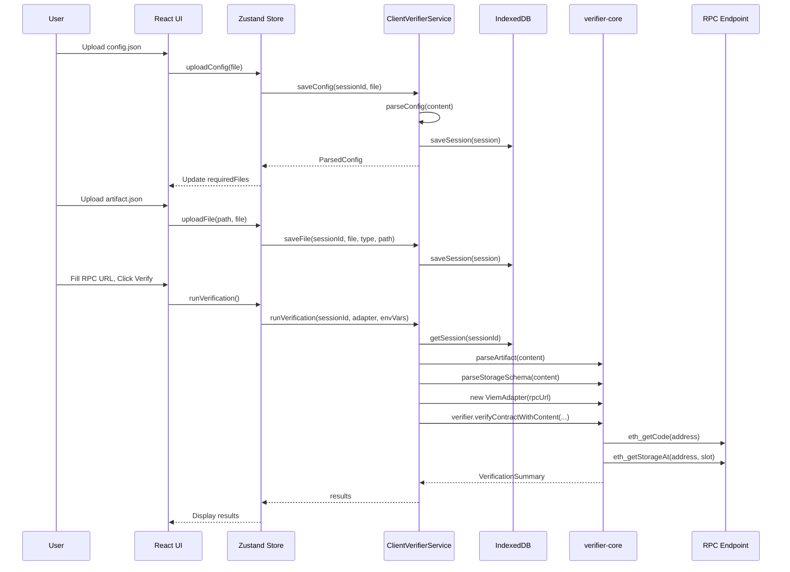

# Contract Integrity Verifier UI

A web-based user interface for the Contract Integrity Verifier. Verify deployed smart contracts against local artifacts through an intuitive browser-based interface.

## Table of Contents

- [Features](#features)
- [Architecture](#architecture)
- [Quick Start](#quick-start)
- [Usage Guide](#usage-guide)
- [Configuration](#configuration)
- [Build & Deploy](#build--deploy)
- [Development](#development)

## Features

- **Client-Side Only**: Runs entirely in the browser - no server required
- **Adapter Selection**: Choose between Ethers.js or Viem as your Web3 library
- **Config File Support**: Upload JSON or Markdown configuration files
- **Dynamic Variables**: Use `${VAR_NAME}` placeholders for environment-specific values
- **Auto-detection**: Automatically detects required schema and artifact files
- **IndexedDB Storage**: Sessions persist across page reloads
- **Static Deployable**: Can be hosted on GitHub Pages, S3, or any static host

## Architecture

### System Overview

```
┌─────────────────────────────────────────────────────────────────────┐
│                        Browser Environment                          │
├─────────────────────────────────────────────────────────────────────┤
│                                                                     │
│   ┌──────────────┐    ┌──────────────┐    ┌──────────────────────┐  │
│   │   React UI   │───▶│ Zustand Store│───▶│ VerifierService      │  │
│   │  Components  │    │              │    │  (Client Mode)       │  │
│   └──────────────┘    └──────────────┘    └──────────┬───────────┘  │
│                                                       │             │
│                                           ┌───────────┴───────────┐ │
│                                           ▼                       ▼ │
│                               ┌──────────────────┐  ┌─────────────┐ │
│                               │  IndexedDB       │  │ verifier-   │ │
│                               │  (Sessions &     │  │ core        │ │
│                               │   Files)         │  │ (browser)   │ │
│                               └──────────────────┘  └──────┬──────┘ │
│                                                             │       │
│                                                    ┌────────┴──────┐│
│                                                    │  Viem Adapter ││
│                                                    └────────┬──────┘│
│                                                             │       │
└─────────────────────────────────────────────────────────────┼───────┘
                                                              │
                                                              ▼
                                                     ┌────────────────┐
                                                     │  RPC Endpoint  │
                                                     │  (eth_call,    │
                                                     │   eth_getCode) │
                                                     └────────────────┘
```

### Data Flow



### File Structure

```
verifier-ui/
├── src/
│   ├── app/                    # Next.js App Router
│   │   ├── api/                # API routes (server mode only, unused)
│   │   ├── layout.tsx          # Root layout
│   │   └── page.tsx            # Main verification page
│   │
│   ├── components/             # React components
│   │   ├── ui/                 # Reusable UI (Button, Card, Input, etc.)
│   │   ├── config-section/     # Config upload
│   │   ├── files-section/      # Artifact/schema upload
│   │   ├── env-vars-section/   # Environment variables form
│   │   ├── options-section/    # Verification options
│   │   └── results-section/    # Results display
│   │
│   ├── services/               # Service abstraction layer
│   │   ├── types.ts            # VerifierService interface
│   │   ├── client-verifier-service.ts  # Browser implementation
│   │   ├── server-verifier-service.ts  # Server placeholder
│   │   └── index.ts            # Service factory
│   │
│   ├── stores/                 # State management
│   │   └── verifier.ts         # Zustand store
│   │
│   ├── lib/                    # Utilities
│   │   ├── indexed-db.ts       # IndexedDB wrapper
│   │   ├── config-parser.ts    # Config parsing
│   │   └── validation.ts       # Input validation
│   │
│   └── types/                  # TypeScript types
│       └── index.ts
│
├── out/                        # Static export output (after build)
├── next.config.mjs             # Next.js configuration
└── .env.example                # Environment variables template
```

## Quick Start

### Development Mode

```bash
cd contract-integrity-verifier/verifier-ui
pnpm install
pnpm dev
```

Open [http://localhost:3000](http://localhost:3000).

### Static Build

```bash
# Build static export
STATIC_EXPORT=true pnpm build

# Serve locally
npx serve out
# or
cd out && python3 -m http.server 3000
```

## Usage Guide

### 1. Prepare Configuration

Create a JSON config file with `${VARIABLE}` placeholders:

```json
{
  "chains": {
    "mainnet": {
      "chainId": 1,
      "rpcUrl": "${MAINNET_RPC_URL}"
    }
  },
  "contracts": [
    {
      "name": "MyContract-Proxy",
      "chain": "mainnet",
      "address": "0x1234...",
      "artifactFile": "./MyContract.json",
      "isProxy": true,
      "stateVerification": {
        "viewCalls": [
          { "function": "owner", "expected": "0xOwner..." }
        ]
      }
    }
  ]
}
```

### 2. Upload Files

1. **Config**: Upload your verification config (.json or .md)
2. **Artifacts**: Upload each artifact file referenced in the config
3. **Schemas**: Upload any storage schema files (if using storagePaths)

### 3. Fill Environment Variables

The UI auto-detects `${...}` placeholders and generates form fields:

| Placeholder | Input Type | Example |
|-------------|------------|---------|
| `${..._RPC_URL}` | URL | `https://eth.llamarpc.com` |
| `${..._ADDRESS}` | Address | `0x1234...` |
| `${..._KEY}` | Password | `abc123...` |
| Other | Text | Any value |

### 4. Configure Options

| Option | Description |
|--------|-------------|
| Verbose | Show detailed output |
| Skip Bytecode | Skip bytecode comparison |
| Skip ABI | Skip ABI selector verification |
| Skip State | Skip state verification |
| Contract Filter | Verify only specific contract |
| Chain Filter | Verify only specific chain |

### 5. Run Verification

Click **Run Verification**. Results show:

- ✅ **Pass**: All checks passed
- ⚠️ **Warn**: Passed with warnings (e.g., immutable differences)
- ❌ **Fail**: Verification failed
- ⏭️ **Skip**: Checks were skipped

## Configuration

### Environment Variables

| Variable | Description | Default |
|----------|-------------|---------|
| `NEXT_PUBLIC_STORAGE_MODE` | `client` (IndexedDB) or `server` (API) | `client` |
| `STATIC_EXPORT` | Build as static site | `false` |

### Storage Modes

```
┌─────────────────────────────────────────────────────────────────┐
│                      STORAGE_MODE=client (default)              │
├─────────────────────────────────────────────────────────────────┤
│  Browser                                                        │
│  ┌──────────────┐     ┌──────────────┐     ┌─────────────────┐  │
│  │ Upload Files │────▶│  IndexedDB   │────▶│ Run Verification│  │
│  └──────────────┘     └──────────────┘     └─────────────────┘  │
│                                                     │           │
│                                                     ▼           │
│                                              ┌─────────────────┐│
│                                              │   RPC Calls     ││
│                                              └─────────────────┘│
└─────────────────────────────────────────────────────────────────┘

┌─────────────────────────────────────────────────────────────────┐
│                      STORAGE_MODE=server (future)               │
├─────────────────────────────────────────────────────────────────┤
│  Browser                          │  Server                     │
│  ┌──────────────┐                 │  ┌──────────────┐           │
│  │ Upload Files │─────────────────┼─▶│ /api/upload  │           │
│  └──────────────┘                 │  └──────┬───────┘           │
│                                   │         ▼                   │
│  ┌──────────────┐                 │  ┌──────────────┐           │
│  │   Verify     │─────────────────┼─▶│ /api/verify  │           │
│  └──────────────┘                 │  └──────────────┘           │
└───────────────────────────────────┴─────────────────────────────┘
```

## Build & Deploy

### Static Export (Recommended)

For hosting on static file servers (GitHub Pages, S3, Netlify):

```bash
# Build
STATIC_EXPORT=true pnpm build

# Output is in out/
ls out/
# index.html  _next/  404.html  ...

# Deploy to your hosting provider
```

### Standalone Server

For running with a Node.js server:

```bash
# Build
pnpm build

# Start server
pnpm start
```

## Development

### Commands

| Command | Description |
|---------|-------------|
| `pnpm dev` | Development server |
| `pnpm build` | Production build |
| `pnpm start` | Start production server |
| `pnpm lint` | Run ESLint |
| `pnpm check-types` | TypeScript type check |

### Adding Components

Components follow this structure:

```
components/
└── my-section/
    ├── index.tsx           # Component logic
    └── my-section.module.scss  # Scoped styles
```

### Service Layer

To add new storage backends, implement the `VerifierService` interface:

```typescript
interface VerifierService {
  readonly mode: "client" | "server";
  
  createSession(): Promise<string>;
  getSession(id: string): Promise<StoredSession | null>;
  deleteSession(id: string): Promise<void>;
  
  saveConfig(id: string, file: File): Promise<ParsedConfig>;
  saveFile(id: string, file: File, type: string, path: string): Promise<void>;
  getFile(id: string, path: string): Promise<StoredFile | null>;
  getRequiredFiles(id: string): Promise<FileRef[]>;
  
  runVerification(id: string, adapter: string, envVars: object, options: object): Promise<VerificationSummary>;
}
```

## Dependencies

- `@consensys/linea-contract-integrity-verifier` - Core library
- `@consensys/linea-contract-integrity-verifier-viem` - Viem adapter (browser)
- `next` - React framework
- `zustand` - State management

## License

Apache-2.0 OR MIT
