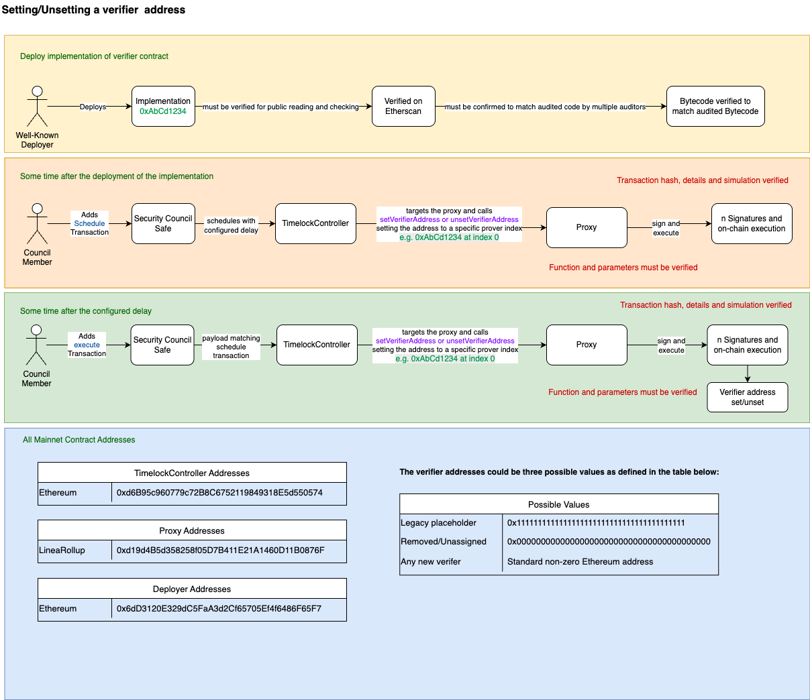

# 🧩 Setting/Unsetting a Verifier Address

This document outlines the secure and auditable flow for **setting or unsetting a verifier address** via a Timelock-controlled multisig process.

---

## 🟨 1. Deploy Implementation of Verifier Contract

**Actor:** Well-Known Deployer  
**Actions:**

- Deploys the `Implementation` contract (e.g. `0xAbCd1234`)
- The implementation:
  - ✅ Must be **verified on Etherscan**
  - ✅ Must be **confirmed to match audited code** by multiple auditors
  - ✅ Bytecode must be **verified** to match the audited version

**Visual Components:**
- `Implementation 0xAbCd1234`
- "Verified on Etherscan"
- "Bytecode verified to match audited Bytecode"

---

## 🟧 2. Schedule Transaction via Timelock

**Timeframe:** Some time after the implementation is deployed  
**Actor:** Council Member  
**Actions:**

- Adds a **scheduled transaction** via the `Security Council Safe`
- This transaction goes to the `TimelockController`
- It schedules a call to the `Proxy` to invoke:
  - `setVerifierAddress` or `unsetVerifierAddress`
  - At a specific index (e.g. `0xAbCd1234 at index 0`)

**Verification Requirements:**
- ✅ Transaction hash, details, and simulation must be verified
- ✅ Function and parameters must be verified

**Flow:**
```
Council Member 
    → Security Council Safe (adds schedule)
        → TimelockController (with configured delay)
            → Proxy (targets and calls set/unset function)
                → Signatures and on-chain execution
```

---

## 🟩 3. Execute Transaction After Delay

**Timeframe:** Some time after the configured delay  
**Actor:** Council Member  
**Actions:**

- Adds an **execute transaction** with a payload **matching** the scheduled transaction
- Follows same path:
  - `Security Council Safe` → `TimelockController` → `Proxy`
  - Executes `setVerifierAddress` or `unsetVerifierAddress`

**Verification Requirements:**
- ✅ Transaction hash, details, and simulation must be verified
- ✅ Function and parameters must be verified

**Outcome:**  
➡️ Verifier address is **set** or **unset**

---

## 🗂️ Mainnet Contract Addresses

| Component               | Chain         | Address                                                                 |
|------------------------|---------------|-------------------------------------------------------------------------|
| **TimelockController** | Ethereum      | `0xd6B9c960f779c728C86752119849318E5d550574`                            |
| **Proxy**              | LineaRollup   | `0xd194Bd535d285f05D7B411E21A1460D11B0876F`                             |
| **Deployer**           | Ethereum      | `0x6dD3120E329dC5FaA3d2c6f65705E4f648fF65F7`                            |

---

## 🧾 Verifier Address Types

| Description               | Value                                                                        |
|---------------------------|------------------------------------------------------------------------------|
| Legacy Placeholder        | `0x1111111111111111111111111111111111111111`                                 |
| Removed / Unassigned      | `0x0000000000000000000000000000000000000000`                                 |
| New Verifier              | Any **standard non-zero Ethereum address**                                   |

---

## ✅ Security Summary

- All changes go through **delayed execution** via the `TimelockController`
- All functions and parameters must be **independently verified**
- Ensures decentralized governance and secure upgrades


