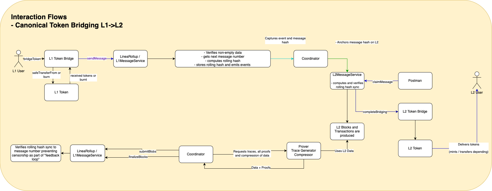

# 🔁 Interaction Flow: Canonical Token Bridging (L1 → L2)

This document describes how tokens are bridged canonically from L1 to L2, step-by-step.

---

## 🔄 Step-by-Step Flow

1. **L1 User** calls `bridgeToken()` on the `L1 Token Bridge`.
2. The `L1 Token` is either:
   - Transferred using `safeTransferFrom()`, or
   - Burned
3. `L1 Token Bridge` sends a message using `sendMessage()` to `LineaRollup / L1MessageService`.
4. The contract:
   - Verifies non-empty data
   - Gets the next message number
   - Computes the rolling hash
   - Stores the rolling hash and emits a message event
5. **Coordinator** captures the event and message hash.
6. Coordinator:
   - Anchors the message hash on L2
7. **L2MessageService** receives the message on L2.
   - Computes and verifies the rolling hash sync
   - Stores each hash for claiming   
8. **Postman** service or **user** calls `claimMessage()` on the L2MessageService.
9. **L2MessageService** calls the **L2 Token Bridge** performing `completeBridging()`.
10. Depending on token status, **L2 Token** is:
    - Minted or,
    - Transferred to the L2 User
11. As part of regular chain operations:
    - **L2 Blocks and Transactions** are produced
    - **Prover / Trace Generator Compressor** uses L2 data, generates traces and all proofs
    - Proofs are submitted to the Coordinator via `SubmitBlocks` / `finalizeBlocks`
12. **LineaRollup / L1MessageService** verifies rolling hash sync as part of a feedback loop.

---

