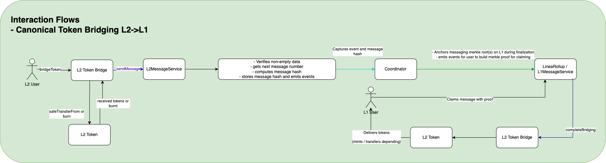

# 🔁 Interaction Flow: Canonical Token Bridging (L2 → L1)

This document outlines the process of bridging tokens from L2 back to L1 using the canonical bridge mechanism.

---

## 🔄 Step-by-Step Flow

1. **L2 User** calls `bridgeToken()` on the `L2 Token Bridge`.
2. The `L2 Token` is either:
   - Transferred via `safeTransferFrom()`, or
   - Burned
3. `L2 Token Bridge` sends a message to the `L2MessageService` using `sendMessage()`.
4. The `L2MessageService`:
   - Verifies non-empty data
   - Gets the next message number
   - Computes the message hash
   - Stores message hash and emits event
5. **Coordinator** captures the event and message hash.
6. Coordinator:
   - Anchors the message Merkle root(s) on L1 during finalization
   - Emits events for proof generation
7. **L1 User** claims the message with proof.
8. `L1 Token Bridge` executes `completeBridging()`.
9. The `L1 Token` is delivered (either minted or transferred) to the **L1 User**.

---

