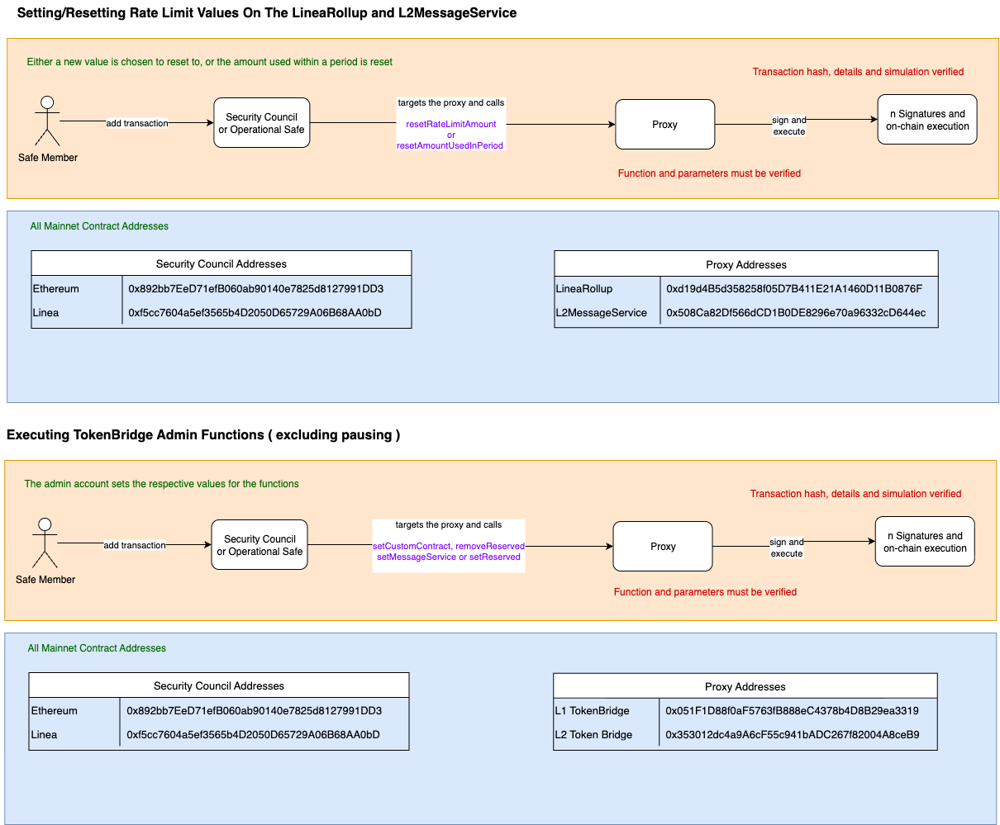

# 🧮 Setting/Resetting Rate Limit Values on the LineaRollup and L2MessageService

This process allows a designated Safe Member to set or reset rate limit values, either by defining a new limit or resetting the amount used during a period.

**Note**: These contracts are governed by the [Security Council Charter](../../security-council-charter.md).

---

## 🟧 Flow: Rate Limit Configuration

**Actor:** Safe Member  
**Actions:**

- Adds a transaction via **Security Council** or **Operational Safe**
- Targets the appropriate **Proxy**
- Calls one of the following functions:
  - `resetRateLimitAmount`
  - `resetAmountUsedInPeriod`

**Execution Path:**
```
Safe Member
    → Security Council / Operational Safe
        → targets Proxy
            → calls resetRateLimitAmount or resetAmountUsedInPeriod
                → signs and executes on-chain
```

**Verification Requirements:**
- ✅ Transaction hash, parameters, and simulation must be verified


## 🗂️ Function Signatures

| 4bytes | Signature                              |
|-------|---------------------------------------|
| `0x557eac73`     | resetRateLimitAmount(uint256)                   |
| `0xaea4f745`    | resetAmountUsedInPeriod()                   |

---

## 🗂️ All Mainnet Contract Addresses

### 🔐 Security Council Addresses

| Network   | Address                                      |
|-----------|----------------------------------------------|
| Ethereum  | `0x892bb72De7f1b06B08a09140e7825d1827991DD3` |
| Linea     | `0xf5cc7604a5ef3565b4D2050D65729A06B68AA0bD` |

### 📦 Proxy Addresses

| Contract           | Address                                           |
|--------------------|---------------------------------------------------|
| LineaRollup        | `0xd194Bd535d285f05D7B411E21A1460D11B0876F`       |
| L2MessageService   | `0x508cA82Df566dCD1B0DE828967a0e96332cDc446`      |

---

## ✅ Security Summary

- Changes require **multisig execution**
- All function parameters must be **explicitly verified**
- Simulation before execution is mandatory

