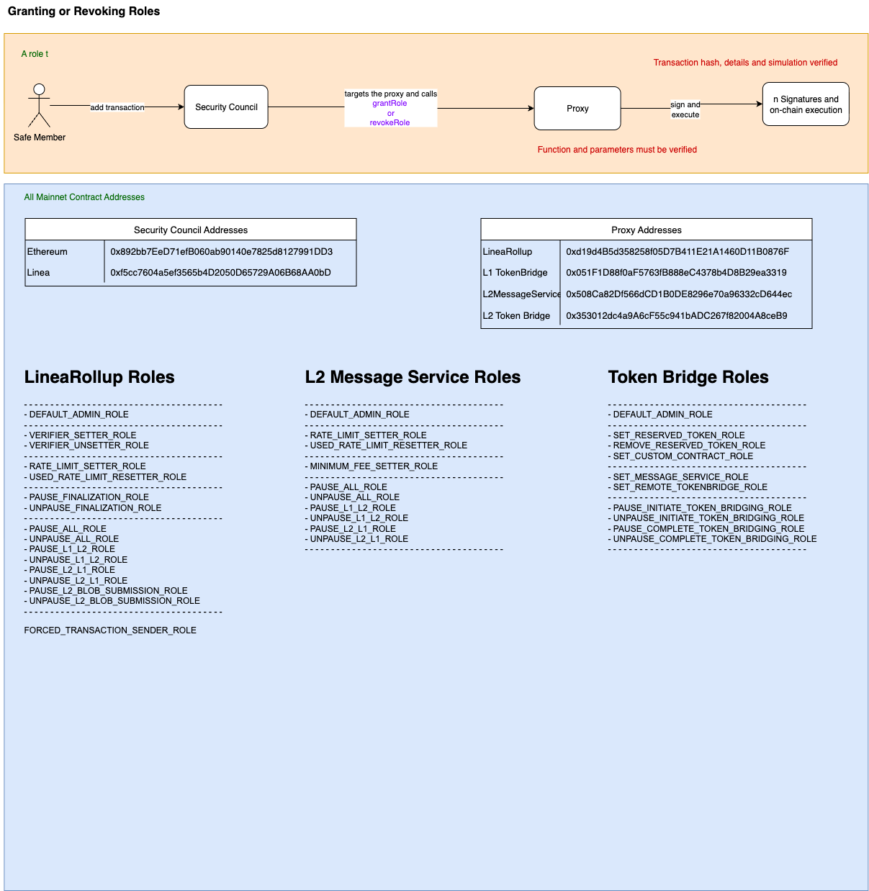

# 🛡️ Granting or Revoking Roles

This document outlines the procedure for assigning or removing specific roles on various components of the Linea ecosystem: **LineaRollup**, **L2MessageService**, and **TokenBridge**.

**Note**: These contracts are governed by the [Security Council Charter](../../security-council-charter.md).

---

## 🟧 Flow: Role Management

**Actor:** Safe Member  
**Actions:**

- Adds a transaction via the **Security Council**
- Targets the appropriate **Proxy**
- Calls one of the following functions:
  - `grantRole`
  - `revokeRole`

**Execution Path:**
```
Safe Member
    → Security Council
        → targets Proxy
            → calls grantRole or revokeRole
                → signs and executes on-chain
```

**Verification Requirements:**
- ✅ Transaction hash, function selector, parameters, and simulation must be verified

## 🗂️ Function Signatures

| 4bytes | Signature                              |
|-------|---------------------------------------|
| `0x2f2ff15d`     | grantRole(bytes32,address)                   |
| `0xd547741f`    | revokeRole(bytes32,address)                   |

---

## 🗂️ All Mainnet Contract Addresses

### 🔐 Security Council Addresses

| Network   | Address                                      |
|-----------|----------------------------------------------|
| Ethereum  | `0x892bb72De7f1b06B08a09140e7825d1827991DD3` |
| Linea     | `0xf5cc7604a5ef3565b4D2050D65729A06B68AA0bD` |

### 📦 Proxy Addresses

| Contract           | Address                                           |
|--------------------|---------------------------------------------------|
| LineaRollup        | `0xd194Bd535d285f05D7B411E21A1460D11B0876F`       |
| L1 TokenBridge     | `0x051F1D88f0aF5673fB88BeC4378eD4BB29ea3319`       |
| L2MessageService   | `0x508cA82Df566dCD1B0DE828967a0e96332cDc446`      |
| L2 Token Bridge    | `0x353012d04a9A6cF5C941bADC267f82004A8ceB9`        |

---

## 🔑 Available Roles by Component

### 📘 LineaRollup Roles

- `DEFAULT_ADMIN_ROLE`
- `VERIFIER_SETTER_ROLE`
- `VERIFIER_UNSETTER_ROLE`
- `RATE_LIMIT_SETTER_ROLE`
- `USED_RATE_LIMIT_RESETTER_ROLE`
- `PAUSE_FINALIZATION_ROLE`
- `UNPAUSE_FINALIZATION_ROLE`
- `PAUSE_ALL_ROLE`
- `UNPAUSE_ALL_ROLE`
- `PAUSE_L1_L2_ROLE`
- `UNPAUSE_L1_L2_ROLE`
- `PAUSE_L2_L1_ROLE`
- `UNPAUSE_L2_L1_ROLE`
- `PAUSE_L2_BLOB_SUBMISSION_ROLE`
- `UNPAUSE_L2_BLOB_SUBMISSION_ROLE`
- `FORCED_TRANSACTION_SENDER_ROLE`

### 📗 L2 Message Service Roles

- `DEFAULT_ADMIN_ROLE`
- `RATE_LIMIT_SETTER_ROLE`
- `USED_RATE_LIMIT_RESETTER_ROLE`
- `MINIMUM_FEE_SETTER_ROLE`
- `PAUSE_ALL_ROLE`
- `UNPAUSE_ALL_ROLE`
- `PAUSE_L1_L2_ROLE`
- `UNPAUSE_L1_L2_ROLE`
- `PAUSE_L2_L1_ROLE`
- `UNPAUSE_L2_L1_ROLE`

### 📙 Token Bridge Roles

- `DEFAULT_ADMIN_ROLE`
- `SET_RESERVED_TOKEN_ROLE`
- `REMOVE_RESERVED_TOKEN_ROLE`
- `SET_CUSTOM_CONTRACT_ROLE`
- `SET_MESSAGE_SERVICE_ROLE`
- `SET_REMOTE_TOKENBRIDGE_ROLE`
- `PAUSE_INITIATE_TOKEN_BRIDGING_ROLE`
- `UNPAUSE_INITIATE_TOKEN_BRIDGING_ROLE`
- `PAUSE_COMPLETE_TOKEN_BRIDGING_ROLE`
- `UNPAUSE_COMPLETE_TOKEN_BRIDGING_ROLE`

---

## ✅ Security Summary

- Role changes are **on-chain** and require **multisig execution**
- Clear access separation across all core modules
- Function selectors and role identifiers must be fully **verified and simulated**

