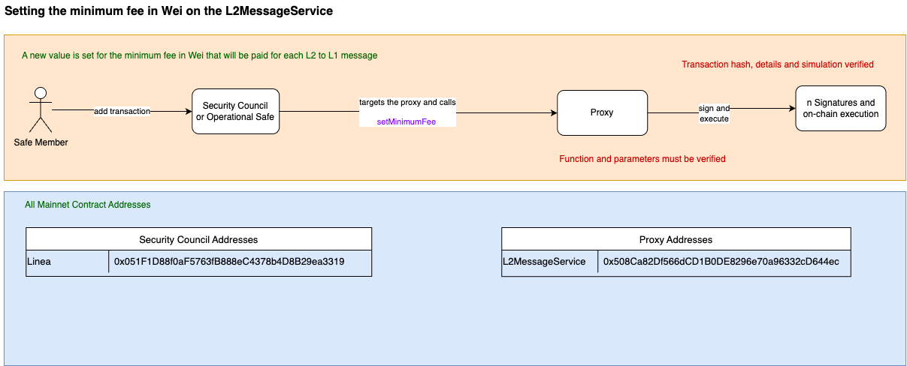

# 💸 Setting the Minimum Fee in Wei on the L2MessageService

This process allows setting a new **minimum fee in Wei** to be paid for each L2 to L1 message on the L2MessageService contract.

**Note**: These contracts are governed by the [Security Council Charter](../../security-council-charter.md).

---

## 🟧 Flow: Minimum Fee Setting

**Actor:** Safe Member  
**Actions:**

- Adds a transaction via **Security Council** or **Operational Safe**
- Targets the **L2MessageService Proxy**
- Calls the function `setMinimumFee`

**Execution Path:**
```
Safe Member
    → Security Council / Operational Safe
        → targets L2MessageService Proxy
            → calls setMinimumFee
                → signs and executes on-chain
```

**Verification Requirements:**
- ✅ Transaction hash, function, and simulation must be verified
- ✅ Fee amount must be thoroughly reviewed before execution

## 🗂️ Function Signatures

| 4bytes | Signature                              |
|-------|---------------------------------------|
| `0x182a7506`     | setMinimumFee(uint256)                   |

---

## 🗂️ All Mainnet Contract Addresses

### 🔐 Security Council Addresses

| Network   | Address                                      |
|-----------|----------------------------------------------|
| Linea     | `0xf5cc7604a5ef3565b4D2050D65729A06B68AA0bD` |

### 📦 Proxy Address

| Contract           | Address                                           |
|--------------------|---------------------------------------------------|
| L2MessageService   | `0x508cA82Df566dCD1B0DE828967a0e96332cDc446`      |

---

## ✅ Security Summary

- Only council or operational safes may perform this action
- **Fee changes** must be reviewed for economic impact
- Requires **simulation and multisig confirmation**

