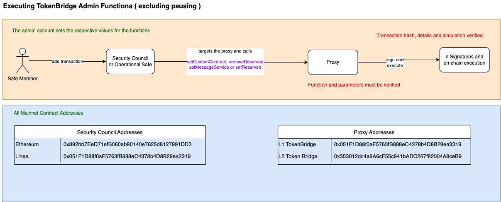

# 🛠️ Executing TokenBridge Admin Functions (Excluding Pausing)

This guide outlines how authorized safe members can execute core **TokenBridge admin functions** like setting or removing reserved addresses or setting custom contracts and message services.

---

## 🟧 Flow: Admin Execution Path

**Actor:** Safe Member  
**Actions:**

- Adds a transaction via **Security Council** or **Operational Safe**
- Targets the relevant **TokenBridge Proxy**
- Calls one of the following functions:
  - `setCustomContract`
  - `removeReserved`
  - `setMessageService`
  - `setReserved`

**Execution Path:**
```
Safe Member
    → Security Council / Operational Safe
        → targets Proxy
            → calls admin function
                → signs and executes on-chain
```

**Verification Requirements:**
- ✅ Transaction hash, parameters, and simulation must be verified

## 🗂️ Function Signatures

| 4bytes | Signature                              |
|-------|---------------------------------------|
| `0x1754f301`    | setCustomContract(address,address)                   |
| `0xedc42a22`    | removeReserved(address)                   |
| `0xbe46096f`    | setMessageService(address)                   |
| `0xcdd914c5`    | setReserved(address)                   |

---

## 🗂️ All Mainnet Contract Addresses

### 🔐 Security Council Addresses

| Network   | Address                                      |
|-----------|----------------------------------------------|
| Ethereum  | `0x892bb72De7f1b06B08a09140e7825d1827991DD3` |
| Linea     | `0x051F1D88f0aF5673fB88BeC4378eD4BB29ea3319` |

### 📦 Proxy Addresses

| Contract         | Address                                           |
|------------------|---------------------------------------------------|
| L1 TokenBridge   | `0x051F1D88f0aF5673fB88BeC4378eD4BB29ea3319`       |
| L2 Token Bridge  | `0x353012d04a9A6cF5C941bADC267f82004A8ceB9`        |

---

## ✅ Security Summary

- Admin functions require **authorized multisig approval**
- All actions are **on-chain and irreversible**
- **Parameter verification and simulation** are mandatory before execution



