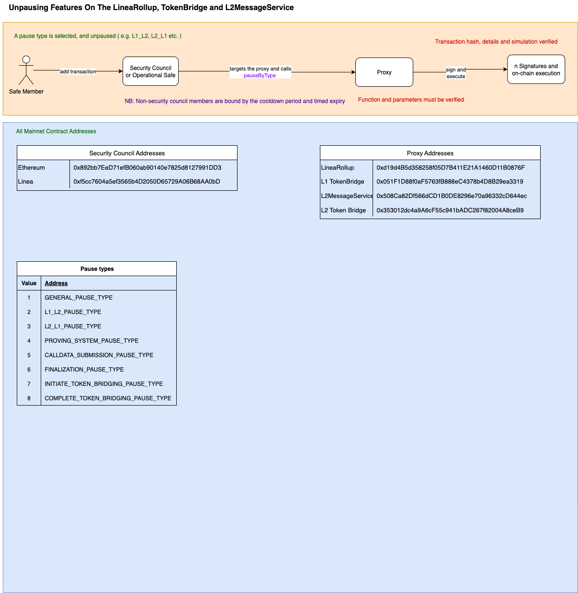

# ▶️ Unpausing Features on the LineaRollup, TokenBridge, and L2MessageService (with Pause Types)

This document outlines how a Safe Member can unpause previously paused features on key Linea ecosystem contracts using the specified pause types.

---

## 🟧 Flow to Unpause Features

**Actor:** Safe Member  
**Actions:**

- Selects a pause type from the list below
- Adds a transaction via **Security Council** or **Operational Safe**
- Targets the relevant **Proxy**
- Calls the `pauseByType()` function with the selected type to unpause

**Execution Path:**
```
Safe Member
    → Security Council / Operational Safe
        → targets Proxy
            → calls pauseByType(type)
                → signs and executes on-chain
```

**Verification Requirements:**
- ✅ Function and parameters must be verified
- ✅ Transaction hash and simulation results must be confirmed

**Note:** Non-security council members are bound by cooldown period and timed expiry.

---

## 🗂️ Pause Types


| Value | Address                              |
|-------|---------------------------------------|
| 1     | GENERAL_PAUSE_TYPE                   |
| 2     | L1_L2_PAUSE_TYPE                     |
| 3     | L2_L1_PAUSE_TYPE                     |
| 4     | PROVING_SYSTEM_PAUSE_TYPE           |
| 5     | CALLDATA_SUBMISSION_PAUSE_TYPE      |
| 6     | FINALIZATION_PAUSE_TYPE             |
| 7     | INITIATE_TOKEN_BRIDGING_PAUSE_TYPE  |
| 8     | COMPLETE_TOKEN_BRIDGING_PAUSE_TYPE  |


---

## 🗂️ Mainnet Contract Addresses

### 🔐 Security Council Addresses

| Network   | Address                                      |
|-----------|----------------------------------------------|
| Ethereum  | `0x892bb72De7f1b06B08a09140e7825d1827991DD3` |
| Linea     | `0x051F1D88f0aF5673fB88BeC4378eD4BB29ea3319` |

### 📦 Proxy Addresses

| Contract           | Address                                           |
|--------------------|---------------------------------------------------|
| LineaRollup        | `0xd194Bd535d285f05D7B411E21A1460D11B0876F`       |
| L1 TokenBridge     | `0x051F1D88f0aF5673fB88BeC4378eD4BB29ea3319`       |
| L2MessageService   | `0x508cA82Df566dCD1B0DE828967a0e96332cDc446`      |
| L2 Token Bridge    | `0x353012d04a9A6cF5C941bADC267f82004A8ceB9`        |

