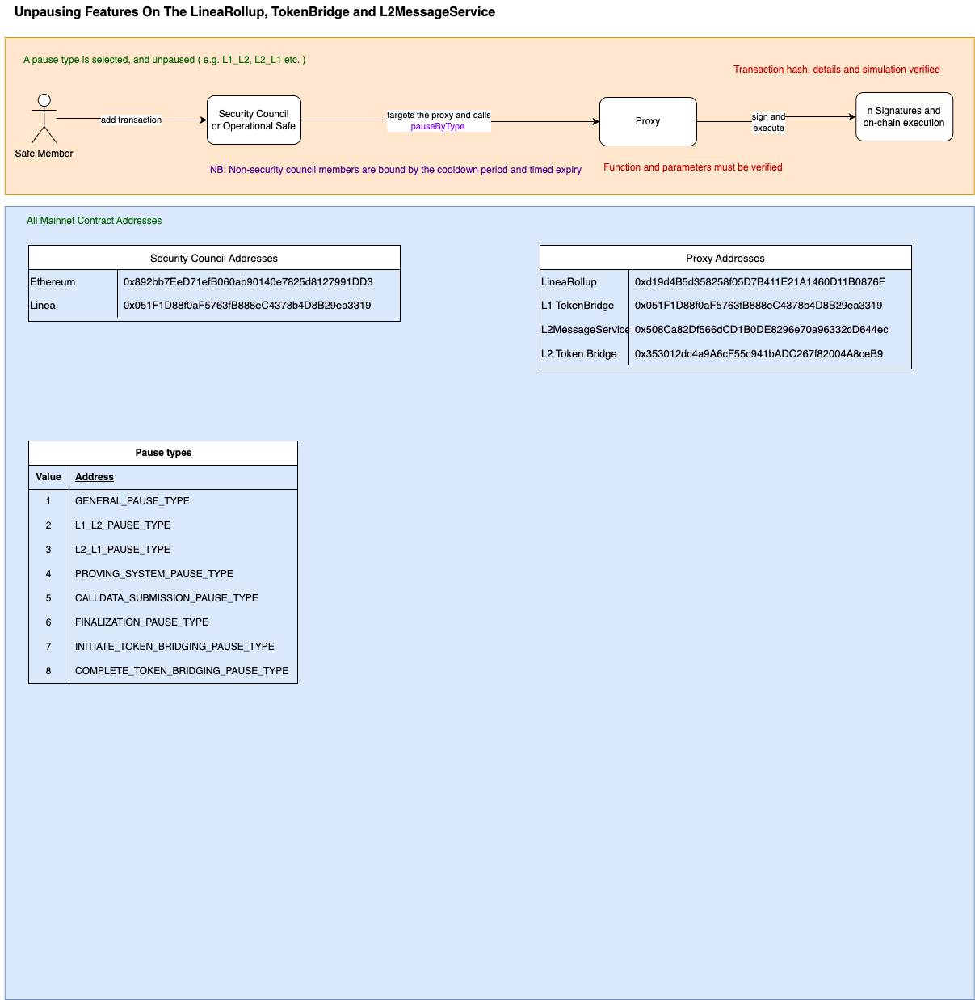

# ▶️ Unpausing Features on the LineaRollup, TokenBridge, and L2MessageService (with Pause Types)

This document outlines how a Safe Member can unpause previously paused features on key Linea ecosystem contracts using the specified pause types.

**Note**: These contracts are governed by the [Security Council Charter](../../security-council-charter.md).

---

## 🟧 Flow to Unpause Features or Set Roles Allowed to Unpause Types 

**Actor:** Safe Member  
**Actions:**

- Selects a pause type from the list below
- Adds a transaction via **Security Council** or **Operational Safe**
- Targets the relevant **Proxy**
- Calls the `unPauseByType()` or `updateUnpauseTypeRole()` function with the selected values to unpause or set unpause type roles

**Execution Path:**
```
Safe Member
    → Security Council / Operational Safe
        → targets Proxy
            → calls unPauseByType(type)
                → signs and executes on-chain
```

**Verification Requirements:**
- ✅ Function and parameters must be verified
- ✅ Transaction hash and simulation results must be confirmed

## 🗂️ Function Signatures

| 4bytes | Signature                              |
|-------|---------------------------------------|
| `0x1065a399`     | unPauseByType(uint8)                   |
| `0x52abf32d`     | updateUnpauseTypeRole(uint8,bytes32)                   |

**Note:** Non-security council members are bound by cooldown period and timed expiry.

---

## 🗂️ Pause Types


| Value | Pause Type                                    | Notes       |
|-------|-----------------------------------------------|-------------|
| 1     | GENERAL_PAUSE_TYPE                            |             |
| 2     | L1_L2_PAUSE_TYPE                              |             |
| 3     | L2_L1_PAUSE_TYPE                              |             |
| 4     | BLOB_SUBMISSION_PAUSE_TYPE                    | deprecated  |
| 5     | CALLDATA_SUBMISSION_PAUSE_TYPE                | deprecated  |
| 6     | FINALIZATION_PAUSE_TYPE                       |             |
| 7     | INITIATE_TOKEN_BRIDGING_PAUSE_TYPE            |             |
| 8     | COMPLETE_TOKEN_BRIDGING_PAUSE_TYPE            |             |
| 9     | NATIVE_YIELD_STAKING_PAUSE_TYPE               |             |
| 10    | NATIVE_YIELD_UNSTAKING_PAUSE_TYPE             |             |
| 11    | NATIVE_YIELD_PERMISSIONLESS_ACTIONS_PAUSE_TYPE|             |
| 12    | NATIVE_YIELD_REPORTING_PAUSE_TYPE             |             |
| 13    | STATE_DATA_SUBMISSION_PAUSE_TYPE              |             |


---

## 🗂️ Mainnet Contract Addresses

### 🔐 Security Council Addresses

| Network   | Address                                      |
|-----------|----------------------------------------------|
| Ethereum  | `0x892bb7EeD71efB060ab90140e7825d8127991DD3` |
| Linea     | `0xf5cc7604a5ef3565b4D2050D65729A06B68AA0bD` |

### 📦 Proxy Addresses

| Contract           | Address                                           |
|--------------------|---------------------------------------------------|
| LineaRollup        | `0xd194Bd535d285f05D7B411E21A1460D11B0876F`       |
| L1 TokenBridge     | `0x051F1D88f0aF5763fB888eC4378b4D8B29ea3319`       |
| L2MessageService   | `0x508Ca82Df566dCD1B0DE8296e70a96332cD644ec`      |
| L2 Token Bridge    | `0x353012dc4a9A6cF55c941bADC267f82004A8ceB9`        |

