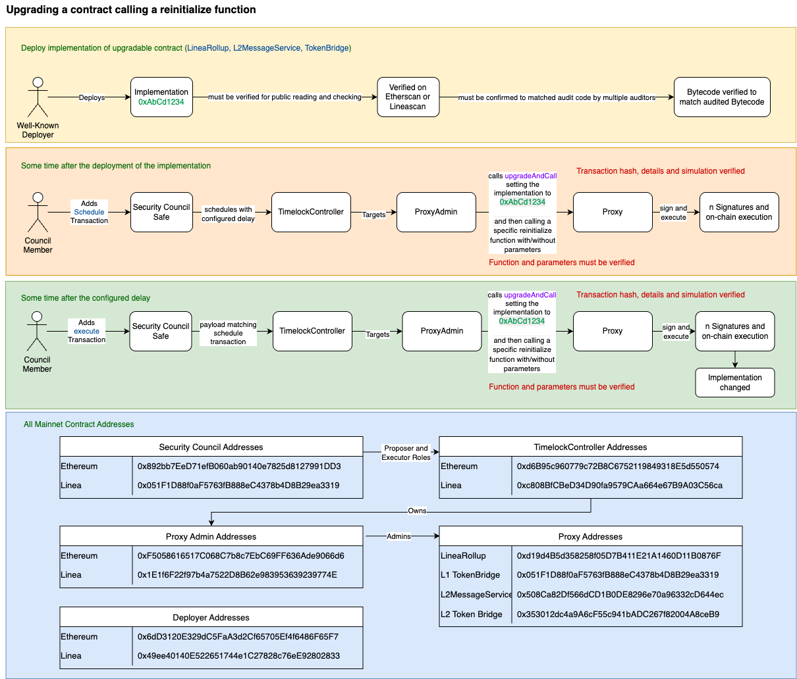

# 🔁 Upgrading a Contract While Calling a Reinitialize Function

This guide outlines the process of **upgrading an upgradable contract** (e.g. **LineaRollup**, **L2MessageService**, **TokenBridge**) and calling a **reinitialize function** in the same transaction. This flow ensures integrity while applying critical upgrades.

**Note**: These contracts are governed by the [Security Council Charter](../../security-council-charter.md).

---

## 🟨 1. Deploy Implementation of Upgradable Contract

**Actor:** Well-Known Deployer  
**Actions:**

- Deploys a new `Implementation` contract (e.g. `0xAbCd1234`)
- The implementation:
  - ✅ Must be **verified on Etherscan or Linescan**
  - ✅ Must be **audited and bytecode-confirmed** by multiple auditors

---

## 🟧 2. Schedule Upgrade Transaction with Reinitialization

**Timeframe:** Some time after deployment  
**Actor:** Council Member  
**Actions:**

- Adds a **scheduled transaction** via the `Security Council Safe`
- Routed through the `TimelockController`
- Targets the `ProxyAdmin`
- Calls `upgradeAndCall()`:
  - Sets the proxy implementation to `0xAbCd1234`
  - Immediately calls a **reinitialize function** (with or without parameters)

**Verification Requirements:**
- ✅ Transaction hash, details, and simulation must be verified
- ✅ Function name, arguments, and reinit logic must be confirmed

---

## 🟩 3. Execute the Transaction After Delay

**Timeframe:** After the configured delay  
**Actor:** Council Member  
**Actions:**

- Adds and signs an **execute transaction** via the `Security Council Safe`
- Routed through `TimelockController` → `ProxyAdmin` → `Proxy`
- Executes `upgradeAndCall()` with:
  - Implementation update
  - Reinitialization function call

**Outcome:**  
➡️ Proxy’s implementation is upgraded and new state is initialized

**Verification Requirements:**
- ✅ Same payload as scheduled
- ✅ Parameters and reinit target must be verified

## 🗂️ Function Signatures

| 4bytes | Signature                              |
|-------|---------------------------------------|
| `0x9623609d`     | upgradeAndCall(address,address,bytes)                   |

---

## 🗂️ Mainnet Contract Addresses

### 🔐 Security Council Addresses

| Network   | Address                                      |
|-----------|----------------------------------------------|
| Ethereum  | `0x892bb7EeD71efB060ab90140e7825d8127991DD3` |
| Linea     | `0xf5cc7604a5ef3565b4D2050D65729A06B68AA0bD` |

### 🕓 TimelockController Addresses

| Network   | Address                                      |
|-----------|----------------------------------------------|
| Ethereum  | `0xd6B9c960f779c728C6752119849318E5d550574`  |
| Linea     | `0xc808BfCBeD34D90fa9579CAa664e67B9A03C56ca` |

- Security Council has **Proposer and Executor roles**
- Timelock owns `ProxyAdmin` contracts

### 👤 Proxy Admin Addresses

| Network   | Address                                      |
|-----------|----------------------------------------------|
| Ethereum  | `0xF5058616517C068C7b8c7EbC69FF636Ade9066d6` |
| Linea     | `0x1E1f6F22f97b4a7522D8B62e983953639239774E` |

### 🧑‍💻 Deployer Addresses

| Network   | Address                                      |
|-----------|----------------------------------------------|
| Ethereum  | `0x6dD3120E329dC5FaA3d2Cf65705Ef4f6486F65F7` |
| Linea     | `0x49ee40140E522651744c1C2878c76eE9f28028d33` |

### 📦 Proxy Addresses

| Contract           | Address                                           |
|--------------------|---------------------------------------------------|
| LineaRollup        | `0xd19d4B5d358258f05D7B411E21A1460D11B0876F`       |
| TokenBridge        | `0x051F1D88f0aF5763fB888eC4378b4D8B29ea3319`       |
| L2MessageService   | `0x508Ca82Df566dCD1B0DE8296e70a96332cD644ec`      |
| L2 Token Bridge    | `0x353012dc4a9A6cF55c941bADC267f82004A8ceB9`        |

---

## ✅ Security Summary

- Upgrades and initializations happen **atomically** via `upgradeAndCall()`
- Timelock and council governance ensures **review and delay**
- Full **simulation and verification** required before execution

