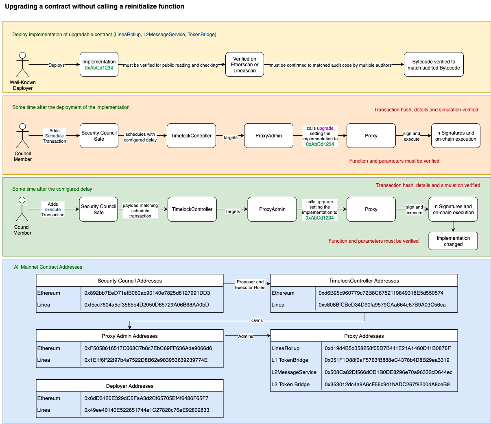

# 🔄 Upgrading a Contract Without Calling a Reinitialize Function

This guide outlines the secure process for upgrading a contract (e.g. **LineaRollup**, **L2MessageService**, **TokenBridge**) without calling a reinitialize function, via a timelock-protected upgrade flow.

**Note**: These contracts are governed by the [Security Council Charter](../../security-council-charter.md).

---

## 🟨 1. Deploy Implementation of Upgradable Contract

**Actor:** Well-Known Deployer  
**Actions:**

- Deploys a new `Implementation` contract (e.g. `0xAbCd1234`)
- The implementation:
  - ✅ Must be **verified on Etherscan or Linescan**
  - ✅ Must match **audited code** confirmed by multiple auditors
  - ✅ Bytecode must be **verified** to match the audit

## 🗂️ Function Signatures

| 4bytes | Signature                              |
|-------|---------------------------------------|
| `0x99a88ec4`     | upgrade(address,address)                   |

---

## 🟧 2. Schedule Upgrade Transaction

**Timeframe:** Some time after deployment  
**Actor:** Council Member  
**Actions:**

- Adds a **scheduled upgrade transaction** via the `Security Council Safe`
- The transaction:
  - Is routed through the `TimelockController`
  - Targets the `ProxyAdmin`
  - Calls the `upgrade()` function to set the proxy’s implementation to the new contract address (e.g. `0xAbCd1234`)
  - Final target: the `Proxy` contract

**Verification Requirements:**
- ✅ Transaction hash, details, and simulation must be verified
- ✅ Function and parameters must be verified

---

## 🟩 3. Execute Upgrade Transaction After Delay

**Timeframe:** After the configured delay  
**Actor:** Council Member  
**Actions:**

- Adds a matching **execute transaction** through the `Security Council Safe`
- Routed again through the `TimelockController`
- Reaches `ProxyAdmin`, which executes the upgrade on the `Proxy`

**Outcome:**  
➡️ Proxy’s implementation is updated (contract logic changed)

**Verification Requirements:**
- ✅ Same transaction hash, parameters, and targets must match scheduled version

---

## 🗂️ Mainnet Contract Addresses

### 🔐 Security Council Addresses

| Network   | Address                                      |
|-----------|----------------------------------------------|
| Ethereum  | `0x892bb72De7f1b06B08a09140e7825d1827991DD3` |
| Linea     | `0xf5cc7604a5ef3565b4D2050D65729A06B68AA0bD` |

### 🕓 TimelockController Addresses

| Network   | Address                                      |
|-----------|----------------------------------------------|
| Ethereum  | `0xd6B9c960f779c728C6752119849318E5d550574`  |
| Linea     | `0xC80BB1C8eD34D049bA579CaBa646e67B9A03C56a` |

- Security Council is both **Proposer** and **Executor**
- Timelock owns `ProxyAdmin` contracts

### 👤 Proxy Admin Addresses

| Network   | Address                                      |
|-----------|----------------------------------------------|
| Ethereum  | `0xF50586165710C86c7b7EcC6B9F636Ada9606d6d6` |
| Linea     | `0x1E16fF2297b4a7522Df8b62e99353692399774E` |

### 🧑‍💻 Deployer Addresses

| Network   | Address                                      |
|-----------|----------------------------------------------|
| Ethereum  | `0x6dD3120E329dC5FaA3d2c6f65705E4f648fF65F7` |
| Linea     | `0x49ee40140522561744c1C2878c76eE9f28028d33` |

### 📦 Proxy Addresses

| Contract           | Address                                           |
|--------------------|---------------------------------------------------|
| LineaRollup        | `0xd194Bd535d285f05D7B411E21A1460D11B0876F`       |
| TokenBridge        | `0x051F1D88f0aF5673fB88BeC4378eD4BB29ea3319`       |
| L2MessageService   | `0x508cA82Df566dCD1B0DE828967a0e96332cDc446`      |
| L2 Token Bridge    | `0x353012d04a9A6cF5C541BADC267f82004A8ceB9`        |

---

## ✅ Security Summary

- All upgrades go through a **timelock delay** using multisig control
- Contract upgrades do **not require reinitialization**
- **Transaction simulation and parameter verification** are essential at both stages

