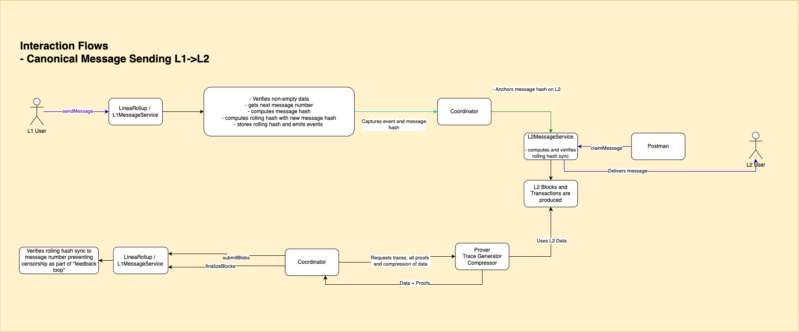

# 📩 Interaction Flow: Canonical Message Sending (L1 → L2)

This document describes the step-by-step flow of how a canonical message is sent from L1 to L2 in the Linea network.

---

## 🔄 Step-by-Step Flow

1. **L1 User** calls `sendMessage()` on the `LineaRollup` or `L1MessageService` contract.
2. The contract:
   - Verifies non-empty data
   - Gets the next message number
   - Computes the message hash with all the message fields
   - Computes the rolling hash using the previous rolling hash and the new message hash
   - Stores the rolling hash and emits a message event
3. **Coordinator** captures the emitted event and message hash.
4. Coordinator:
   - Anchors the message hash on L2
5. **L2MessageService** receives the anchored message hash.
   - Computes and verifies the rolling hash sync
   - Stores each hash for claiming
6. **Postman** service or **L2 User** calls `claimMessage()` to deliver the message to the **L2 User**.
7. As part of regular chain operations:
   - **L2 Blocks and Transactions** are produced
   - **Prover / Trace Generator Compressor** uses L2 data, generates traces and all proofs
   - Proofs are submitted to the Coordinator via `SubmitBlocks` / `finalizeBlocks`
8. **L1MessageService / LineaRollup** verifies rolling hash sync as part of a feedback loop.

---

