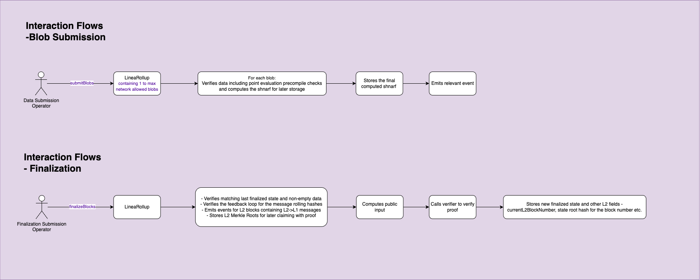

# 🧩 Blob Submission & Finalization

This document outlines the core data and finalization flows involved in LineaRollup's lifecycle, including blob commitment and zk-proof-based finality.

---

## 📦 Blob Submission

This flow is used by the **Data Submission Operator** to submit blobs to the LineaRollup system.

### 🔄 Steps

1. **Data Submission Operator** calls `submitBlobs()` on the `LineaRollup` contract with **1 to N blobs**, where **N = network maximum**.
2. For each submitted blob:
   - The contract verifies data integrity.
   - Performs evaluation checks via the point evaluation precompile.
   - Computes a `shnarf` for internal tracking.
3. The final computed `shnarf` is stored.
4. A corresponding event is emitted to reflect successful blob(s) storage.

**Note:** The `shnarf` is a computation that aggregates previous shnarfs, a per-blob submission snark-friendly hash, the final state in a blob's submission and fields linking the data availability.

---

## 🧮 Finalization Submission

This flow finalizes 1 or more aggregated blob transaction submissions by verifying correct execution proven via zero-knowledge proofs.

### 🔄 Steps

1. **Finalization Submission Operator** calls `finalizeBlocks()`.
2. `LineaRollup` contract:
   - Verifies submitted data matches the last finalized state and is non-empty to verify proper continuity.
   - Validates the messaging rolling hash feedback loop preventing manipulation or censorship.
   - Emits events for L2 blocks containing L2 → L1 messages.
   - Stores **Merkle roots** of L2 messages for proof-based claiming.
3. Computes the **public input** to be verified.
4. Calls the Plonk-based **Verifier** to validate the provided zk-proof.
5. Upon success, updates finalized state:
   - Includes latest 
   - Stores the `currentL2BlockNumber`, `finalStateRootHash` and other related finalization state metadata.

---

### 🔐 Verifier Contract

The verifier contract is an advanced zero-knowledge proof verifier specifically tailored for the PLONK protocol on Ethereum mainnet. It verifies zk-SNARK proofs generated using [gnark](https://github.com/ConsenSys/gnark), ensuring that a given proof corresponds to a valid computation without revealing inputs. The contract is written almost entirely in inline Yul assembly for gas efficiency and precision, and it uses elliptic curve operations, pairings, and the Fiat-Shamir heuristic to validate a serialized proof against public inputs. This is critical infrastructure for trustless, privacy-preserving applications such as rollups, where it ensures the integrity of off-chain computations before accepting their results on-chain.

---

