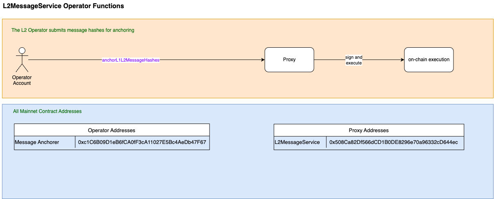

# 🧩 L2 Message hash anchoring

## 📦 Anchoring

This flow is used by the **L2 Message Anchoring Operator** to submit L1 to L2 hashes synchronising the rolling hash for the feedback loop.

For all L1 to L2 messaging, please see the L1 to L2 messaging workflows.

### 1. 🧾 [L1 to L2 Messaging](./messaging/canonicalL1ToL2Messaging.md)
View the L1 to L2 Messaging flow.

### 2. 🧾 [L1 to L2 Token Bridging](../messaging/canonicalL1ToL2TokenBridging.md)
View the L1 to L2 Token Bridging flow.
---

