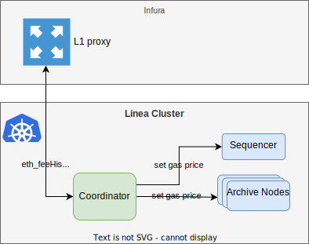

# Linea architecture alpha v3

<!--
ToC can be automatically updated with:
A) VC Code "Markdown All In One" plugin - https://marketplace.visualstudio.com/items?itemName=yzhang.markdown-all-in-one#table-of-contents
B) IntelliJ - https://www.jetbrains.com/help/idea/markdown.html#table-of-contents
-->

<!-- TOC -->
* [Linea architecture - alpha v3](#linea-architecture---alpha-v3)
* [Transaction execution and management](#transaction-execution-and-management)
  * [File system](#file-system)
  * [Sequencer](#sequencer)
  * [State manager](#state-manager)
    * [For L1 finalized states](#for-l1-finalized-states)
    * [For latest L2 states](#for-latest-l2-states)
  * [Coordinator](#coordinator)
    * [Batches](#batches)
    * [Blobs](#blobs)
    * [Aggregation](#aggregation)
    * [Finalization](#finalization)
    * [Notes](#notes)
  * [Blob compressor](#blob-compressor)
    * [Blob structure](#blob-structure)
      * [Packing](#packing)
      * [The Blob](#the-blob)
  * [Shnarf calculator](#shnarf-calculator)
  * [Traces API](#traces-api)
  * [Provers](#provers)
    * [Execution proofs](#execution-proofs)
    * [Compression Proof](#compression-proof)
    * [Aggregation proof](#aggregation-proof)
  * [Web3 signer](#web3-signer)
  * [L2 message service](#l2-message-service)
* [Gas price setting](#gas-price-setting)
* [L1 &lt;-> L2 interactions](#l1---l2-interactions)
  * [L1 finalization](#l1-finalization)
    * [Blobs](#blobs-1)
    * [Aggregation](#aggregation-1)
  * [L1 -> L2 messages](#l1---l2-messages)
  * [L2 -> L1](#l2---l1)
* [Finalized block tag on L2](#finalized-block-tag-on-l2)
<!-- TOC -->

# Transaction execution and management

The objective of the Linea network is to provide the functionality of Ethereum network at a fraction of the cost of Ethereum mainnet while providing guarantees on the correctness of its state.

Transaction execution is done using the [Clique consensus protocol](https://besu.hyperledger.org/23.4.0/private-networks/how-to/configure/consensus/clique) and correctness is guaranteed by providing proof of validity using zk-proofs.

The main components of Linea are:

* The sequencer which plays the role of the signer of the Clique protocol and creates blocks.
* The state manager for all L2 states which is used to store Linea state in a way that makes it easy to generate data used as inputs for zk-proof creation.
* The coordinator which orchestrates the different steps to create zk-proofs and persists them in the L1 Ethereum network. In particular, it's responsible for conflated batch creation, blob creation and aggregation
* The traces-APIs which provide trace counts and generate conflated trace files to be used for zk-proof creation
* The provers which generate zk-proof for conflated blocks, kzg commitment and compression proof of the blobs, as well as aggregated proof for multiple conflation and compression proofs.


The above diagram shows the flow from transaction to finalization. High level, the flow is as follow:
(1) the coordinator pulls the latest block from the sequencer,
(2) it gets the trace count from the traces API,
(3) once a batch is ready it generates the conflated traces and gets the state transition,
(4) request for an execution proof.
(5) a prover generates the execution proof,
(6) the coordinator packs a number of batches and generates a request for a blob,
(7) a prover generates the compression proof.
(8)The coordinator persists the blob on L1,
(9) then requests an aggregation proof for the finalization which is provided by the prover (10)
and then finally coordinator (11) posts the finalization proof on L1.

## File system

A file system is shared across multiple processes. It is used as a persistent queue.

The file system is used to store files for:

* Block traces
* Conflated-traces of batches
* Prover request (execution, compression & KZG commitment, aggregation)
* Proof responses (execution, compression & KZG commitment, aggregation)

A script automatically removes all files that are more than one week old.


## Sequencer

There is a unique instance of Sequencer. It’s a special instance of a consensus client based on Besu. The consensus protocol used is Clique.

The sequencer receives the transactions pre-validated by the Ethereum nodes in order to execute them. It arranges and combines the transactions into blocks.

Blocks produced by the sequencer, in addition to common verifications, must fulfill the below requirements:


1. trace counts are small enough to ensure the prover can prove the block
2. the block total gas usage is below the gasLimit parameter
3. And for each transaction:
   a. gas fees are above minMinableGasPrice
   b. They are ‘profitable’ i.e. the ratio between gas fees and compressed tx size is good enough.
   c. Neither `from` nor `to` fields of the transaction correspond to a blacklisted user.
   d. calldata size is below the configured limit.
   e. gas limit is below the configured limit.
4. compressed block data can fit into a blob of size 128kB.

Transactions exceeding trace limits are added to an unexecutableTxList in-memory to avoid reconsidering them. Similarly transactions that take too long to be processed by the sequencer are added to the unexecutable list. Transactions from the unexecutable lists are removed from the pool.

Priority transactions are prioritized over normal ones. Priority transactions are those sent by a user whose address is in a predefined list. It typically corresponds to transactions triggered by the Linea system.

Note that if no transactions are received within the block window, no block is generated. This behavior differs from Ethereum mainnet, where empty blocks are still produced to maintain chain continuity and prevent certain attacks.

If a transaction could not be included in the current block, it will remain as a candidate for inclusion in the next block.

Endpoints exposed by the sequencer and used in the flow are:

```
eth_blockNumber():
  blockNumber             string
```

```
eth_getBlockByNumber(
  blockNumber             string
  Transaction_detail_flag boolean
)
```

## State manager
<a id = "StateManagerL1"></a>

### For L1 finalized states

The state manager is configured differently based on the role it serves. The node described in this section is configured to serve the linea_getProof method, and has a different configuration than the one described in
[State manager - for latest L2 states](#StateManagerL2).

The publicly exposed method linea_getProof is served by the state manager. We have a single instance of state manager.

The state manager keeps its representation of the Linea state by applying the block transactions computed by the sequencer, which it receives through P2P. It is composed of two parts:

1. a Besu node with a Shomei plugin
2. and a Shomei node.

The Besu node is connected to the other Ethereum nodes using P2P, and from the blocks it receives, it generates a trielog which it sends to the Shomei node. The trielog is a list of state modifications that occurred during the execution of the block. As soon as Shomei receives this trielog it will apply these changes to his state. The Shomei nodes use Sparse Merkle trees to represent Linea’s state.

Besu and Shomei nodes know each other's IP and port for direct communication.

The Shomei plugin implements the RPC endpoint to return rollup proofs. Rollup proofs are used to provide a Merkle proof of the existence of a key in a given block number for a specific address. This proof can be used onchain in the Ethereum L1 for the blocks that have been finalized given their root hashes are present onchain.

This state manager instance, which is configured to handle the linea_getProof requests, is configured to store only the states corresponding to the L2 blocks finalized on L1.

To serve the linea_getProof requests, the Shomei instance needs to know the latest L2 block finalized on L1. It is pushed by the coordinator to Shomei through a dedicated RPC endpoint. The IP address and port of Shomei are set in the coordinator configuration, allowing direct communication.

The endpoint `linea_getProof` is as follows:


```
linea_getProof(
  address      string
  key          List[string]
  blockNumber  string
):
result: {
  accountProof   MerkleProof
  storageProofs  List[MerkleProof[^1]]
}
```


<a id = "StateManagerL2"></a>
### For latest L2 states

This component is identical to the one described in
[State manager - for L1 finalized states](#StateManagerL1) except that it is configured to compute and keep the state of each L2 block.

The IP address of Shomei is set in the coordinator configuration, allowing direct communication. The coordinator calls it to get proofs of state changes that are used as input for the prover.

End point exposed by the state manager and used in the flow are:


```
rollup_getZkEVMStateMerkleProofV0(
  startBlockNumber      int
  endBlockNumber        int
  zkStateManagerVersion string
):
  zkParentStateRootHash  string
  zkStateMerkleProof     StateMerkleProof[^1]
  zkStateManagerVersion  string
```

[^1]: Cf Shomei [documentation](#https://documenter.getpostman.com/view/27370530/2s93ebTr7h)


## Coordinator

The coordinator is responsible for


* deciding how many blocks can be conflated into a batch,
* deciding when to create a blob,
* deciding when an aggregation is generated,
* Posting proofs and data to L1.

For this, it gets the blocks from the sequencer using Json-RPC `eth_blockNumber `and` eth_getBlockByNumber `methods. This is done every ‘block time’ seconds.


### Batches

The coordinator has a candidate list of blocks to create the next batch. For every new block, the coordinator checks if it can be added to the candidate list while respecting the batch requirements (data size and line count limits). If a block cannot be added, a new batch is created from the candidate list, and a new list is started containing the new block.

When the coordinator creates of a batch of blocks, it must ensure that:

* The data of all blocks of a batch can fit in a single blob or in the call data of a single transaction (size limit).
* Each batch can be proven in a conflation-proof (trace counts limit).

For each block, the coordinator gets the trace counts by calling a service implementing traces-api `linea_getBlockTracesCountersV2` JSON-RPC method.

It checks the total compressed size of the transactions in the batch under construction using the compressor library `canAppendBlock `method of the compressor.

In case of low activity, the coordinator triggers batch creation after some time out.

Upon batch creation, the coordinator gathers the inputs to create an execution proof, namely: the conflated traces using `linea_generateConflatedTracesToFileV2`, and a Merkle proof for the change of state between the first and the last block of the batch using `rollup_getZkEVMStateMerkleProofV0`.

The coordinator collects all L2-L1 requests to be included in the batch looking at all logs emitted by `l2MessageServiceAddress` for each block in the batch. The coordinator also collects L1->L2 anchoring message event logs.

The coordinator creates an execution proof request containing all information required to generate the proof.

Note: conflation step might be removed in future if aggregation turns out to be enough. However we keep it to optimize the resources of the provers in case of low activities.


### Blobs

The coordinator creates blobs by combining multiple contiguous batches. Upon creation of a blob, the coordinator must ensure that the total compressed size of the batches constituting it can fit in an EIP4844 blob (the size has to be at most 128kB, our current limit being 127 KB). To ensure profitability, the coordinator aims at fitting as much data in a blob as possible, hence it considers the size left in a blob while building batches. Dictated by constraints on the decompression prover, the plain size of batches on a blob must also add up to no more than around 800 KB.

If a batch cannot be added to the current, a blob is created, and a new blob construction is initiated with the last batch.

For every blob, the coordinator creates a KZG consistency proof and a compression proof request.

Once the proofs are generated, the coordinator sends the blob to L1 with the KZG proofs using blob storage.

Once a blob has been created, the coordinator retrieves a state change merkle proof from the state manager using `rollup_getZkEVMStateMerkleProofV0. `

It then calculates its schnarf using the go calculate schnarf library.

Finally it creates a proof request file for a KZG and a compression proof. This request file contains all required data to generate the proof. The coordinator is responsible to ensure that all data required by the prover is available before creating the request.

Once the KZG proof is generated, the coordinator sends a transaction to L1 LineaService with the blob and this proof as described in
[L1 finalization](#L1_finalization). In addition, it sends merkle tree roots of merkle trees storing L1L2 and L2L1 messages.


### Aggregation

When sufficiently many batches and blobs have been generated, or after some maximum elapsed time, the coordinator creates a request file for the prover to generate an aggregation proof.

To build a request file, the coordinator needs information on the parent of the first block, its timestamp, the last L1-L2 message number and rolling hash anchored in this parent block. It gets these information using


```
L2MessageService.lastAnchoredL1MessageNumber and L2MessageService.l1RollingHashes.
```


The coordinator ensures that all data required by the prover is available before creating the request.


### Finalization

Once an aggregation proof is available and after some delay, the coordinator sends a finalization transaction to the L1 LineaService smart contract as described in
[L1 finalization](#L1_finalization). The smart contract verifies the caller entitlement, its solvability, the proof validity and then executes the L2 root hash state change.


### Notes

If the coordinator is down no new batches, blob or aggregation will be produced, but blocks will still be produced by the sequencer. These new blocks will not be finalized on L1, similarly previously created batches, blob and aggregation proofs not yet submitted will not be submitted to L1 until the coordinator restarts.


## Blob compressor

This is a library written in go which takes as input a block and returns a byte array of the compressed data. Note that the signature of the sender of the transaction is also removed from the compressed data.

The compressor library is initialized with a data limit parameter and exposes the methods

`startNewBatch `starts a new batch. Must be called between batches in the same blob

`canWrite `returning true if the cumulative data once compressed has a size smaller than the data limit.

`write `appends an RLP encoded block to the compressor

From the block, the compressor extract all transactions and format them keeping the following values:

For `DynamicFeeTxType`


| Field            | Type          | DynamicFee | AccessList | Legacy |
|------------------|---------------|-----------|-----------|--------|
| type             | uint8         | ✅         | ✅         | ✅      |
| nonce            | uint64        | ✅         | ✅         | ✅      |
| gasTipCap        | int           | ✅         |           |        |
| gasFeeCap        | int           | ✅         |           |        |
| gasPrice         | int           |           | ✅         | ✅      |
| gasLimit         | int           | ✅         | ✅         | ✅      |
| from             | byte[20]      | ✅         | ✅         | ✅      |
| to               | byte[20]      | ✅         | ✅         | ✅      |
| value            | int           | ✅         | ✅         | ✅      |
| data             | bytes         | ✅         | ✅         | ✅      |
| accessList       | AccessTuple[] | ✅         | ✅         |        |
| signature{r,s,v} | byte[]        |           |           |        |
| chainId          | int           |           |           |        |


```
AccessTuple
  Address      string
  StorageKeys  List[string]
```


Each block is an RLP encoded list, consisting of a timestamp and a list of transactions as described above.


```
Block
  blocktime uint64                // block timestamp
  encodedTransactions Transaction // list of transactions
```


### Blob structure

#### Packing

In order to use the EIP4844 KZG commitment pre-compiles, we need to ensure that the blob as stored is a sequence of 32 byte, BLS12-381 scalar field elements. Since the scalar field modulus is a 255-bit number, we can fit 254 bits of arbitrary data in each 32 byte chunk of the blob. This necessary zero padding consumes 1 KB of the blob’s size. The packing mechanism reads more significant bits of every input byte first, and writes to the more significant bits of the field elements first. The input is padded with `0xFF000000…` until it is exactly 127 KB long. This consumes at least another byte and thus gives us exactly 130047 bytes to work with.

#### The Blob

We usually refer to the following data structure as “the blob”, although in actuality it is stored after being packed as described above. The blob consists of compressed payload, following a header containing metadata.

Blob header:

```
Header
  version      uint16   // of the blob spec; currently 0xffff
  dictChecksum [32]byte
  nbBatches    uint16   // number of batches in payload
  batchNbBytes []uint24 // size of each batch in bytes
```


The payload is compressed according to the [Linea compress spec](https://github.com/Consensys/compress/blob/main/README.md). In short, the compressed stream consists of a 3-byte header denoting the `compress` spec version used, and whether the following payload is _actually_ _compressed_ (accounting for the rare cases where the “compression” algorithm backfires and results in expansion.)

Header:

```
Header
  version    uint16 // compressor spec version
  bypassed   uint8  // boolean
```


The payload that follows (the main bulk of the blob) is a sequence of RLP encoded blocks. The boundary between batches is _not_ marked here, as it is already specified in the blob header.


## Shnarf calculator

Go library to compute shnarf, commitment and kzg proofs. The library exposes a method `calculateShnarf` as follow:


```
calculateShnarf(
  eip4844Enabled                      boolean
  compressedData                      string
  parentStateRootHash                 string
  finalStateRootHash                  string
  prevShnarf                          string
  conflationOrderStartingBlockNumber  long
  conflationOrderUpperBoundariesLen   int
  conflationOrderUpperBoundaries      longArray
): CalculateShnarfResult
```


The returned data structure is:


```
CalculateShnarfResult
  commitment          string
  kzgProofContract    string
  kzgProofSideCar     string
  dataHash            string
  snarkHash           string
  expectedX           string
  expectedY           string
  expectedShnarf      string
  errorMessage        string
```

## Traces API

This component is used to generate line counts for each block and execution traces for batches. It is called by the coordinator. It is based on Geth and implements the traces-API endpoints. It has a representation of the ethereum state and executes the block to generate the traces.

Traces-API has two endpoints:

* Trace counts `linea_getBlockTracesCountersV2` returning the trace counts for a given block.
* Conflated trace generation `linea_generateConflatedTracesToFileV2` used to trigger the generation of conflated traces. Conflated traces are expected to be of size 100MB~500MB (JSON + gzipped). They are stored in a shared folder inside shared/traces/conflated. This shared folder acts as a queue for other services. This call returns the name of the file once it is generated.

The number of trace generators is static for a given deployment. It’s determined in the deployment configuration.

The current implementation of traces-API proactively produces trace files for blocks produced as soon as it receives them via P2P. Each instance of traces-API is configured to handle blocks whose id is 0 modulo the instance number. This allows the generation of block traces across multiple instances.

Trace count works by loading the generated trace file of a block and returning the actual number of lines in the file.

Trace conflation consists in combining multiple trace files with some specific merging.

The endpoint exposed by the traces api and used in the flow are:


```
linea_getBlockTracesCountersV2(
  blockNumber                    string
  expectedTracesEngineVersion    string
):
  tracesEngineVersion        string
  tracesCounters             map[string:string]

```


```
linea_generateConflatedTracesToFileV2(
  startBlockNumber              string
  endBlockNumber                string
  expectedTracesEngineVersion   string
):
  tracesEngineVersion        string
  conflatedTracesFileName    string //$first-$last.conflated.v$version.lt
```


`linea_generateConflatedTracesToFileV2 `is a blocking call. On completion, the trace API service persists the conflated trace to the shared file system and returns the conflated trace file name.


## Provers

There are three types of proofs: execution, compression and aggregation. The proving flow is identical for all of them. Each prover can generate any of the three types of proofs.

The number of instances of prover is dynamic and driven by the number of proof requests in the file system. There is also one instance of a large prover running to handle requests that could not be handled by the regular prover instance.

In testnet, but not in the main Linea Layer, there are instances of provers that generate shorter proofs. The regular provers generate full proofs with standard memory settings. The large prover also generates full proof, the difference is that it is configured to have 1TB of memory. They are used to deal with proofs that unexpectedly cannot be handled by the default full prover (oom, too many constraints, …).

The proof sizes are estimated to be in the order of 2MB to 15MB.

The prover encapsulate two processes:

*  One long running that monitors the file system and picks up proof requests.
*  Another short running one which is instantiated when a request is picked up by the first process.

The long running process monitor triggers and monitors the short running process. It allows capturing unexpected issues occurring during the proving.

The short running process is further made up of two internal logic components: the traces expander (aka Corset) and the prover itself. Corset is responsible for expanding the execution traces into a format the prover can use before building the proof. The prover relies on the [gnark](https://github.com/ConsenSys/gnark) library for zk-SNARKs implementation.

Corset is hosted inside the same process as the short running component of the prover. Traces are expanded by corset in memory and ingested by the prover directly, without the need for intermediate files to be sent over the network. This was motivated by the following reasons:

* Simplification of the overall architecture, with one less component to manage/maintain;
* Expanded traces is the largest file/chunk of data in the system, 100-500MB gzipped atm;
  * No need to send large file over the network
  * No need to decompress/deserialize expanded traces in the prover, which can be heavy when traces are large ~5GB;
  * Reduce the probability of incompatibility between Corset/Prover versions and their input/output formats;
* Reduce latency of the overall system (rather a beneficial side effect than a driving motivation);

The paragraphs highlights the roles of the different proofs that are generated.

### Execution proofs

It validates the correct execution of transactions within the Ethereum Virtual Machine (EVM). The proof system for the execution has a complex structure which involves the Vortex proof system, GKR and PLONK. The final proof takes the form of a BLS12-377-based PLONK proof.

An execution request proof is a file stored in the shared filesystem under the repository: with file name pattern: `$startBlockNumber-$endBlockNumber-etv$tracesVersion-stv$stateManagerVersion-getZkProof.json`

Requests folder name `/shared/prover-execution/requests`

Response folder name `/shared/prover-execution/responses`

Inprogress suffix: .inprogress

The request file contains this structure:

```
ProofRequest
  zkParentStateRootHash        string
  keccakParentStateRootHash    string
  conflatedExecutionTracesFile string
  tracesEngineVersion          string
  type2StateManagerVersion     string
  zkStateMerkleProof           arrayNode
  blocksData                   List[BlockData]
```


```
BlockData
  rlp                    string // hex encoded
  bridgeLogs             List[RlpBridgeLogsData]
```

```
RlpBridgeLogsData
  removed                 boolean
  logIndex               string
  transactionIndex string
  transactionHash  string
  blockHash        string
  blockNumber          string
  address          string
  data             string
  topics           List[string]
```

The response file contains this file structure:

```
ProofResponse
  proof                               string // hex encoded
  proverMode                          long
  verifierIndex                       long   // deprecated
  verifyingKeyShaSum                  string // hex encoded
  parentStateRootHash                 string // hex encoded
  hasParentStateRootHashMismatch      bool
  blocksData                          List[ResponseBlockData]
  proverVersion                       string
  firstBlockNumber                    long
  debugData                           {
    …
    finalHash                         string // hex encoded
  }
```

```
ResponseBlockData
  rlpEncodedTransactions              string       // hex encoded
  l2ToL1Hashes                        List[string] // hex encoded
  timestamp                           long
  rootHash                            string       // hex encoded
  fromAddresses                       List[string] // hex encoded
  batchReceptionIndices               List[int]
  lastRollingHashUpdatedEvent         RollingHashUpdatedEvent
```

```
RollingHashUpdatedEvent
   messageNumber                      long
   rollingHash                        string
```

### Compression proof

Verifies the effective compression of a byte stream of data, which represents the inputs for the EVM execution circuit. This circuit ensures that the compressed data submitted on Ethereum can be accurately decompressed, revealing the necessary inputs for validation. The proof system used for generating the compression proof is PLONK and is based on the curve BLS12-377. \


File name

```
$startBlockNumber-$endBlockNumber-bcv$blobCalculatorVersion-ccv$conflationCalculatorVersion-getZkBlobCompressionProof.json
```

Requests folder name `/shared/prover-compression/requests`

Response folder name `/shared/prover-compression/responses`

Inprogress suffix: .inprogress

Compression proof request file format:


```
BlobCompressionProofJsonRequest
  compressedData       bytes
  conflationOrder      BlockIntervals
  prevShnarf           bytes
  parentStateRootHash  bytes
  finalStateRootHash   bytes
  parentDataHash       bytes
  dataHash             bytes
  snarkHash            bytes
  expectedX            bytes
  expectedY            bytes
  expectedShnarf       bytes
  eip4844Enabled       boolean
  commitment           bytes
  kzgProofContract     bytes
  kzgProofSidecar      bytes
```


```
BlockIntervals
  startingBlockNumber  ULong
  upperBoundaries      List[ULong]
```

Compression proof response file format:

```
BlobCompressionProofJsonResponse
  compressedData           bytes // The data that are explicitly sent in the blob (i.e. after compression)
  conflationOrder          BlockIntervals
  prevShnarf               bytes
  parentStateRootHash      bytes
  finalStateRootHash       bytes
  parentDataHash           bytes
  dataHash                 bytes
  snarkHash                bytes
  expectedX                bytes
  expectedY                bytes
  expectedShnarf           bytes
  decompressionProof       bytes // zkProof of compression and consistency
  proverVersion            string
  verifyingKeyShaSum       string
  eip4844Enabled           boolean
  commitment               bytes
  kzgProofContract         bytes
  kzgProofSidecar          bytes
```

### Aggregation proof

Serves as the cornerstone of Linea's proof system, recursively verifying proofs from N execution circuits and M compression circuit instances. This circuit encapsulates the primary statement of Linea's prover and is the sole circuit subjected to external verification. The proof system used is a combination of several PLONK circuits on BW6, BLS12-377 and BN254 which tactically profits from the 2-chained curves BLS12-377 and BW6 to efficiently recurse the proofs. The final proof takes the form of a BN254 curve that can be efficiently verified on Ethereum thanks to the available precompiles.

File name

```
$startBlockNumber-$endBlockNumber-getZkAggregatedProof.json
```

Requests folder name `/shared/prover-aggregation/requests`

Response folder name `/shared/prover-aggregation/responses`

Inprogress suffix: .inprogress


```
AggregationProofJsonRequest
  executionProofs                                     List[String]
  compressionProofs                                   List[String]
  parentAggregationLastBlockTimestamp                 long
  parentAggregationLastL1RollingHashMessageNumber     long
  parentAggregationLastL1RollingHash                  string
```

```
ProofToFinalizeJsonResponse
  aggregatedProof                             bytes
  aggregatedProverVersion                     string
  parentStateRootHash                         bytes
  aggregatedVerifierIndex                     int
  aggregatedProofPublicInput                  bytes
  dataHashes                                  List[bytes]
  dataParentHash                              bytes
  lastFinalizedBlockNumber                    long
  finalBlockNumber                            long
  parentAggregationLastBlockTimestamp         string
  finalTimestamp                              string
  l1RollingHash                               bytes
  l1RollingHashMessageNumber                  long
  l2MerkleRoots                               List[bytes]
  l2MerkleTreesDepth                          int
  l2MessagingBlocksOffsets                    bytes
```


## Web3 signer

The [web3 signer](https://docs.web3signer.consensys.io/) is a generic system used by the coordinator to sign the transaction it sends to L1.

This allows authenticating the transaction in order to pay for the gas fees and to handle entitlement of the smart contract being called.

The web3 signer exposes the following REST endpoint which is used in the flow:


```
/api/v1/eth1/sign/${publicKey}(
  data        bytes
):
  signature  string
```


It is deployed as a HA system with primary and secondary pods. Transactions are signed by both primary and secondary. The keys are isolated from the core blockchain environment. Web3Signer is accessed by the Coordinator using a AWS VPC Private link feature.


## L2 message service

This is the L2 smart contract message service used to anchor messages submitted to L1.

It is responsible to ensure that messages are claimed at most once.

Methods


```
lastAnchoredL1MessageNumber():
  lastAnchoredL1MessageNumber uint256
```


```
l1RollingHashes(
  messageNumber  uint256
):
  rollingHash    bytes32
```


# Gas price setting

Gas pricing on Linea is designed to ensure the following three properties:
* Ensure Sequencer's inclusion logic is aligned to the L1 fee market. This is to avoid exploiting Linea to execute
transactions for unsustainably low fees
* Ensure the best user experience for users who use Linea nodes with extended capabilities. Unlike the vanilla Ethereum
protocol, gas price on Linea and other rollups is not 2-dimensional (base fee, priority fee). There's at least L1 fees
(execution fees and blob fees), infrastructural cost (mostly proving, but not only), potential priority fee
(only when there's a high congestion and there's competition for L2 block space). This is an issue for interoperability,
because vanilla Ethreum API isn't tailored for this. That's why there's a Besu plugin addressing this issue and
providing gas price depending on input transaction
* Ensure an acceptable user experience for users who run vanilla nodes. Namely, `eth_gasPrice` should return fees high enough, so
99.9% of transactions are includable on Linea.

This is how these challenges were solved technically:



The Coordinator fetches L1 fees data, based on which it will compute gas pricing components. There are 3 of them:
* Fixed cost. Represents infrastructural cost per unit of L2 gas. Doesn't really depend on the L1, and it's just a
configuration in the Coordinator
* Variable cost. Cost of 1 byte of compressed data on L2, which is finalized on L1 contract. Depends on the fees Linea
pays for finalization, which in turn depends on the L1 blob and execution fee market
* Legacy cost. Recommended gas price for the vanilla Ethereum API (`eth_gasPrice`)

## Gas pricing propagation
This information is delivered to nodes in 2 ways:
* via extraData, part of the vanilla Ethereum Protocol
* via RPC calls (only Geth and Besu are supported and tested)

### ExtraData
The Coordinator sends extraData to the Sequencer via `miner_setExtraData`. ExtraData contains all 3 fields mentioned above.
The Sequencer in turn uses this information for inclusion logic, to include only profitable transactions, and it adds last
received extraData to the next block it seals. Once it gets inside a block, it's propagated to all the nodes on Linea
via P2P as a block header's field. And since this info is on all the nodes, they can use this information to figure out,
what the gas price is for a given transaction that would make it includable on Linea. This currently is possible with Besu +
Linea plugin with a custom `linea_estimateGas` method.

### Direct RPC calls
For nodes that are reachable from the Coordinator directly, it's possible to set legacy cost via `miner_setGasPrice` (Geth)
and `miner_setMinGasPrice` (Besu). Later isn't really used, because extraData driven approach is superior and is
supported by Besu nodes with Linea plugin

### Ways to compute Legacy cost
In the Coordinator 2 ways are supported:
* So called "naive" way. Based on raw L1 fees processed by some formula
* So called "sample transaction" way. The idea is to take some relatively unprofitable transaction, estimate its
profitable gas price the same way Sequencer would. Resulting value would be used as a legacy cost. this is configured by
2 arguments to a profitability function: execution gas and tx compressed size and it may be changed depending on what
load is there on Linea.

# L1 &lt;-> L2 interactions

There are three types of integration:


* Block finalization, specific to Linea, it’s used to persist on L1 the state changes happening on L2. This happens in two steps, first blob data and KZG proofs are persisted on L1, then aggregation proofs are sent to L1
* L1 -> L2, typically used to transfer funds from L1 to L2.
* L2 -> L1, to retrieve funds from L2 back to L1.

A summary of each of them is given below.

<a id="L1_finalization"/>

## L1 finalization


### Blobs

The coordinator submits up to six blobs it generates at once to L1 using eip4844 standard to `v3.1 LineaRollup.submitBlobs` alongside
 the KZG proof. The LineaRollup smart contract verifies the validity of the proofs for the given blob data.

Blob submission can support sending up to six blobs at once. This allows saving cost by amortizing the processing
overhead over multiple blobs.

```
submitBlobs(
  blobSubmissionData BlobSubmissionData[]
  parentShnarf bytes32
  finalBlobShnarf bytes32
)
```

Where:

```
BlobSubmissionData
  submissionData SupportingSubmissionDataV2
  dataEvaluationClaim uint256
  kzgCommitment bytes
  kzgProof bytes
```

and

```
SupportingSubmissionDataV2
  finalStateRootHash bytes32
  firstBlockInData uint256
  finalBlockInData uint256
  snarkHash bytes32
```

### Aggregation

L1 finalization is triggered by the coordinator once an aggregation proof has been generated. This is done by triggering
a transaction to execute `LineaService.finalizeCompressedBlocksWithProof `method on L1. In the process, the aggregation
proof is sent to L1. Once the transaction is completed on L1, all the blocks are finalized on L2.

The interface use is described bellow labeled with their respective Linea release version.

```
finalizeBlocksWithProof(
  aggregatedProof bytes
  proofType uint256
  finalizationData FinalizationDataV2
)
```
where
```
FinalizationDataV2
  parentStateRootHash bytes32
  lastFinalizedShnarf bytes32
  finalBlockInData uint256
  shnarfData ShnarfData
  lastFinalizedTimestamp uint256
  finalTimestamp uint256
  lastFinalizedL1RollingHash bytes32
  l1RollingHash bytes32
  lastFinalizedL1RollingHashMessageNumber uint256
  l1RollingHashMessageNumber uint256
  l2MerkleTreesDepth uint256
  l2MerkleRoots bytes32[]
  l2MessagingBlocksOffsets bytes
```

Note that a method which can be used by the security council is also available to finalize a block without proof:
```
finalizeCompressedBlocksWithoutProof(
  finalizationData FinalizationData
)
```
## L1 -> L2 messages

Cross-chain operations happen when a user triggers a transaction on L1 by calling the `L1MessageService.sendMessage` method of message service smart contract, where L1MessageService is inherited by the deployed LineaRollup smart contract.


```
sendMessage(
  to String
  fee uint256
  calldata bytes
)
```


Optional ETH value to be transferred can be set when calling the above method.

When such a transaction is executed on L1, it triggers the publication of a message in the chain log of events, and the user pays for gas related to the L1 transaction execution.

Internally, the message service computes a rolling hash. It’s computed recursively as the hash of the previous rolling hash and the new message hash.

Linea’s coordinator, which is subscribing to L1 events, detects the L1 finalized (2 epochs to avoid reorgs) cross-chain MessageSent event and anchors it on L2. The coordinator anchors the messages by batches.

Anchoring (Anchoring is the process for placing a "cross-chain validity reference", that must exist for any message to be claimed) of messages is done through the executed via [anchorL1L2MessageHashes](https://github.com/Consensys/zkevm-monorepo/blob/main/contracts/contracts/messageService/l2/L2MessageManager.sol#L35) which is inherited by the [L2MessageService](https://github.com/Consensys/zkevm-monorepo/blob/main/contracts/contracts/messageService/l2/L2MessageService.sol) smart contract.

To anchor a message, the coordinator collects all L1-L2 message logs from which it gets the message hash, the rolling hash, the nonce (unique message number) and the L1 block number. Note that the L1 block number facilitates the processing but is not anchored on L2.

Filtering takes place beforehand to exclude anchored messages by looking on L2 at the `L2MessageService.inboxL1L2MessageStatus` for each hash to see if it’s already anchored

For those not yet anchored, it anchors the message hashes, recomputing the  rolling hash and final message number using the `L2MessageService` function. \


```
anchorL1L2MessageHashes(
  messageHashes          bytes32[]
  startingMessageNumber  uint256
  finalMessageNumber     uint256
  finalRollingHash       bytes32
)
```


The rolling hash passed as parameter to this method serves to perform a soft validation that the messages anchored on L2 lead to the expected rolling hash computed on L1. It is used to detect inconsistency early, but it does not provide provable guarantees. The full benefit of the rolling hash is only really realized on L1 finalization as part of the feedback loop.

Checking that the rolling hash and message number matches, ensures that the anchoring is censorship and tamper resistant.

Once the message is anchored on L2, it can then be claimed. Claims can be triggered via a Postman or manually.

The coordinator is the only operator entitled to anchor messages on L2.

Triggering via the Postman service will happen if the initial user asked for it and has prepaid the estimated fees. In this case, if the prepaid fees match the Postman service expectations (profitability based on gas costs etc.), it executes a claim transaction to call the L2 Service Message claimMessage method and the Postman service receives the prepaid estimated fees on L2.

Additionally, should the cost to execute the delivery be less than the fee paid, and the difference is cost effective to send to the message recipient, the difference is transferred to the destination user.

Claims can also be done manually. In this case, a user will trigger the claim transaction using the L2 Service Message and pay for the required gas fees.


```
claimMessage(
  from           address
  to             address
  fee            uint256
  value          uint256
  feeRecipient   address
  calldata       bytes
  nonce          uint256
)
```


When a message is claimed, an event is emitted using:


```
emit MessageClaimed(messageHash)
```


On finalization the value of the final (last in rollup data being finalized) RollingHashUpdated event on the L2 Service Message is validated against the expected value on L1 exists (using` l1RollingHash bytes32` and `l1RollingHashMessageNumber uint256`). A successful finalization guarantees that no message can be claimed on L2 that did not exist on L1, and that no messages were excluded on anchoring message hashes.


## L2 -> L1

Whenever a transaction is executed on L2 to send a message to L1, a MessageSent event is emitted.

Txs to send L2 -> L1 messages are sent to the L2 Message Service function:


```
sendMessage(
  to String
  fee uint256
  calldata bytes
)
```


Optional eth can be set, this value is then mapped to the value field of the MessageSent event.

Fee must have a minimum value of 0.0001 ETH to prevent DDOS attacks.

```
MessageSent(
  from String
  to String
  fee uint256
  value uint256
  nonce uint256
  calldata bytes
  messageHash bytes32
)
```

A configurable fixed Merkle tree depth is set on the Prover.

The Prover collects ordered message hashes from all emitted MessageSent events contained in the blocks being finalized.

The Prover groups the message hashes based on the Merkle tree depth configured. E.g. a depth of 5 will group the hashes into groups of 2^5 (32) hashes.

A group will be filled with empty hashes to make 32 if it is partial.

The prover computes the Merkle root of each group.

During the finalization, the Merkle roots are anchored on L1.

The depth of the tree forms part of the finalization calldata.

An event is emitted per Merkle root anchoring along with the depth.

Offsets indicating which blocks post the last finalized block containing MessageSent events are sent during finalization.

The finalization process emits on L1 an event per L2 block containing an L2 MessageSent event.

Any party (e.g. via an npm package we provide for the bridge/partners etc) does the following :


1. Takes a message on L2 noting the block the event was fired on.
2. Finds the event (and transaction hash) where that block was emitted/finalized on L1 using the block number as a filter.
3. Retrieves all block numbers from the events in that transaction.
4. Retrieves the tree depth from the transaction events.
5. Queries the L2 blocks in that list (or range - lowest-highest) to get all MessageSent events.
6. Groups all the message hashes from the query into groups based on the tree depth from the Merkle root anchoring events. E.g. depth 5 results in 2^5 (32) hashes. A group will be filled with empty hashes to make 32 if it is partial.
7. Picks the group for the required message hash and constructs a Merkle proof to claim against using the group's message hashes.


# Finalized Block Tag on L2

For a Linea besu node to support `finalized` tag on Ethereum RPC methods (e.g. `eth_getBlockByNumber`), the linea besu node would need to run with the `finalized-tag-updater` plugin (download [page](https://github.com/Consensys/zkevm-monorepo/releases/tag/finalized-tag-updater-v0.0.1) and please note that it requires a Github access token for now but would soon to be publicly downloadable from [linea-monorepo](https://github.com/Consensys/linea-monorepo))

The plugin periodically calls the L1 Linea rollup contract's `currentL2BlockNumber` method to retrieve the latest proven L2 block number from the current L1 `finalized` block, and set the L2 block number as the `finalized` (and `safe` block number) to the plugin-hosting besu client.

For more information on how to run besu node with plugin, please check out the Besu official [website](https://besu.hyperledger.org/private-networks/concepts/plugins)
