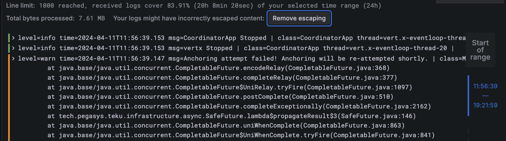

# Linea developer guidelines <!-- omit in toc -->

<!--
ToC can be automatically updated with:
A) VC Code "Markdown All In One" plugin - https://marketplace.visualstudio.com/items?itemName=yzhang.markdown-all-in-one#table-of-contents
B) IntelliJ - https://www.jetbrains.com/help/idea/markdown.html#table-of-contents
-->

- [Logging Guidelines](#logging-guidelines)
  - [Log Levels](#log-levels)
  - [Log Format](#log-format)
    - [Considerations](#considerations)
    - [Exceptions Stack Traces](#exceptions-stack-traces)
  - [Java/Kotlin Guidelines](#javakotlin-guidelines)
    - [Favor argument placeholder instead of String templating](#favor-argument-placeholder-instead-of-string-templating)
    - [Performance](#performance)
  - [GO Guidelines](#go-guidelines)
  - [JavaScript/Typescript Guidelines](#javascripttypescript-guidelines)

## Logging Guidelines

Effective logging is crucial for understanding the behavior of our applications, diagnosing issues, and ensuring that our system is running smoothly. We have established the following logging guidelines, please adhere to these practices to help us keep our logs informative, actionable, and manageable.

### Log Levels
- **error** - for errors that compromise application/Linea functionality, may have impact on user experience and should trigger an investigation right away. Consider including stack trace for unknown errors. Examples:
  - Transaction reverted with "Invalid Proof" error.
  - Message anchoring TX reverted
- **warn** - for error that application can recover/retry from but will compromise the system if the problem persists overtime. e.g. 3 consecutive connection errors to upstream service within 30s period.
- **info** - Application key events and state transitions, e.g Start/Stop, new batches/blob/aggregations generated and proven. Debounce repetitive log lines with 15s, also "heartbeat" logs informing why something expected is not happening, otherwise may look like a crash. INFO should offer the right amount of logs to Production.
- **debug** - For extra events/state transitions that to help troubleshoot debug the application. Performance overhead should not be over 20%.

`error` or `warn` logs will trigger alerts in our system, please use these levels carefully.


### Log Format
Our logs aim to be both human and machine friendly. We use [Grafana and Loki](https://grafana.com/docs/loki/latest/query/log_queries/#logfmt) so our logs must be **single-lined** and follow [logfmt](https://brandur.org/logfmt) format: `varName1=value1 varName2=value2`. Note, values must be white space delimited without trailing punctuation or special characters.

Log entry
```
time=<iso8601_utc_time> level=<log_level> message=<message> | <other_runtime_fields> | <inline_error_stack_trace>
```

Message format
```
<Event/action description>: contextField1=value1 contextField2=value2
```

<details>
  <summary>Sys log example</summary>
  <div>

```syslog
time=2024-04-10T13:59:38.328+00:00 level=INFO message=new blob: blob=[9726..9729]4 trigger=TIME_LIMIT startBlockNumber=9726 endBlockNumber=9729 blobSizeBytes=11808 blobBatchesCount=4 blobBatchesLimit=299 blobBatchesList=[[9726..9726]1, [9727..9727]1, [9728..9728]1, [9729..9729]1]4 | class=GlobalBlobAwareConflationCalculator thread=pool-2-thread-13
time=2024-04-10T15:40:18.1880-00:00 level=INFO message=blobs to submit: lastFinalizedBlockNumber=9572 totalBlobs=8 maxBlobsToSubmitPerTick=5 newBlobsToSubmit=[[9887..9888]2,[9889..9908]20]2  startBlockNumber=9887 endBlockNumber=9888 alreadySubmittedBlobs=[[9573..9573]1, [9574..9721]148, [9722..9722]1, [9723..9725]3, [9726..9885]160, [9886..9886]1]6 | class=BlobSubmissionCoordinatorImpl thread=pool-2-thread-140
time=2024-04-16T14:21:02.388Z level=ERROR message=failed to fetch batches: errorMessage=Index 4 out of bounds for length 3 | logger=Playground thread=test-error-timer | java.lang.ArrayIndexOutOfBoundsException: Index 4 out of bounds for length 3\n	at java.base/java.util.Arrays$ArrayList.get(Arrays.java:4165)\n	at net.consensys.zkevm.coordinator.app.PlaygroundKt$testLog$$inlined$timer$2.run(Timer.kt:151)\n	at java.base/java.util.TimerThread.mainLoop(Timer.java:566)\n	at java.base/java.util.TimerThread.run(Timer.java:516)
```
 </div>
</details>

**Note**: time needs to be in [ISO8601](https://en.wikipedia.org/wiki/ISO_8601) format with milliseconds and timezone, like in the one of 3 examples above (invalid `2024-04-10T15:40:18.188`) otherwise promtail won't parse it correctly.

Query example to filter logs for blocks numbers between 9720 and 9888
```json
{cluster="linea-devnet", pod="coordinator"} | logfmt | startBlockNumber >= 9720 and endBlockNumber <= 9888
```


#### Considerations
- All the info/context associated with an event shall be in a single log message instead of fragmented across multiple log messages
- Consistency: log the same event/entity/concept exactly the same way everywhere across the application. 
  > Example: Continuous block intervals: `[10..15]6`
- Sensitive information: when logging a field make sure it doesn't have sensitive information. Examples:
  - Application start up configs may contain APP Keys, passwords, etc. Use masked fields instead
  - Debug/trace HTTP requests with credentials in the headers/URLs
- Don't log "non-happy path" valid cases as error/warnings, e.g HTTP server logging "404 not path not found" can open window for logging DoS/noise

#### Exceptions Stack Traces

Error's Stack Traces shall be logged in-line with `\n` character representing line breaks so Loki can escape them and display them in multi-line.

<details>
  <summary>Sys log example</summary>
  <div>

```syslog
level=warn time=2024-04-11T11:56:39.147 msg=Anchoring attempt failed! Anchoring will be re-attempted shortly. | class=MessageAnchoringService thread=vert.x-eventloop-thread-8 | java.util.concurrent.CompletionException: java.lang.InterruptedException: sleep interrupted\n	at java.base/java.util.concurrent.CompletableFuture.encodeRelay(CompletableFuture.java:368)\n	at java.base/java.util.concurrent.CompletableFuture.completeRelay(CompletableFuture.java:377)\n	at java.base/java.util.concurrent.CompletableFuture$UniRelay.tryFire(CompletableFuture.java:1097)\n	at java.base/java.util.concurrent.CompletableFuture.postComplete(CompletableFuture.java:510)\n	at java.base/java.util.concurrent.CompletableFuture.completeExceptionally(CompletableFuture.java:2162)\n	at tech.pegasys.teku.infrastructure.async.SafeFuture.lambda$propagateResult$3(SafeFuture.java:146)\n	at java.base/java.util.concurrent.CompletableFuture.uniWhenComplete(CompletableFuture.java:863)\n	at java.base/java.util.concurrent.CompletableFuture$UniWhenComplete.tryFire(CompletableFuture.java:841)\nat java.base/java.util.concurrent.CompletableFuture.postComplete(CompletableFuture.java:510)\n	at java.base/java.util.concurrent.CompletableFuture.completeExceptionally(CompletableFuture.java:2162)\n	at io.vertx.core.Future.lambda$toCompletionStage$3(Future.java:583)\n	at io.vertx.core.impl.future.FutureImpl$4.onFailure(FutureImpl.java:188)\n	at io.vertx.core.impl.future.FutureBase.lambda$emitFailure$1(FutureBase.java:75)\n	at io.netty.util.concurrent.AbstractEventExecutor.runTask(AbstractEventExecutor.java:173)\n	at io.netty.util.concurrent.AbstractEventExecutor.safeExecute(AbstractEventExecutor.java:166)\n	at io.netty.util.concurrent.SingleThreadEventExecutor.runAllTasks(SingleThreadEventExecutor.java:470)\n	at io.netty.channel.kqueue.KQueueEventLoop.run(KQueueEventLoop.java:300)\n	at io.netty.util.concurrent.SingleThreadEventExecutor$4.run(SingleThreadEventExecutor.java:997)\n	at io.netty.util.internal.ThreadExecutorMap$2.run(ThreadExecutorMap.java:74)\n	at io.netty.util.concurrent.FastThreadLocalRunnable.run(FastThreadLocalRunnable.java:30)\n	at java.base/java.lang.Thread.run(Thread.java:833)\nCaused by: java.lang.InterruptedException: sleep interrupted\n	at java.base/java.lang.Thread.sleep(Native Method)\n	at net.consensys.zkevm.ethereum.coordination.messageanchoring.L1EventQuerierImpl.collectEvents(L1EventQuerierImpl.kt:111)\n	at net.consensys.zkevm.ethereum.coordination.messageanchoring.L1EventQuerierImpl.getSendMessageEventsForAnchoredMessage$lambda-0(L1EventQuerierImpl.kt:74)\n	at io.vertx.core.impl.ContextImpl.lambda$executeBlocking$1(ContextImpl.java:190)\n	at io.vertx.core.impl.ContextInternal.dispatch(ContextInternal.java:276)\n	at io.vertx.core.impl.ContextImpl.lambda$internalExecuteBlocking$2(ContextImpl.java:209)\n	at io.vertx.core.impl.TaskQueue.run(TaskQueue.java:76)\n	at java.base/java.util.concurrent.ThreadPoolExecutor.runWorker(ThreadPoolExecutor.java:1136)\n	at java.base/java.util.concurrent.ThreadPoolExecutor$Worker.run(ThreadPoolExecutor.java:635)\n	... 2 more
```
 </div>
</details>

With **Escape newlines** enabled in Grafana, the stack trace will be displayed as multi-line,but still a single log entry in Loki.


### Java/Kotlin Guidelines

These guidelines reelect some specificities of our logging library [Log4J2](https://logging.apache.org/log4j/2.x/)

#### Favor argument placeholder instead of String templating
```kotlin
// Do
log.info("already proven: batch={}, reusedResponse={}", batch, fileName)

// Don't - new string created every time, even if INFO is disabled
log.info("already proven: batch=${batch}, reusedResponse=${fileName}")
```

#### Performance
Avoid heavy computation for logging arguments. Consider using argument suppliers in Debug/Trace


```kotlin
// Ok
log.debug(
  "state={}",
  { getTreeStateAsString() }  // argument supplier fun, lazy evaluated
)
// OK
if(log.isDebugEnabled) {
  log.debug("state={}", getTreeStateAsString())
}

// Not OK - will always evaluate getTreeStateAsString() function even debug is not enabled
log.debug("state={}”, getTreeStateAsString())
```

### GO Guidelines

### JavaScript/Typescript Guidelines
