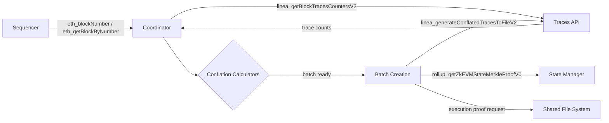
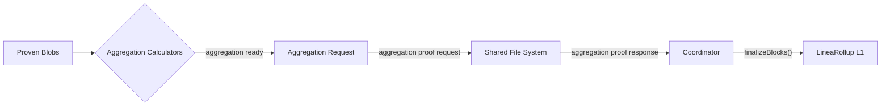

# Coordinator

> Orchestrates conflation, blob submission, aggregation, finalization, gas pricing, and message anchoring.

## Overview

The coordinator is the central backend service that drives the Linea proving and submission pipeline. It is a Kotlin/Vert.x application that:

1. Pulls blocks from the sequencer
2. Decides batch boundaries (conflation)
3. Compresses batches into blobs
4. Submits blobs to L1
5. Orchestrates proof generation (execution, compression, aggregation)
6. Submits finalization transactions to L1
7. Anchors L1→L2 messages on L2
8. Computes and propagates gas pricing

## Components

| Component | Path | Role |
|-----------|------|------|
| CoordinatorApp | `coordinator/app/` | Main application entry point |
| L1DependentApp | `coordinator/app/` | L1 submission pipeline (blobs, aggregations, gas pricing) |
| ConflationApp | `coordinator/app/` | Conflation orchestration |
| BlobSubmissionCoordinator | `coordinator/ethereum/blob-submitter/` | Periodic blob submission to L1 |
| AggregationFinalizationCoordinator | `coordinator/ethereum/blob-submitter/` | Periodic finalization after aggregation |
| Message Anchoring | `coordinator/ethereum/message-anchoring/` | L1→L2 message anchoring |
| Gas Pricing | `coordinator/ethereum/gas-pricing/` | L1 fee-based gas price computation |
| Finalization Monitor | `coordinator/ethereum/finalization-monitor/` | Monitors finalization status |
| Persistence | `coordinator/persistence/` | PostgreSQL storage for blobs, aggregations, batches, fee history |
| Clients | `coordinator/clients/` | Prover, traces, Shomei, Web3Signer, smart contract clients |

## Conflation Pipeline

### Conflation Calculators

Multiple calculators run simultaneously; a batch is created when any triggers:

| Calculator | Trigger Condition |
|------------|-------------------|
| `ConflationCalculatorByExecutionTraces` | Trace line counts exceed prover capacity |
| `ConflationCalculatorByDataCompressed` | Compressed data exceeds blob size limit |
| `ConflationCalculatorByTimeDeadline` | Maximum elapsed time since last batch |
| `ConflationCalculatorByBlockLimit` | Maximum number of blocks per batch |
| `ConflationCalculatorByTargetBlockNumbers` | Specific target block numbers (hard forks) |
| `TimestampHardForkConflationCalculator` | Timestamp-based hard fork boundaries |

`GlobalBlockConflationCalculator` and `GlobalBlobAwareConflationCalculator` compose these into a unified decision.

## Aggregation Pipeline

### Aggregation Triggers

| Calculator | Trigger |
|------------|---------|
| `AggregationTriggerCalculatorByProofLimit` | Max number of execution proofs |
| `AggregationTriggerCalculatorByBlobLimit` | Max number of blobs |
| `AggregationTriggerCalculatorByDeadline` | Maximum elapsed time |
| `AggregationTriggerCalculatorByTargetBlockNumbers` | Target block boundaries |
| `AggregationTriggerCalculatorByTimestampHardFork` | Timestamp hard fork boundaries |

## Gas Pricing

The coordinator computes three gas pricing components and propagates them to the sequencer:

| Component | Description |
|-----------|-------------|
| Fixed cost | Infrastructure cost per unit of L2 gas (configuration-driven) |
| Variable cost | Cost of 1 byte of compressed L2 data finalized on L1 (depends on L1 blob/execution fees) |
| Legacy cost | Recommended `eth_gasPrice` for vanilla Ethereum API compatibility |

Pricing is delivered via `miner_setExtraData` (embedded in block headers for P2P propagation) and direct RPC calls (`miner_setMinGasPrice`).

See [L1 Dynamic Gas Pricing](../l1-dynamic-gas-pricing.md) for the full pricing formula.

## Proof Coordination

The coordinator communicates with provers via a shared file system:

| Proof Type | Request Dir | Response Dir |
|------------|-------------|--------------|
| Execution | `/shared/prover-execution/requests` | `/shared/prover-execution/responses` |
| Compression | `/shared/prover-compression/requests` | `/shared/prover-compression/responses` |
| Aggregation | `/shared/prover-aggregation/requests` | `/shared/prover-aggregation/responses` |

Files use `.inprogress` suffix during processing. Naming pattern: `$startBlock-$endBlock-$versions-$proofType.json`.

## Key Endpoints

| Endpoint | Source | Used For |
|----------|--------|----------|
| `eth_blockNumber`, `eth_getBlockByNumber` | Sequencer | Block polling |
| `linea_getBlockTracesCountersV2` | Traces API | Trace counts per block |
| `linea_generateConflatedTracesToFileV2` | Traces API | Conflated trace generation |
| `rollup_getZkEVMStateMerkleProofV0` | State Manager (Shomei) | State transition proofs |
| `/api/v1/eth1/sign/${publicKey}` | Web3Signer | L1 transaction signing |

## Restart Behavior

If the coordinator goes down, blocks continue to be produced by the sequencer. On restart, the coordinator resumes from the last persisted state, re-submitting unfinalized blobs and aggregations.

## Test Coverage

| Test File | Runner | Validates |
|-----------|--------|-----------|
| `coordinator/` unit tests | JUnit 5 | Conflation calculators, aggregation triggers, gas pricing |
| `coordinator/ethereum/blob-submitter/` integration | JUnit 5 | `BlobAndAggregationFinalizationIntTest` |
| `e2e/src/submission-finalization.spec.ts` | Jest | End-to-end submission and finalization |
| `e2e/src/restart.spec.ts` | Jest | Resume after coordinator restart |

## Related Documentation

- [Architecture: Coordinator](../architecture-description.md#coordinator)
- [Architecture: Gas Price Setting](../architecture-description.md#gas-price-setting)
- [L1 Dynamic Gas Pricing](../l1-dynamic-gas-pricing.md)
- [Official docs: Coordinator](https://docs.linea.build/protocol/architecture/coordinator)
