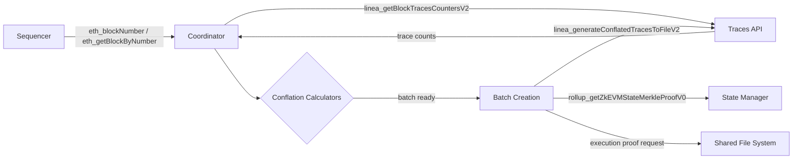
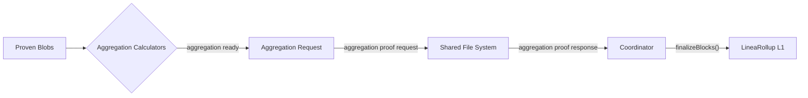

# Coordinator

> Orchestrates conflation, blob submission, aggregation, finalization, gas pricing, and message anchoring.

## Overview

The coordinator is the central backend service that drives the Linea proving and submission pipeline. It is a Kotlin/Vert.x application that:

1. Pulls blocks from the sequencer
2. Decides batch boundaries (conflation)
3. Compresses batches into blobs
4. Submits blobs to L1
5. Orchestrates proof generation (execution, compression, aggregation)
6. Submits finalization transactions to L1
7. Anchors L1→L2 messages on L2
8. Computes and propagates gas pricing

## Components

| Component | Path | Role |
|-----------|------|------|
| CoordinatorApp | `coordinator/app/` | Main application entry point |
| L1DependentApp | `coordinator/app/` | L1 submission pipeline (blobs, aggregations, gas pricing) |
| ConflationApp | `coordinator/app/` | Conflation orchestration |
| BlobSubmissionCoordinator | `coordinator/ethereum/blob-submitter/` | Periodic blob submission to L1 |
| AggregationFinalizationCoordinator | `coordinator/ethereum/blob-submitter/` | Periodic finalization after aggregation |
| Message Anchoring | `coordinator/ethereum/message-anchoring/` | L1→L2 message anchoring |
| Gas Pricing | `coordinator/ethereum/gas-pricing/` | L1 fee-based gas price computation |
| Finalization Monitor | `coordinator/ethereum/finalization-monitor/` | Monitors finalization status |
| Persistence | `coordinator/persistence/` | PostgreSQL storage for blobs, aggregations, batches, fee history |
| Clients | `coordinator/clients/` | Prover, traces, Shomei, Web3Signer, smart contract clients |

## Conflation Pipeline


```mermaid
flowchart LR
    Seq[Sequencer] -->|"eth_blockNumber / eth_getBlockByNumber"| Coord[Coordinator]
    Coord -->|"linea_getBlockTracesCountersV2"| Traces[Traces API]
    Traces -->|trace counts| Coord
    Coord --> CC{Conflation Calculators}
    CC -->|batch ready| Batch[Batch Creation]
    Batch -->|"linea_generateConflatedTracesToFileV2"| Traces
    Batch -->|"rollup_getZkEVMStateMerkleProofV0"| Shomei[State Manager]
    Batch -->|execution proof request| FS[Shared File System]
```

### Conflation Calculators

Multiple calculators run simultaneously; a batch is created when any triggers:

| Calculator | Trigger Condition |
|------------|-------------------|
| `ConflationCalculatorByExecutionTraces` | Trace line counts exceed prover capacity |
| `ConflationCalculatorByDataCompressed` | Compressed data exceeds blob size limit |
| `ConflationCalculatorByTimeDeadline` | Maximum elapsed time since last batch |
| `ConflationCalculatorByBlockLimit` | Maximum number of blocks per batch |
| `ConflationCalculatorByTargetBlockNumbers` | Specific target block numbers (hard forks) |
| `TimestampHardForkConflationCalculator` | Timestamp-based hard fork boundaries |

`GlobalBlockConflationCalculator` and `GlobalBlobAwareConflationCalculator` compose these into a unified decision.

## Aggregation Pipeline


```mermaid
flowchart LR
    Blobs[Proven Blobs] --> AC{Aggregation Calculators}
    AC -->|aggregation ready| Agg[Aggregation Request]
    Agg -->|aggregation proof request| FS[Shared File System]
    FS -->|aggregation proof response| Coord[Coordinator]
    Coord -->|"finalizeBlocks()"| L1[LineaRollup L1]
```

### Aggregation Triggers

| Calculator | Trigger |
|------------|---------|
| `AggregationTriggerCalculatorByProofLimit` | Max number of execution proofs |
| `AggregationTriggerCalculatorByBlobLimit` | Max number of blobs |
| `AggregationTriggerCalculatorByDeadline` | Maximum elapsed time |
| `AggregationTriggerCalculatorByTargetBlockNumbers` | Target block boundaries |
| `AggregationTriggerCalculatorByTimestampHardFork` | Timestamp hard fork boundaries |

## Gas Pricing

The coordinator computes three gas pricing components and propagates them to the sequencer:

| Component | Description |
|-----------|-------------|
| Fixed cost | Infrastructure cost per unit of L2 gas (configuration-driven) |
| Variable cost | Cost of 1 byte of compressed L2 data finalized on L1 (depends on L1 blob/execution fees) |
| Legacy cost | Recommended `eth_gasPrice` for vanilla Ethereum API compatibility |

Pricing is delivered via `miner_setExtraData` (embedded in block headers for P2P propagation) and direct RPC calls (`miner_setMinGasPrice`).

See [L1 Dynamic Gas Pricing](../l1-dynamic-gas-pricing.md) for the full pricing formula.

## Proof Coordination

The coordinator communicates with provers via a shared file system:

| Proof Type | Request Dir | Response Dir |
|------------|-------------|--------------|
| Execution | `/shared/prover-execution/requests` | `/shared/prover-execution/responses` |
| Compression | `/shared/prover-compression/requests` | `/shared/prover-compression/responses` |
| Aggregation | `/shared/prover-aggregation/requests` | `/shared/prover-aggregation/responses` |

Files use `.inprogress` suffix during processing. Naming pattern: `$startBlock-$endBlock-$versions-$proofType.json`.

## Key Endpoints

| Endpoint | Source | Used For |
|----------|--------|----------|
| `eth_blockNumber`, `eth_getBlockByNumber` | Sequencer | Block polling |
| `linea_getBlockTracesCountersV2` | Traces API | Trace counts per block |
| `linea_generateConflatedTracesToFileV2` | Traces API | Conflated trace generation |
| `rollup_getZkEVMStateMerkleProofV0` | State Manager (Shomei) | State transition proofs |
| `/api/v1/eth1/sign/${publicKey}` | Web3Signer | L1 transaction signing |

## Restart Behavior

If the coordinator goes down, blocks continue to be produced by the sequencer. On restart, the coordinator resumes from the last persisted state, re-submitting unfinalized blobs and aggregations.

## Conflation Backtesting

Conflation backtesting allows re-running the conflation and proof-request pipeline over a historical block range without affecting the live submission pipeline. It is useful for testing new blob compressor versions, batch sizing strategies, or conflation parameter changes against real historical data.

### How It Works

1. Submit one or more backtesting jobs via `conflation_createProverRequests`, each specifying a block range, blob compressor version, a **traces** RPC configuration (`tracesApi`, and optionally `tracesConflationApi`), and the Shomei (state manager) endpoint.
2. Each job spins up an isolated `ConflationBacktestingApp` instance. Trace line counts always use `tracesApi`. If `tracesConflationApi` is **omitted**, the same `tracesApi` client is also used for conflated traces (`linea_generateConflatedTracesToFileV2`). If `tracesConflationApi` is **set** (split-traces deployment), counters stay on `tracesApi` and conflated traces use `tracesConflationApi`; both must declare the **same** `version` string. Blobs use the requested compressor version; prover request files are written under `conflation.backtesting-directory` — same file layout as the live pipeline.
3. Poll job status via `conflation_getReconflationJobsStatus` until `COMPLETED`.

### Prerequisites and validation

| Rule | Rationale                                                       |
|------|-----------------------------------------------------------------|
| `conflation.backtesting-directory` is set in coordinator config | Per-job output needs a parent directory on disk                 |
| `blobCompressorVersion` is not `V2` | Compressor `V3` or above is required for backtesting            |
| If `tracesConflationApi` is present, `tracesConflationApi.version` equals `tracesApi.version` | Split clients must target the same traces API protocol version  |
| No URL overlap between `tracesApi` / `tracesConflationApi` (when set) and the coordinator’s live `[traces]` endpoints (`common`, `counters`, or `conflation`) | Keeps backtesting traffic off the main conflation pipeline URLs |

These checks run when each job is submitted.

### JSON-RPC API

#### `conflation_createProverRequests`

Submits one or more backtesting jobs. Each element in `params` is an independent job. Returns a list of job IDs (one per submitted job).

**Blob compressor versions (backtesting):** `V3` or above.

```json
{
  "jsonrpc": "2.0",
  "id": 1,
  "method": "conflation_createProverRequests",
  "params": [
    {
      "startBlockNumber": 1,
      "endBlockNumber": 2,
      "blobCompressorVersion": "V3",
      "batchesFixedSize": null,
      "parentBlobShnarf": null,
      "tracesApi": {
        "endpoint": "http://<traces-counters-node>:8545",
        "version": "v2",
        "requestLimitPerEndpoint": 1
      },
      "tracesConflationApi": {
        "endpoint": "http://<traces-conflation-node>:8545",
        "version": "v2",
        "requestLimitPerEndpoint": 1
      },
      "shomeiApi": {
        "endpoint": "http://shomei:8888",
        "version": "v0.0.4",
        "requestLimitPerEndpoint": 1
      }
    }
  ]
}
```

To use **one** traces base URL for both counters and conflated traces, omit the `tracesConflationApi` object entirely; only `tracesApi` is required in that case.

**curl:**

> Port `9546` is the coordinator's JSON-RPC API port (`json-rpc-port` under `[api]` in the coordinator config, mapped in `docker/compose-spec-l2-services.yml` as `"9546:9546"`).

```bash
curl -X POST http://localhost:9546 \
  -H 'Content-Type: application/json' \
  -d '{
    "jsonrpc": "2.0",
    "id": 1,
    "method": "conflation_createProverRequests",
    "params": [
      {
        "startBlockNumber": 1,
        "endBlockNumber": 2,
        "blobCompressorVersion": "V3",
        "batchesFixedSize": null,
        "parentBlobShnarf": null,
        "tracesApi": {
          "endpoint": "http://<traces-counters-node>:8545",
          "version": "beta-v5.0-rc6",
          "requestLimitPerEndpoint": 1
        },
        "tracesConflationApi": {
          "endpoint": "http://<traces-conflation-node>:8546",
          "version": "beta-v5.0-rc6",
          "requestLimitPerEndpoint": 1
        },
        "shomeiApi": {
          "endpoint": "http://shomei:8888",
          "version": "3.0.0",
          "requestLimitPerEndpoint": 1
        }
      }
    ]
  }'
```

**Response:**

```json
{
  "jsonrpc": "2.0",
  "id": 1,
  "result": ["1-2-hash"]
}
```

#### `conflation_getReconflationJobsStatus`

Polls the status of one or more jobs by ID. Returns `IN_PROGRESS` or `COMPLETED` for each.

```json
{
  "jsonrpc": "2.0",
  "id": 2,
  "method": "conflation_getReconflationJobsStatus",
  "params": ["1-2-hash"]
}
```

**curl:**

```bash
curl -X POST http://localhost:9546 \
  -H 'Content-Type: application/json' \
  -d '{
    "jsonrpc": "2.0",
    "id": 2,
    "method": "conflation_getReconflationJobsStatus",
    "params": ["1-2-hash"]
  }'
```

**Response:**

```json
{
  "jsonrpc": "2.0",
  "id": 2,
  "result": ["COMPLETED"]
}
```

### Field Reference

| Field | Type | Required | Description                                                                                                                                   |
|-------|------|----------|-----------------------------------------------------------------------------------------------------------------------------------------------|
| `startBlockNumber` | integer | ✓ | First block of the range to backtest (inclusive)                                                                                              |
| `endBlockNumber` | integer | ✓ | Last block of the range to backtest (inclusive)                                                                                               |
| `blobCompressorVersion` | string | ✓ | Compressor version: `V3` or above for backtesting                                                                            |
| `batchesFixedSize` | integer\|null | | Override batch size; `null` uses calculator-driven batching                                                                                   |
| `parentBlobShnarf` | string\|null | | Hex-encoded parent shnarf to chain from; `null` starts fresh                                                                                  |
| `tracesApi.endpoint` | string | ✓ | Traces API URL for `linea_getBlockTracesCountersV2`                                                                                           |
| `tracesApi.version` | string | ✓ | Traces API version; when `tracesConflationApi` is set, must match its `version`                                                       |
| `tracesApi.requestLimitPerEndpoint` | integer | ✓ | Max concurrent requests to the counters traces client                                                                                         |
| `tracesConflationApi` | object\|omitted | | Optional. If omitted, `tracesApi` is also used for `linea_generateConflatedTracesToFileV2`. If present, split-traces mode; nested fields apply. |
| `tracesConflationApi.endpoint` | string | If split | Traces API URL for `linea_generateConflatedTracesToFileV2` (different base URL than `tracesApi` when using dedicated conflation nodes)        |
| `tracesConflationApi.version` | string | If split | Must be identical to `tracesApi.version`                                                                                                      |
| `tracesConflationApi.requestLimitPerEndpoint` | integer | If split | Max concurrent requests to the conflation traces client                                                                                       |
| `shomeiApi.endpoint` | string | ✓ | State manager (Shomei) URL                                                                                                                    |
| `shomeiApi.version` | string | ✓ | Shomei API version string                                                                                                                     |
| `shomeiApi.requestLimitPerEndpoint` | integer | ✓ | Max concurrent requests to Shomei                                                                                                             |

## Test Coverage

| Test File | Runner | Validates |
|-----------|--------|-----------|
| `coordinator/` unit tests | JUnit 5 | Conflation calculators, aggregation triggers, gas pricing |
| `coordinator/ethereum/blob-submitter/` integration | JUnit 5 | `BlobAndAggregationFinalizationIntTest` |
| `e2e/src/submission-finalization.spec.ts` | Jest | End-to-end submission and finalization |
| `e2e/src/restart.spec.ts` | Jest | Resume after coordinator restart |

## Related Documentation

- [Architecture: Coordinator](../architecture-description.md#coordinator)
- [Architecture: Gas Price Setting](../architecture-description.md#gas-price-setting)
- [Tech: Coordinator Component](../tech/components/coordinator.md) — Database schema, build/run instructions, configuration files
- [L1 Dynamic Gas Pricing](../l1-dynamic-gas-pricing.md)
- [Official docs: Coordinator](https://docs.linea.build/protocol/architecture/coordinator)
