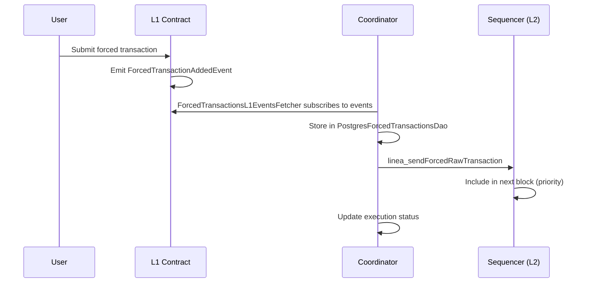

# Forced Transactions

> Force-include transactions on L2 via L1 event submission, bypassing the sequencer's normal mempool.

## Overview

Forced transactions provide a censorship-resistance mechanism: users submit transactions to an L1 contract, which emits events that the coordinator picks up and injects into L2 blocks. This ensures transactions can be included even if the sequencer is unresponsive or censoring.

**Note**: This feature has existing code and documentation across the coordinator and sequencer. This document serves as an index to the relevant components.

## Components

| Component | Path | Role |
|-----------|------|------|
| ForcedTransactionsApp | `coordinator/ethereum/forced-transactions/` | L1 event fetching, L2 injection orchestration |
| ForcedTransactionsL1EventsFetcher | `coordinator/ethereum/forced-transactions/` | Subscribes to L1 `ForcedTransactionAddedEvent` logs |
| ForcedTransactionsSenderForExecution | `coordinator/ethereum/forced-transactions/` | Polls unprocessed forced txs, calls `linea_sendForcedRawTransaction` |
| ForcedTransactionsExecutionStatusUpdater | `coordinator/ethereum/forced-transactions/` | Tracks execution status |
| ForcedTransactionsSafeBlockNumberManager | `coordinator/ethereum/forced-transactions/` | Manages safe block number for conflation with in-flight forced txs |
| ForcedTransactionsResumePointProvider | `coordinator/ethereum/forced-transactions/` | Resume point after restart |
| PostgresForcedTransactionsDao | `coordinator/persistence/` | Forced transaction persistence |
| Forced Transactions Client | `coordinator/clients/forced-transactions/` | Client interface for forced tx operations |

## Flow

## Conflation Impact

The `ForcedTransactionsSafeBlockNumberManager` adjusts the safe block number used by conflation calculators to account for forced transactions that are in flight but not yet included in a block. This prevents conflation from advancing past blocks where forced transactions are expected.

## Related Source

- `coordinator/ethereum/forced-transactions/src/main/kotlin/` — Full implementation
- `coordinator/clients/forced-transactions/` — Client interfaces
- `coordinator/persistence/` — DAO for forced transaction records
