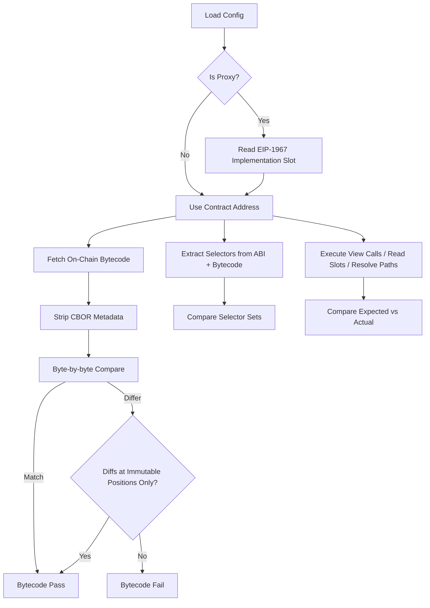

# Integrity Verifier

> TypeScript toolkit for verifying deployed smart contract integrity against local build artifacts.

## Overview

The Contract Integrity Verifier validates that on-chain contracts match expected local artifacts. It performs three independent checks:

1. **Bytecode verification** — Strips CBOR metadata and compares runtime bytecode, with immutable reference masking for constructor-set values.
2. **ABI verification** — Extracts function selectors from both the artifact ABI and on-chain bytecode, then compares the sets.
3. **State verification** — Reads on-chain state via view calls, raw storage slots, ERC-7201 storage paths, and namespace batch verification, comparing against expected values.

Supports proxy detection (EIP-1967), Hardhat and Foundry artifacts, and both ethers and viem via an adapter pattern.

## Packages

| Package | Path | Role |
|---------|------|------|
| `@consensys/linea-contract-integrity-verifier` | `contracts/integrity-verifier/verifier-core/` | Core library — adapter interface, verifier class, types, utilities |
| `@consensys/linea-contract-integrity-verifier-ethers` | `contracts/integrity-verifier/verifier-ethers/` | ethers adapter + CLI |
| `@consensys/linea-contract-integrity-verifier-viem` | `contracts/integrity-verifier/verifier-viem/` | viem adapter + CLI |
| `@consensys/linea-contract-integrity-verifier-ui` | `contracts/integrity-verifier/verifier-ui/` | Next.js web interface with client-side verification |

The core package has zero web3 dependencies. Adapter packages provide `Web3Adapter` implementations that handle RPC calls, ABI encoding, and crypto operations.

## Verification Flow



## State Verification Methods

Four methods for checking on-chain state, each suited to different use cases:

| Method | Best For | Example |
|--------|----------|---------|
| `viewCalls` | Values exposed via getters (roles, version, addresses) | `hasRole(ADMIN_ROLE, addr)` |
| `slots` | Internal state not exposed via getters, packed storage, OZ `_initialized` | Slot `0x0`, type `uint8` |
| `storagePaths` | ERC-7201 namespaced storage, struct fields, mapping values | `YieldManagerStorage:_yieldManager` |
| `namespaces` | Batch verification of related variables in a single namespace | `linea.storage.YieldManager` |

Comparison operators: `eq` (default), `gt`, `gte`, `lt`, `lte`, `contains`. Address comparisons are case-insensitive.

## Configuration

Supports JSON and Markdown configuration formats. Environment variables are injected via `${VAR_NAME}` placeholders, resolved from `process.env` (CLI) or user input (UI).

```json
{
  "chains": {
    "ethereum-sepolia": {
      "chainId": 11155111,
      "rpcUrl": "${ETHEREUM_SEPOLIA_RPC_URL}"
    }
  },
  "contracts": [
    {
      "name": "LineaRollup-Proxy",
      "chain": "ethereum-sepolia",
      "address": "0x...",
      "artifactFile": "../path/to/LineaRollup.json",
      "isProxy": true,
      "stateVerification": {
        "viewCalls": [{ "function": "CONTRACT_VERSION", "expected": "7.1" }],
        "slots": [{ "slot": "0x0", "type": "uint8", "name": "_initialized", "expected": "8" }]
      }
    }
  ]
}
```

## CLI

Each adapter package provides a CLI:

```
npx verify-contract-viem -c ./config.json -v
npx verify-contract-ethers -c ./config.json -v
```

Options: `--contract <NAME>`, `--chain <NAME>`, `--skip-bytecode`, `--skip-abi`, `--skip-state`.

## Bundled Tools

| Tool | Purpose |
|------|---------|
| `generate-schema` | Generate storage schema JSON from Solidity files with ERC-7201 annotation parsing |
| `convert-artifact` | Convert between Hardhat and Foundry artifact formats |
| `generate-viewcalls` | Generate view call config templates from contract ABI |
| `analyze-initializers` | Analyze constructor/initializer signatures to suggest state verifications |
| `enrich-hardhat-artifact` | Extract `immutableReferences` from Hardhat `build-info` into standard artifacts |

## Web UI

The `verifier-ui` package provides a browser-based interface. Supports both server-rendered and fully static deployment (`STATIC_EXPORT=true`). Static mode uses IndexedDB for file storage and runs verification entirely client-side via `ViemAdapter`.

## Test Coverage

| Test File | Runner | Validates |
|-----------|--------|-----------|
| `verifier-core/tests/` | Jest | Core verifier logic, config loading, utility functions |
| `verifier-ethers/tests/integration.test.ts` | Jest | Ethers adapter with mock RPC |
| `verifier-viem/tests/integration.test.ts` | Jest | Viem adapter with mock RPC |
| `verifier-ethers/tests/live.test.ts` | Jest | Live verification against Sepolia contracts |
| `verifier-viem/tests/live.test.ts` | Jest | Live verification against Sepolia contracts |

## Related Documentation

- [Integrity Verifier README](../../contracts/integrity-verifier/README.md)
- [Integrity Verifier Architecture](../../contracts/integrity-verifier/ARCHITECTURE.md)
