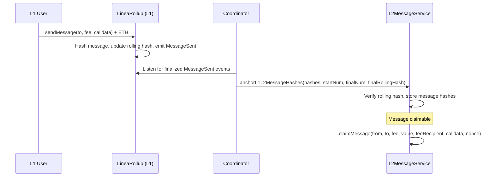
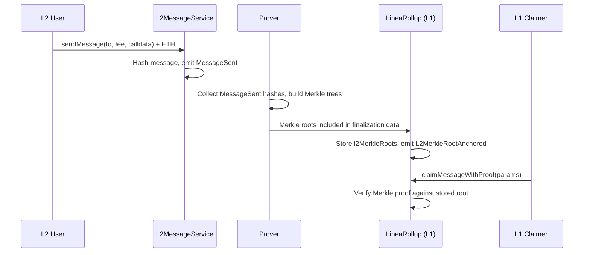

# Messaging

> Trustless L1↔L2 message passing with rolling hash integrity and Merkle proof claiming.

## Overview

Linea provides a canonical messaging protocol between Ethereum L1 and L2. Messages are sent on the origin chain and claimed on the destination chain after anchoring. Two directions with distinct mechanics:

- **L1→L2**: Messages anchored on L2 via rolling hash; claimed using hash lookup.
- **L2→L1**: Message hashes grouped into Merkle trees during finalization; claimed on L1 with Merkle proofs.

The coordinator handles anchoring L1→L2 messages on L2, and the prover computes L2→L1 Merkle roots anchored during finalization.

## Components

| Component | Path | Role |
|-----------|------|------|
| L1MessageService | `contracts/src/messaging/l1/L1MessageService.sol` | L1 send and claim (inherited by LineaRollup) |
| L1MessageManager | `contracts/src/messaging/l1/L1MessageManager.sol` | L1 message hash and Merkle root storage |
| L2MessageService | `contracts/src/messaging/l2/L2MessageService.sol` | L2 send, claim, and anchoring |
| L2MessageManager | `contracts/src/messaging/l2/L2MessageManager.sol` | L2 anchoring logic, rolling hash verification |
| Coordinator (anchoring) | `coordinator/ethereum/message-anchoring/` | Detects L1 events, anchors on L2 |
| Postman | `postman/` | Automated message claiming service |

## L1→L2 Flow



### Rolling Hash Integrity

Each L1 message updates a rolling hash: `rollingHash = keccak256(prevRollingHash, messageHash)`. The coordinator passes the final rolling hash to `anchorL1L2MessageHashes`, which L2 verifies. At finalization, L1 validates that the rolling hash on L2 matches, creating a tamper-proof feedback loop.

## L2→L1 Flow



### Merkle Tree Construction

The prover groups message hashes by a configurable tree depth (e.g., depth 5 = 32 leaves). Partial groups are padded with empty hashes. Each group produces a Merkle root anchored on L1 during finalization. `l2MessagingBlocksOffsets` encodes which L2 blocks contain `MessageSent` events.

## Key Interfaces

```solidity
// Sending (both L1 and L2)
function sendMessage(address _to, uint256 _fee, bytes calldata _calldata) external payable;

// Claiming on L2
function claimMessage(
    address _from, address _to, uint256 _fee, uint256 _value,
    address _feeRecipient, bytes calldata _calldata, uint256 _nonce
) external;

// Claiming on L1 (with Merkle proof)
function claimMessageWithProof(ClaimMessageWithProofParams calldata _params) public;

struct ClaimMessageWithProofParams {
    bytes32[] proof;
    uint256 messageNumber;
    uint32 leafIndex;
    address from;
    address to;
    uint256 fee;
    uint256 value;
    address payable feeRecipient;
    bytes32 merkleRoot;
    bytes data;
}

// Anchoring (coordinator → L2)
function anchorL1L2MessageHashes(
    bytes32[] calldata _messageHashes,
    uint256 _startingMessageNumber,
    uint256 _finalMessageNumber,
    bytes32 _finalRollingHash
) external;
```

## Postman Service

The Postman automates claiming for users who prepay a fee. If the claiming gas cost is less than the fee paid, the difference is forwarded to the message recipient. The Postman monitors anchored messages and submits claim transactions.

## Pause Types

| PauseType | Effect |
|-----------|--------|
| `L1_L2` | Blocks `sendMessage` on L1 |
| `L2_L1` | Blocks `sendMessage` on L2 |

## Events

| Event | Chain | Description |
|-------|-------|-------------|
| `MessageSent` | Both | Message dispatched with hash, nonce, fee |
| `MessageClaimed` | Both | Message successfully claimed |
| `L1L2MessageHashesAddedToInbox` | L2 | Messages anchored by coordinator |

## Test Coverage

| Test File | Runner | Validates |
|-----------|--------|-----------|
| `contracts/test/hardhat/messaging/L1MessageService.ts` | Hardhat | L1 send, claim, fees, rate limits |
| `contracts/test/hardhat/messaging/L2MessageService.ts` | Hardhat | L2 init, send, claim, fees, roles |
| `contracts/test/hardhat/messaging/L1MessageManager.ts` | Hardhat | Hash storage, Merkle root management |
| `contracts/test/hardhat/messaging/L2MessageManager.ts` | Hardhat | Anchoring, rolling hash verification |
| `contracts/test/hardhat/messaging/MessageServiceBase.ts` | Hardhat | Shared base behavior |
| `e2e/src/messaging.spec.ts` | Jest | Full L1↔L2 message round-trips, postman sponsoring |

## Related Documentation

- [Architecture: L1→L2 Messages](../architecture-description.md#l1---l2-messages)
- [Architecture: L2→L1](../architecture-description.md#l2---l1)
- [Workflow: L1→L2 Messaging](../../contracts/docs/workflows/messaging/canonicalL1ToL2Messaging.md)
- [Workflow: L2→L1 Messaging](../../contracts/docs/workflows/messaging/canonicalL2ToL1Messaging.md)
- [Official docs: Canonical Message Service](https://docs.linea.build/protocol/architecture/interoperability/canonical-message-service)
