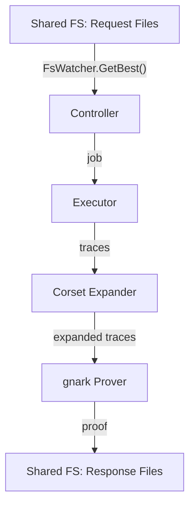

# Prover

> ZK proof generation for execution, blob compression, and aggregation using gnark circuits.

## Overview

The prover is a Go service that generates zero-knowledge proofs for three distinct circuit types. It consumes proof requests from a shared file system, expands traces via Corset (Rust), and produces proofs using gnark-based PLONK circuits. Multiple prover instances run in parallel, with a dedicated large-memory instance for edge cases.

## Components

| Component | Path | Role |
|-----------|------|------|
| Controller | `prover/cmd/controller/` | Job scheduler, file system watcher, executor |
| Execution Circuit | `prover/circuits/execution/` | Proves correct EVM transaction execution |
| Blob Decompression Circuit | `prover/circuits/blobdecompression/` | Proves compression integrity |
| Aggregation Circuit | `prover/circuits/aggregation/` | Recursively verifies execution + compression proofs |
| PI Interconnection | `prover/circuits/pi-interconnection/` | Public input consistency across circuits |
| Corset | `corset/` | Rust trace expander (compiled into prover binary) |
| Crypto | `prover/crypto/` | Vortex, SHA2, Keccak, MiMC, Fiat-Shamir, Ringsis |

## Circuit Registry

| Circuit ID | Priority | Curve | Purpose |
|------------|----------|-------|---------|
| `execution` | 0 (highest) | BLS12-377 | Standard execution proof |
| `execution-large` | 0 | BLS12-377 | Large-memory execution proof |
| `execution-limitless` | 0 | BLS12-377 | No trace limits (testing) |
| `blob-decompression-v0` | — | BLS12-377 | Compression proof (v0 format) |
| `blob-decompression-v1` | — | BLS12-377 | Compression proof (v1 format) |
| `aggregation` | — | BN254 via BW6→BLS12-377 | Recursive proof aggregation |
| `public-input-interconnection` | — | — | PI consistency check |

## Proof Pipeline



### Controller

The controller (`prover/cmd/controller/controller.go`) runs a long-lived process that:

1. Watches request directories via `FsWatcher`
2. Selects the highest-priority job via `GetBest()`
3. Spawns a short-lived process (`Executor.Run`) that expands traces and generates the proof
4. Handles OOM (exit code 137) and trace limit failures (exit code 77)
5. Supports SIGTERM graceful shutdown and SIGUSR1 spot instance reclaim

### Job Definition

Job types are defined by file name regex patterns:

| Type | Pattern | Request Dir |
|------|---------|-------------|
| Execution | `*-getZkProof.json` | `/shared/prover-execution/requests` |
| Compression | `*-getZkBlobCompressionProof.json` | `/shared/prover-compression/requests` |
| Aggregation | `*-getZkAggregatedProof.json` | `/shared/prover-aggregation/requests` |

## Proof System Architecture

Proofs are generated in two stages (referred to as "inner" and "outer" in Linea documentation):

- **Inner proof**: Corset expands traces, then Vortex/GKR/PLONK on BLS12-377 recursively reduces the proof.
- **Outer proof**: gnark compresses the result into a final zk-SNARK on BN254, verifiable on Ethereum.

The full curve chain:

```
Execution Proofs (BLS12-377 PLONK) ─ inner
         ↓
Compression Proofs (BLS12-377 PLONK) ─ inner
         ↓
Recursion (BW6 ← BLS12-377 2-chain)
         ↓
Final Aggregation (BN254 PLONK) ─ outer
         ↓
Ethereum ecPairing precompile verification
```

The BLS12-377/BW6 2-chain enables efficient recursive verification. The final BN254 proof is verified on Ethereum via the `ecPairing` precompile.

## Corset Integration

Corset is a Rust library compiled into the prover binary for in-process trace expansion. This avoids:
- Transferring 100-500 MB gzipped trace files over the network
- Deserializing expanded traces (~5 GB uncompressed)
- Version incompatibility between Corset and the prover

## Test Coverage

| Test File | Runner | Validates |
|-----------|--------|-----------|
| `prover/cmd/controller/*_test.go` | Go test | Controller job lifecycle, file watching |
| `prover/circuits/execution/*_test.go` | Go test | Execution circuit correctness |
| `prover/circuits/blobdecompression/*_test.go` | Go test | Decompression circuit |
| `prover/circuits/aggregation/*_test.go` | Go test | Aggregation circuit |
| `prover/circuits/pi-interconnection/e2e_test.go` | Go test | End-to-end PI interconnection |
| `prover/crypto/**/*_test.go` | Go test | Cryptographic primitives |

## Related Documentation

- [Architecture: Provers](../architecture-description.md#provers)
- [Architecture: Execution Proofs](../architecture-description.md#execution-proofs)
- [Architecture: Compression Proof](../architecture-description.md#compression-proof)
- [Architecture: Aggregation Proof](../architecture-description.md#aggregation-proof)
- [Tech: Prover Component](../tech/components/prover.md) — Corset integration details, build/run, configuration
- [Official docs: Prover](https://docs.linea.build/protocol/architecture/prover)
