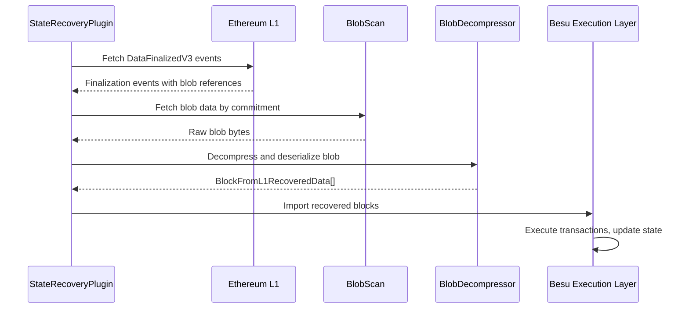

# State Recovery

> Recovering L2 state from L1 blob data when the sequencer is unavailable.

## Overview

State recovery is a Besu plugin that enables an L2 node to reconstruct its state entirely from data posted to L1. It fetches finalization events from the LineaRollup contract, retrieves the corresponding blobs (via BlobScan), decompresses them, and replays the recovered blocks through Besu's execution layer.

This provides a censorship-resistance guarantee: even if the sequencer stops producing blocks, any party can recover the full L2 state from L1 data.

## Components

| Component | Path | Role |
|-----------|------|------|
| LineaStateRecoveryPlugin | `besu-plugins/state-recovery/besu-plugin/` | Besu plugin entry point |
| RecoveryModeManager | `besu-plugins/state-recovery/besu-plugin/` | Switches between recovery and normal sync |
| StateRecoveryApp | `besu-plugins/state-recovery/appcore/logic/` | Orchestrates the recovery flow |
| StateSynchronizerService | `besu-plugins/state-recovery/appcore/logic/` | Polling service for L1 events and blob fetching |
| BlobDecompressorAndDeserializer | `besu-plugins/state-recovery/appcore/logic/` | Decompresses blobs into block data |
| LineaSubmissionEventsClient | `besu-plugins/state-recovery/appcore/` | Fetches `DataFinalizedV3` events from L1 |
| BlobScanClient | `besu-plugins/state-recovery/clients/blobscan-client/` | Retrieves blob data from BlobScan API |
| ExecutionLayerInProcessClient | `besu-plugins/state-recovery/besu-plugin/` | Imports recovered blocks into Besu |

## Recovery Flow

## Mode Management

The `RecoveryModeManager` controls two modes:
1. **Recovery mode** — Active when the node is behind and needs to catch up from L1 data.
2. **Normal sync** — Switches to P2P sync once recovery reaches the chain head.

## Test Coverage

| Test File | Runner | Validates |
|-----------|--------|-----------|
| `besu-plugins/state-recovery/test-cases/` | JUnit | StateRecoveryE2ETest |
| Unit tests in submodules | JUnit | Individual component behavior |

## Related Documentation

- [Architecture: L1 Finalization](../architecture-description.md#l1-finalization)
- [Tech: Besu Plugins Component](../tech/components/besu-plugins.md) — Plugin lifecycle, state recovery plugin details
- [Official docs: State Manager](https://docs.linea.build/protocol/architecture/state-manager)
- Makefile targets: `make start-env-with-staterecovery`, `make staterecovery-replay-from-block`
