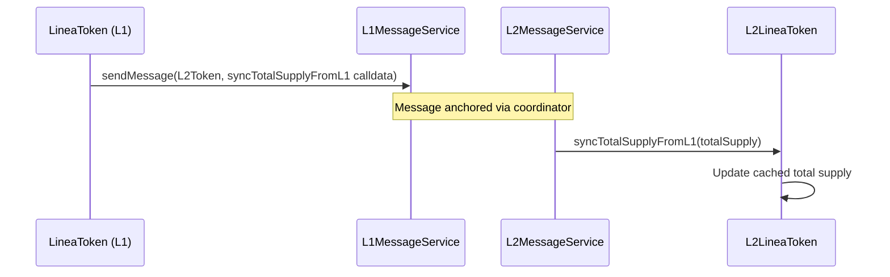

# Token Generation Event (TGE)

> LINEA token contracts (L1/L2), cross-chain supply sync, and token airdrops.

## Overview

The TGE module defines the LINEA token on both L1 and L2, plus an airdrop mechanism. The L1 token mints the initial supply and syncs total supply to L2 via the message service. The L2 token integrates with the canonical token bridge for mint/burn and supports ERC20Votes for governance.

Located in `contracts/tge/` as a separate Foundry sub-project.

## Components

| Component | Path | Role |
|-----------|------|------|
| LineaToken | `contracts/tge/src/L1/LineaToken.sol` | L1 LINEA token (ERC20, Burnable, Permit, AccessControl) |
| L2LineaToken | `contracts/tge/src/L2/L2LineaToken.sol` | L2 LINEA token (ERC20, Permit, Votes, AccessControl) |
| MessageServiceBase | `contracts/tge/src/MessageServiceBase.sol` | Cross-chain message authentication |
| TokenAirdrop | `contracts/tge/src/airdrops/TokenAirdrop.sol` | Merkle-free allocation-based airdrop |
| Reference Tokens | `contracts/tge/src/referenceTokens/` | Soulbound multiplier tokens for airdrop calculations |

## L1 LineaToken

Upgradeable ERC20 with:
- `MINTER_ROLE` for initial supply minting
- `syncTotalSupplyToL2()` sends total supply to L2 via the L1 message service
- Burnable, Permit (ERC-2612)

## L2 LineaToken

Upgradeable ERC20 with:
- `mint` / `burn` restricted to `lineaCanonicalTokenBridge`
- `syncTotalSupplyFromL1()` — callable only from L2 message service with `remoteSender == l1TokenAddress`
- ERC20Votes for governance delegation
- Permit (ERC-2612)

## Cross-Chain Supply Sync

## TokenAirdrop

Allocation-based airdrop using primary and secondary factors with configurable multipliers:
- `calculateAllocation(address)` — Computes allocation from primary/secondary factors and multiplier tokens
- `claim()` — Claims allocated tokens (one-time per address)
- `DENOMINATOR = 1e9` for basis-point precision
- Reference tokens (`PrimaryExplicitMultiplier`, `SecondaryExplicitMultiplier`, `PrimaryConditionalMultiplier`) are soulbound ERC20s — transfers and approvals revert.

## Test Coverage

| Test File | Runner | Validates |
|-----------|--------|-----------|
| `contracts/tge/test/L1/LineaToken.t.sol` | Foundry | L1 token init, mint, burn, supply sync |
| `contracts/tge/test/L2/L2LineaToken.t.sol` | Foundry | L2 token init, bridge mint/burn, votes |
| `contracts/tge/test/airdrops/TokenAirdrop.t.sol` | Foundry | Allocation calculation, claiming, withdrawal |
