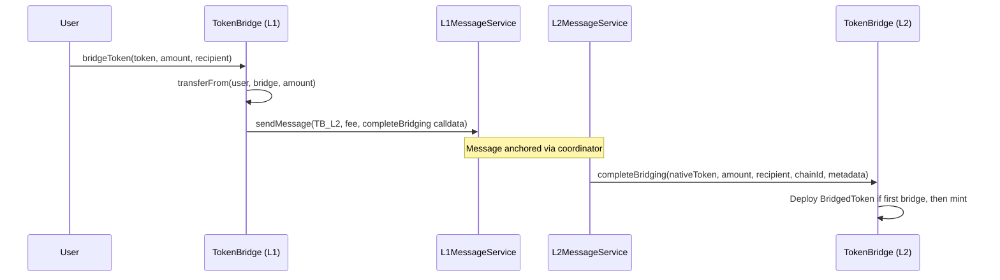

# Token Bridge

> Canonical ERC20 bridging between Ethereum L1 and Linea L2.

## Overview

The Token Bridge enables ERC20 token transfers between L1 and L2 using the messaging protocol as transport. When a token is bridged for the first time, a `BridgedToken` (beacon proxy) is deployed on the destination chain. Subsequent transfers mint/burn the bridged representation.

The bridge supports:
- Standard ERC20 bridging with approval
- ERC-2612 permit-based bridging (single-tx UX)
- Reserved tokens (admin-controlled token mapping)
- Custom bridged token contracts

## Components

| Component | Path | Role |
|-----------|------|------|
| TokenBridge | `contracts/src/bridging/token/TokenBridge.sol` | Main bridge contract (deployed on both chains) |
| TokenBridgeBase | `contracts/src/bridging/token/TokenBridgeBase.sol` | Shared logic, roles, token status tracking |
| BridgedToken | `contracts/src/bridging/token/BridgedToken.sol` | Mintable/burnable ERC20 beacon proxy |
| CustomBridgedToken | `contracts/src/bridging/token/CustomBridgedToken.sol` | Custom token implementation |
| Bridge UI | `bridge-ui/` | Next.js frontend for bridging |
| SDK | `sdk/` | Programmatic bridging via ethers/viem |

## Bridge Flow (L1→L2)



For L2→L1, the bridged token is burned on L2 and the native token released on L1 after L1 claiming.

## Token Status Machine

| Status | Value | Meaning |
|--------|-------|---------|
| `EMPTY` | 0 | Unknown token |
| `RESERVED` | 1 | Admin-reserved, custom mapping pending |
| `NATIVE` | 2 | Native token on this chain |
| `DEPLOYED` | 3 | BridgedToken deployed on this chain |

## Roles

| Role | Purpose |
|------|---------|
| `SET_MESSAGE_SERVICE_ROLE` | Update the underlying message service address |
| `SET_RESERVED_TOKEN_ROLE` | Reserve a token for custom bridging |
| `REMOVE_RESERVED_TOKEN_ROLE` | Remove a token reservation |
| `SET_CUSTOM_CONTRACT_ROLE` | Map a native token to a custom bridged contract |

## Key Functions

```solidity
function bridgeToken(address _token, uint256 _amount, address _recipient) external payable;
function bridgeTokenWithPermit(address _token, uint256 _amount, address _recipient, bytes calldata _permitData) external payable;
function completeBridging(address _nativeToken, uint256 _amount, address _recipient, uint256 _chainId, bytes calldata _tokenMetadata) external;
function setReserved(address _token) external onlyRole(SET_RESERVED_TOKEN_ROLE);
function setCustomContract(address _nativeToken, address _targetContract) external onlyRole(SET_CUSTOM_CONTRACT_ROLE);
function confirmDeployment(address[] memory _tokens) external payable;
```

## Test Coverage

| Test File | Runner | Validates |
|-----------|--------|-----------|
| `contracts/test/hardhat/bridging/token/TokenBridge.ts` | Hardhat | Init, pause, reserved tokens, bridging actions |
| `contracts/test/hardhat/bridging/token/BridgedToken.ts` | Hardhat | Token deployment, mint/burn |
| `contracts/test/hardhat/bridging/token/MockedE2E.ts` | Hardhat | Mocked L1↔L2 end-to-end bridging flow |
| `e2e/src/bridge-tokens.spec.ts` | Jest | Full ERC20 bridge L1→L2 and L2→L1 |

## Related Documentation

- [Workflow: TokenBridge](../../contracts/docs/workflows/TokenBridge.md)
- [Workflow: L1→L2 Token Bridging](../../contracts/docs/workflows/messaging/canonicalL1ToL2TokenBridging.md)
- [Workflow: L2→L1 Token Bridging](../../contracts/docs/workflows/messaging/canonicalL2ToL1TokenBridging.md)
- [Official docs: Canonical Token Bridge](https://docs.linea.build/protocol/architecture/interoperability/canonical-token-bridge)
