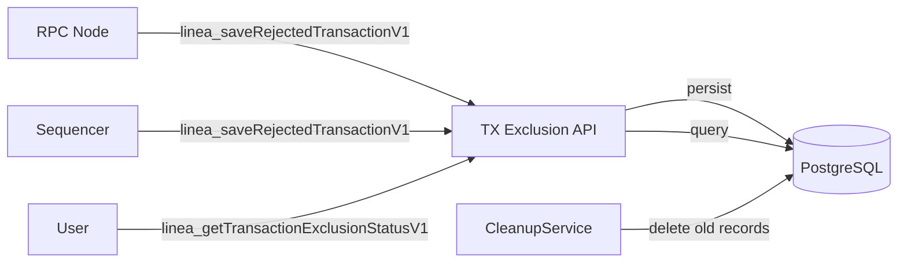

# Transaction Exclusion

> API for tracking and querying why transactions were rejected by the sequencer or RPC nodes.

## Overview

The Transaction Exclusion API is a standalone Kotlin/Vert.x service that records transactions rejected by the sequencer or RPC nodes, along with the rejection reason. External users can query the API to understand why their transaction was not included in a block.

Rejected transaction records are periodically cleaned up to prevent unbounded storage growth.

## Components

| Component | Path | Role |
|-----------|------|------|
| TransactionExclusionApp | `transaction-exclusion-api/app/` | Main application, wires DB, service, API |
| TransactionExclusionServiceV1 | `transaction-exclusion-api/app/` | Business logic for save/query |
| RejectedTransactionCleanupService | `transaction-exclusion-api/app/` | Periodic cleanup of old records |
| RejectedTransactionsPostgresDao | `transaction-exclusion-api/persistence/` | PostgreSQL persistence |
| Api | `transaction-exclusion-api/app/` | JSON-RPC API handlers |

## JSON-RPC Methods

### `linea_saveRejectedTransactionV1`

Called by the sequencer or RPC node when a transaction is rejected. Stores the transaction hash, rejection reason, and source (RPC vs sequencer).

### `linea_getTransactionExclusionStatusV1`

Called by external users to check if a transaction was rejected and retrieve the reason.

## Data Flow

## Infrastructure

- **Runtime**: Kotlin, Vert.x, Caffeine (caching), Hoplite (config)
- **Storage**: PostgreSQL with connection pooling (read/write pools)
- **Deployment**: Docker (`transaction-exclusion-api/Dockerfile`)
- **Config**: `config/transaction-exclusion-api/`

## Test Coverage

| Test File | Runner | Validates |
|-----------|--------|-----------|
| `transaction-exclusion-api/` unit tests | JUnit 5 | Service logic, DAO operations |
| `transaction-exclusion-api/` integration tests | JUnit 5 | Full app with PostgreSQL |
| `e2e/src/transaction-exclusion.spec.ts` | Jest | RPC rejection → query round-trip |

## Related Documentation

- [Architecture: Sequencer](../architecture-description.md#sequencer) (rejected transaction context)
