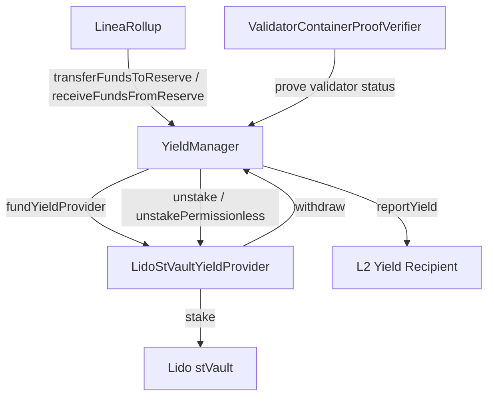

# Yield Management

> Earning yield on bridged ETH via Lido staking, with on-chain withdrawal reserve management and validator proof verification.

## Overview

The YieldManager allows Linea to stake bridged ETH held in the LineaRollup contract into yield-bearing protocols (currently Lido stVaults). Revenue is reported to L2 yield recipients. The system maintains withdrawal reserves to ensure bridge redemptions remain liquid.

Key invariant: user funds in the rollup must always be redeemable. The withdrawal reserve mechanism enforces minimum and target reserve levels, triggering unstaking when reserves fall below thresholds.

## Components

| Component | Path | Role |
|-----------|------|------|
| YieldManager | `contracts/src/yield/YieldManager.sol` | Core yield orchestration, reserve management |
| LidoStVaultYieldProvider | `contracts/src/yield/LidoStVaultYieldProvider.sol` | Lido stVault integration |
| LidoStVaultYieldProviderFactory | `contracts/src/yield/LidoStVaultYieldProviderFactory.sol` | Factory for deploying yield providers |
| YieldProviderBase | `contracts/src/yield/YieldProviderBase.sol` | Abstract yield provider interface |
| ValidatorContainerProofVerifier | `contracts/src/yield/ValidatorContainerProofVerifier.sol` | Beacon chain validator proof verification |
| LineaRollupYieldExtension | `contracts/src/rollup/LineaRollupYieldExtension.sol` | Integrates YieldManager into LineaRollup |
| SSZ/GIndex libs | `contracts/src/yield/libs/` | Beacon chain SSZ proof helpers |

## Architecture

## Withdrawal Reserve

The reserve system uses four parameters:

| Parameter | Description |
|-----------|-------------|
| `minimumWithdrawalReservePercentageBps` | Minimum reserve as % of user funds (basis points) |
| `minimumWithdrawalReserveAmount` | Minimum reserve as absolute ETH amount |
| `targetWithdrawalReservePercentageBps` | Target reserve % (higher than minimum) |
| `targetWithdrawalReserveAmount` | Target reserve absolute amount |

The effective reserve is `max(percentageBased, absoluteAmount)`. When the reserve falls below minimum, `replenishWithdrawalReserve` triggers unstaking from yield providers.

## Roles

| Role | Purpose |
|------|---------|
| `YIELD_PROVIDER_STAKING_ROLE` | Stake ETH into yield providers |
| `YIELD_PROVIDER_UNSTAKER_ROLE` | Unstake from yield providers |
| `YIELD_REPORTER_ROLE` | Report yield to L2 recipients |
| `STAKING_PAUSE_CONTROLLER_ROLE` | Pause/unpause staking per provider |
| `OSSIFICATION_INITIATOR_ROLE` | Start yield provider ossification |
| `OSSIFICATION_PROCESSOR_ROLE` | Complete pending ossification |
| `WITHDRAWAL_RESERVE_SETTER_ROLE` | Update reserve parameters |
| `SET_YIELD_PROVIDER_ROLE` | Add/remove yield providers |
| `SET_L2_YIELD_RECIPIENT_ROLE` | Add/remove L2 yield recipients |

## Permissionless Unstaking

`unstakePermissionless` allows anyone to trigger unstaking for a validator by providing a beacon chain proof (via `ValidatorContainerProofVerifier`) that the validator has exited. This prevents yield providers from indefinitely locking funds.

## Ossification

Yield providers can be ossified (permanently frozen) through a two-step process:
1. `initiateOssification` — Starts a pending ossification
2. `progressPendingOssification` — Completes after conditions are met

## Test Coverage

| Test File | Runner | Validates |
|-----------|--------|-----------|
| `contracts/test/hardhat/yield/unit/YieldManager.basic.ts` | Hardhat | Constructor, roles, fallback/receive |
| `contracts/test/hardhat/yield/unit/YieldManager.funds.ts` | Hardhat | Fund transfers, reserve management |
| `contracts/test/hardhat/yield/unit/YieldManager.controls.ts` | Hardhat | Staking pause, ossification, provider management |
| `contracts/test/hardhat/yield/unit/LidoStVaultYieldProvider.basic.ts` | Hardhat | Provider initialization, role checks |
| `contracts/test/hardhat/yield/unit/LidoStVaultYieldProvider.yield.ts` | Hardhat | Staking, unstaking, yield reporting |
| `contracts/test/hardhat/yield/unit/LidoStVaultYieldProviderFactory.ts` | Hardhat | Factory deployment |
| `contracts/test/hardhat/yield/unit/ValidatorContainerProofVerifier.ts` | Hardhat | Beacon chain proof verification |
| `contracts/test/hardhat/yield/unit/LineaRollupYieldExtension.ts` | Hardhat | Rollup↔YieldManager integration |
| `contracts/test/hardhat/yield/integration/YieldManager.integration.ts` | Hardhat | Full stack: LineaRollup + YieldManager + LidoProvider |
