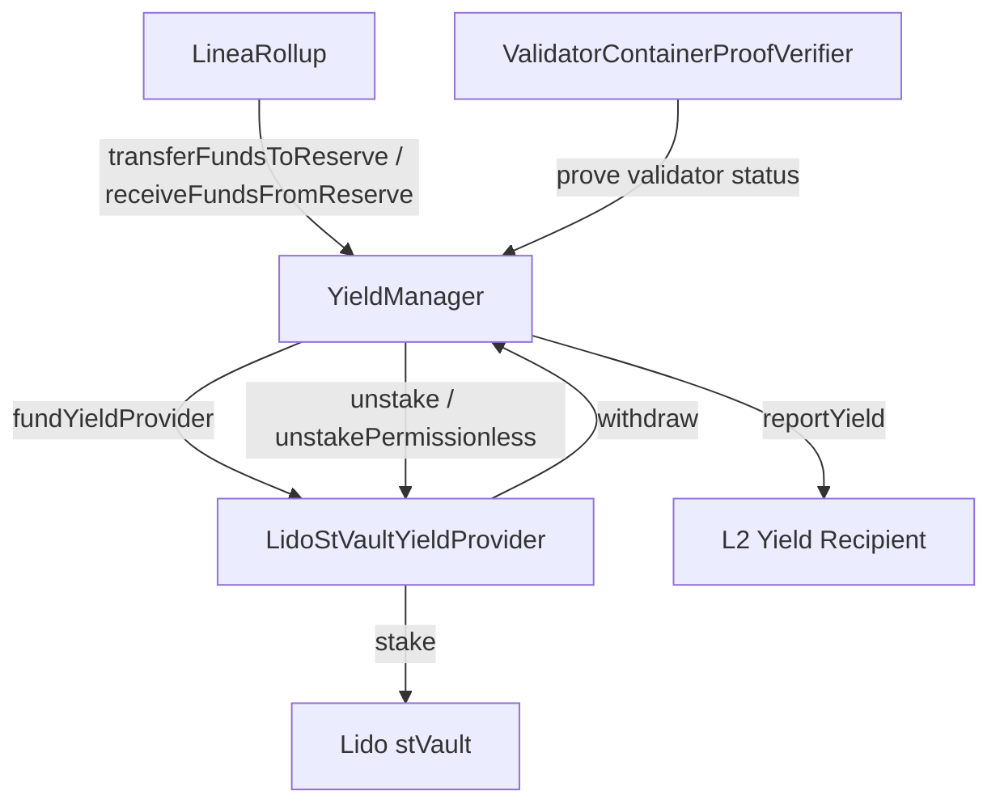

# Yield Management

> Earning yield on bridged ETH via Lido staking, with on-chain withdrawal reserve management and validator proof verification.

## Overview

The YieldManager allows Linea to stake bridged ETH held in the LineaRollup contract into yield-bearing protocols (currently Lido stVaults). Revenue is reported to L2 yield recipients. The system maintains withdrawal reserves to ensure bridge redemptions remain liquid.

Key invariant: user funds in the rollup must always be redeemable. The withdrawal reserve mechanism enforces minimum and target reserve levels, triggering unstaking when reserves fall below thresholds.

## Components

| Component | Path | Role |
|-----------|------|------|
| YieldManager | `contracts/src/yield/YieldManager.sol` | Core yield orchestration, reserve management |
| LidoStVaultYieldProvider | `contracts/src/yield/LidoStVaultYieldProvider.sol` | Lido stVault integration |
| LidoStVaultYieldProviderFactory | `contracts/src/yield/LidoStVaultYieldProviderFactory.sol` | Factory for deploying yield providers |
| YieldProviderBase | `contracts/src/yield/YieldProviderBase.sol` | Abstract yield provider interface |
| ValidatorContainerProofVerifier | `contracts/src/yield/ValidatorContainerProofVerifier.sol` | Beacon chain validator proof verification |
| LineaRollupYieldExtension | `contracts/src/rollup/LineaRollupYieldExtension.sol` | Integrates YieldManager into LineaRollup |
| SSZ/GIndex libs | `contracts/src/yield/libs/` | Beacon chain SSZ proof helpers |

## Architecture

## Withdrawal Reserve

The reserve system uses four parameters:

| Parameter | Description |
|-----------|-------------|
| `minimumWithdrawalReservePercentageBps` | Minimum reserve as % of user funds (basis points) |
| `minimumWithdrawalReserveAmount` | Minimum reserve as absolute ETH amount |
| `targetWithdrawalReservePercentageBps` | Target reserve % (higher than minimum) |
| `targetWithdrawalReserveAmount` | Target reserve absolute amount |

The effective reserve is `max(percentageBased, absoluteAmount)`. When the reserve falls below minimum, `replenishWithdrawalReserve` triggers unstaking from yield providers.

## Roles

| Role | Purpose |
|------|---------|
| `YIELD_PROVIDER_STAKING_ROLE` | Stake ETH into yield providers |
| `YIELD_PROVIDER_UNSTAKER_ROLE` | Unstake from yield providers |
| `YIELD_REPORTER_ROLE` | Report yield to L2 recipients |
| `STAKING_PAUSE_CONTROLLER_ROLE` | Pause/unpause staking per provider |
| `OSSIFICATION_INITIATOR_ROLE` | Start yield provider ossification |
| `OSSIFICATION_PROCESSOR_ROLE` | Complete pending ossification |
| `WITHDRAWAL_RESERVE_SETTER_ROLE` | Update reserve parameters |
| `SET_YIELD_PROVIDER_ROLE` | Add/remove yield providers |
| `SET_L2_YIELD_RECIPIENT_ROLE` | Add/remove L2 yield recipients |

## Permissionless Unstaking

`unstakePermissionless` allows anyone to trigger unstaking for a validator by providing a beacon chain proof (via `ValidatorContainerProofVerifier`) that the validator has exited. This prevents yield providers from indefinitely locking funds.

## Ossification

Yield providers can be ossified (permanently frozen) through a two-step process:
1. `initiateOssification` — Starts a pending ossification
2. `progressPendingOssification` — Completes after conditions are met

---

## Yield Automation Service

### Overview

A long-running TypeScript service (`native-yield-operations/automation-service/`) that automates the yield lifecycle. It continuously polls the YieldManager contract and routes execution through one of three operation modes based on the yield provider's ossification state.

### Operation Modes

| Mode | Condition | Actions |
|------|-----------|---------|
| `YIELD_REPORTING_MODE` | Provider is active (not ossified) | Rebalance reserves (stake/unstake), submit Lido vault reports, report yield to L2, queue beacon chain withdrawals |
| `OSSIFICATION_PENDING_MODE` | `initiateOssification` called | Process pending ossification steps |
| `OSSIFICATION_COMPLETE_MODE` | Provider fully ossified | Final cleanup |

### Yield Reporting Cycle

Each `YIELD_REPORTING_MODE` cycle follows this sequence:

1. **Read state** — Fetch Lido report params, determine rebalance direction (STAKE / UNSTAKE / NONE)
2. **Safety** — If reserve is in deficit, pause staking to prevent deposits worsening the shortfall
3. **Primary rebalance** — Transfer surplus to yield provider (stake) or withdraw from provider (unstake)
4. **Mid-cycle drift fix** — If external flows (e.g., bridge withdrawals) flipped surplus to deficit during processing, perform an amendment unstake
5. **Resume staking** — Unpause staking if no deficit detected
6. **Beacon chain withdrawals** — Queue validator withdrawal requests for any remaining deficit (fulfillment is asynchronous)

The service interacts with: `YieldManager`, `LineaRollupYieldExtension`, `VaultHub`, `StakingVault`, `LazyOracle`, and the Lido accounting report API. Cycle-based yield reporting triggers every N cycles regardless of thresholds.

### Components

| Component | Path | Role |
|-----------|------|------|
| OperationModeSelector | `automation-service/src/services/` | Main loop — polls ossification state, dispatches to processor |
| YieldReportingProcessor | `automation-service/src/services/operation-mode-processors/` | Rebalancing, vault reports, yield reporting, beacon chain withdrawals |
| OssificationPendingProcessor | `automation-service/src/services/operation-mode-processors/` | Handles pending ossification |
| OssificationCompleteProcessor | `automation-service/src/services/operation-mode-processors/` | Handles completed ossification |
| RebalanceQuotaService | `automation-service/src/services/` | Tracks rebalance quotas |
| GaugeMetricsPoller | `automation-service/src/services/` | Prometheus metrics for yield state |

---

## Lido Governance Monitor

### Overview

A standalone TypeScript service (`native-yield-operations/lido-governance-monitor/`) that monitors Lido governance activity and alerts on proposals that may affect Linea's yield infrastructure.

### Pipeline

1. **Fetch proposals** — Polls two sources:
   - **On-chain**: `LdoVotingContractFetcher` reads Lido DAO voting contract events
   - **Off-chain**: `DiscourseFetcher` scrapes the Lido governance forum
2. **Normalize** — `NormalizationService` converts raw proposals into a common `Proposal` entity
3. **AI risk analysis** — `ProposalProcessor` sends each new proposal to Claude (`ClaudeAIClient`) for risk scoring
4. **Alert** — `NotificationService` sends Slack alerts for proposals exceeding the configured risk threshold
5. **Persist** — All proposals and assessments are stored in PostgreSQL via Prisma

### Components

| Component | Path | Role |
|-----------|------|------|
| ProposalFetcher | `lido-governance-monitor/src/services/` | Aggregates proposals from all sources |
| ProposalProcessor | `lido-governance-monitor/src/services/` | AI analysis with retry logic |
| NotificationService | `lido-governance-monitor/src/services/` | Slack alerting |
| ClaudeAIClient | `lido-governance-monitor/src/clients/` | Anthropic Claude integration |
| ProposalRepository | `lido-governance-monitor/src/clients/db/` | Prisma PostgreSQL persistence |

---

## Test Coverage

| Test File | Runner | Validates |
|-----------|--------|-----------|
| `contracts/test/hardhat/yield/unit/YieldManager.basic.ts` | Hardhat | Constructor, roles, fallback/receive |
| `contracts/test/hardhat/yield/unit/YieldManager.funds.ts` | Hardhat | Fund transfers, reserve management |
| `contracts/test/hardhat/yield/unit/YieldManager.controls.ts` | Hardhat | Staking pause, ossification, provider management |
| `contracts/test/hardhat/yield/unit/LidoStVaultYieldProvider.basic.ts` | Hardhat | Provider initialization, role checks |
| `contracts/test/hardhat/yield/unit/LidoStVaultYieldProvider.yield.ts` | Hardhat | Staking, unstaking, yield reporting |
| `contracts/test/hardhat/yield/unit/LidoStVaultYieldProviderFactory.ts` | Hardhat | Factory deployment |
| `contracts/test/hardhat/yield/unit/ValidatorContainerProofVerifier.ts` | Hardhat | Beacon chain proof verification |
| `contracts/test/hardhat/yield/unit/LineaRollupYieldExtension.ts` | Hardhat | Rollup↔YieldManager integration |
| `contracts/test/hardhat/yield/integration/YieldManager.integration.ts` | Hardhat | Full stack: LineaRollup + YieldManager + LidoProvider |
| `native-yield-operations/automation-service/` unit tests | Jest | Operation mode processors, rebalance logic, metrics |
| `native-yield-operations/lido-governance-monitor/` unit tests | Jest | Proposal lifecycle, fetchers, notification, AI analysis |

## Related Documentation

- [Automation Service README](../../native-yield-operations/automation-service/README.md) — Configuration, environment variables, development
- [Tech: Contracts Component](../tech/components/contracts.md) — Yield contract directory, deployment
