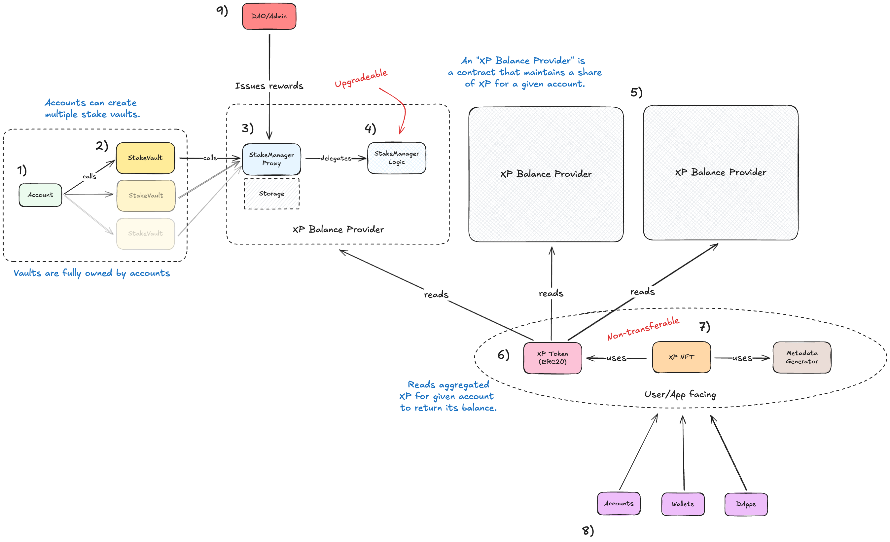

# System Overview

This document provides an overview of the system architecture and design of the staking system. We'll learn about the
system components, their interactions, and the data flow between them.

## Components

1. **Account**: EOAs and smart accounts that participate in the staking system.
2. **Stake vault**: A smart contract that maintains the account's stake. Accounts interface with the staking system
   through their stake vaults.
3. **Stake manager proxy**: A smart contract proxy that delegates to the logic/implementation contract of the staking
   system. It maintains its own onchain storage. Stake vaults interact with the staking system through the proxy.
4. **Stake manager implementation**: A smart contract in which the logic of the staking system resides. The stake
   manager proxy uses this contract to execute the staking system's logic. This contract is ugpradeable.
5. **XP balance providers**: Systems that provide XP token balances to the XP token contract. The staking system is one
   such XP balance provider.
6. **XP token**: An ERC20 token contract that issues XP tokens to accounts based on their stake. In addition to its own
   balance accounting, it relies on XP balance providers to aggregate total balances of individual accounts. XP tokens
   are not transferable.
7. **XP NFT**: An ERC721 token contract that maintains non-transferable NFTs of accounts that participate in the XP
   program, either via the staking system or other activities. The XP NFTs rely on the XP token contract to render an
   accounts XP balance.
8. **Accounts, DApps, Wallets**: External entities that consume the XP tokens and NFTs.
9. **DAO/Admin**: Entity that controls the contract and sets XP rewards in the system which will be distributed
   according to every participant's stake.

## How the system works

- Accounts (EOAs or smart accounts) create one or multiple stake vaults to stake their SNT and participate in the XP
  Programme. In most cases, accounts will have only one stake vault, but nothing prevents them from creating more vaults
  with different configurations.
- The stake vaults interact with the stake manager through the proxy by forwarding calls to the implementation contract.
  When an account stakes funds, their funds are moved into the stake vault and they will stay there until the account
  decides to unstake them.
- While the account is staking, it will accrue experience points (XP) based on the amount of SNT staked and the duration
  of the stake. The longer accounts stake, the more XP they will earn.
- By locking up their stake, accounts receive multiplier points that increase their initial XP earnings upon staking.
- At any point in time, accounts can view their XP token balance in their wallets and how it updates in realtime.
- In addition, every account receives an NFT that represents their participation in the XP Programme. It will evolve as
  the account gains XP.
- Eventually, an account will either reach the maximum amount of XP they can accrue based on their stake amount, at
  which point they will no longer earn XP, or they will decide to unstake their funds, at which point they will not only
  stop earning XP, but even lose the XP they've received through staking.
- The XP in the account's wallet can be used to access exclusive features or services within the Status app or other
  DApps that support the XP token, like voting in governance proposals or participating in exclusive events.
