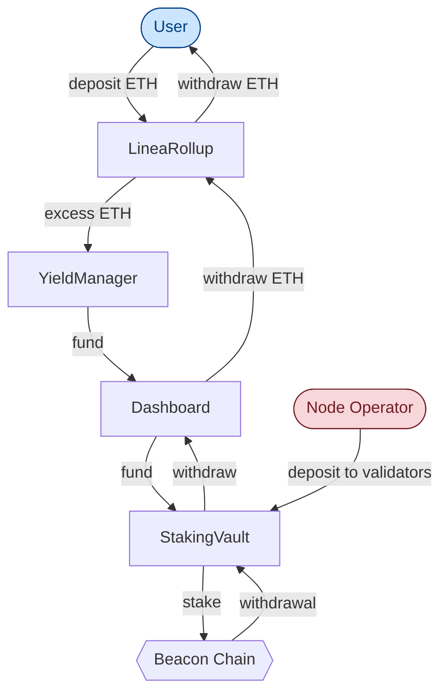
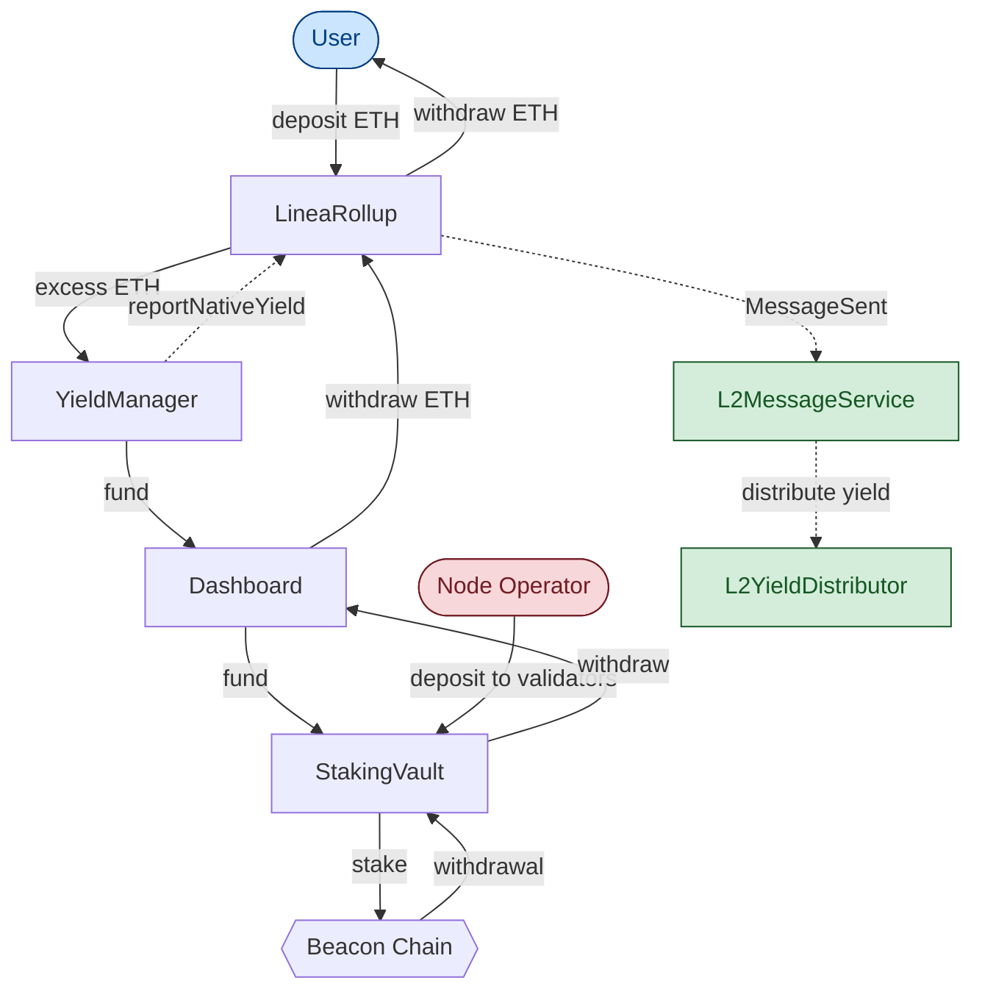
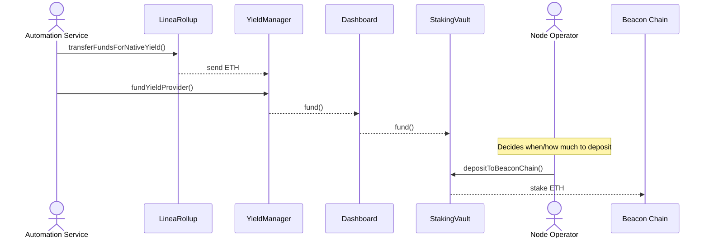
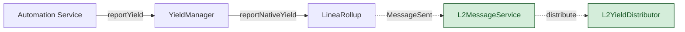
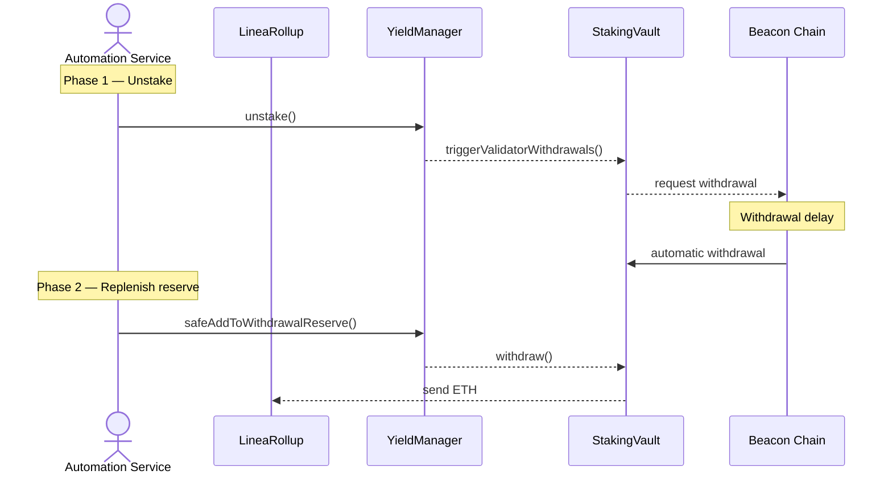
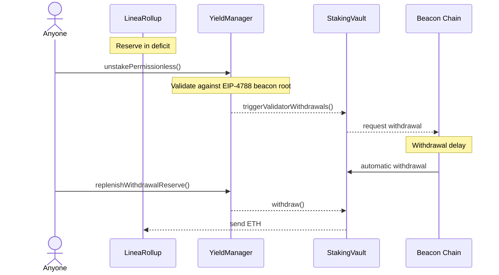
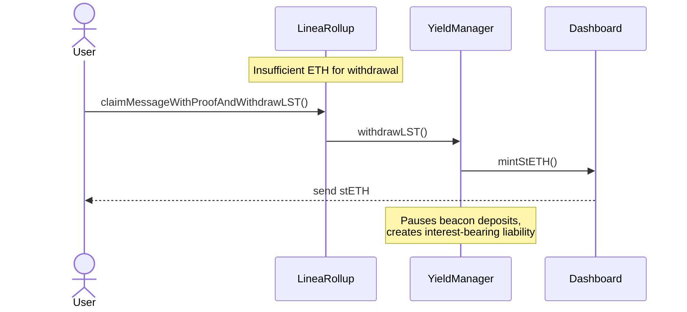
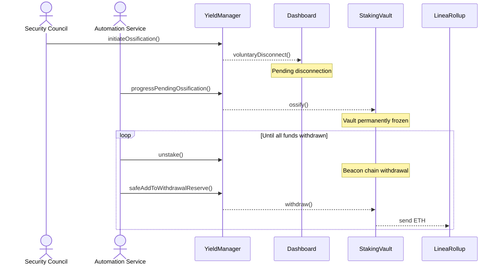

# Yield Boost — ETH Fund Flow

## Overview

The Linea Yield Boost system stakes LineaRollup funds on Ethereum L1 via Lido V3 stVaults to generate beacon chain rewards, which are reported to L2 for distribution. This document maps **where ETH flows** and **which roles control each movement**.

## High-Level Architecture

**Legend:** Red = privileged operator | Blue = permissionless | Green = L2 | Dashed = synthetic message (no L1 ETH moves)

## Roles & Fund Movement Permissions

| Role | Held By | ETH Movement Authorized |
|------|---------|------------------------|
| `YIELD_PROVIDER_STAKING_ROLE` | Automation Service | LineaRollup → YieldManager → StakingVault |
| `YIELD_PROVIDER_UNSTAKER_ROLE` | Automation Service | StakingVault → YieldManager → LineaRollup |
| `YIELD_REPORTER_ROLE` | Automation Service | None (synthetic message only) |
| `STAKING_PAUSE_CONTROLLER_ROLE` | Security Council | None (pauses/unpauses beacon deposits) |
| `OSSIFICATION_INITIATOR_ROLE` | Security Council | Initiates full withdrawal of all staked funds |
| `OSSIFICATION_PROCESSOR_ROLE` | Automation Service | Progressive withdrawal during ossification |
| `SET_YIELD_MANAGER_ROLE` | Security Council | None (configuration) |
| Permissionless | Anyone | `fund()` donations; `unstakePermissionless()` + `replenishWithdrawalReserve()` during deficit |

## Fund Flow Scenarios

### 1. Staking

Surplus ETH in LineaRollup (above minimum reserve) is routed to the StakingVault for beacon chain staking.

### 2. Yield Reporting

No L1 ETH moves — a synthetic `MessageSent` event relays net yield to L2 for distribution.

Yield is reported **after** deducting LST liabilities, Lido protocol fees, and node operator fees.

### 3. Reserve Replenishment — Operator

Two-phase process: first trigger beacon chain withdrawal, then route funds to LineaRollup once they arrive in the vault.

### 4. Permissionless Flows

When LineaRollup balance drops below the minimum reserve, anyone can trigger unstaking and reserve replenishment.

`unstakePermissionless()` is capped to the remaining deficit minus available liquidity in the YieldManager and provider.

### 5. LST Withdrawal — Last Resort

When LineaRollup lacks sufficient ETH for a user withdrawal, stETH is minted against StakingVault collateral and sent directly to the user.

This creates an LST liability that accrues interest; the system prioritizes repaying it from subsequent deposits and yield.

### 6. Ossification Withdrawal

Security Council initiates permanent vault freeze; Automation Service progressively withdraws all funds.

An accounting report must be submitted between `initiateOssification()` and `progressPendingOssification()`. Partial validator withdrawals are preferred to bypass the Ethereum exit queue.

## Quick Reference

| Fund Movement | Source | Destination | Trigger | Role Required |
|--------------|--------|-------------|---------|---------------|
| Stake excess reserve | LineaRollup | StakingVault | Automation | `YIELD_PROVIDER_STAKING_ROLE` |
| Beacon chain deposit | StakingVault | Validators | Node Operator decision | Node Operator |
| Report yield to L2 | — (synthetic) | L2YieldDistributor | Automation | `YIELD_REPORTER_ROLE` |
| Operator replenish reserve | StakingVault | LineaRollup | Reserve below target | `YIELD_PROVIDER_UNSTAKER_ROLE` |
| Permissionless unstake | StakingVault | LineaRollup | Reserve below minimum | Permissionless |
| LST withdrawal | StakingVault (mint) | User | Insufficient ETH | Permissionless (user) |
| Ossification withdrawal | StakingVault | LineaRollup | Security Council initiates | `OSSIFICATION_INITIATOR_ROLE` + `OSSIFICATION_PROCESSOR_ROLE` |
| Donation | External | LineaRollup | Voluntary | Permissionless |