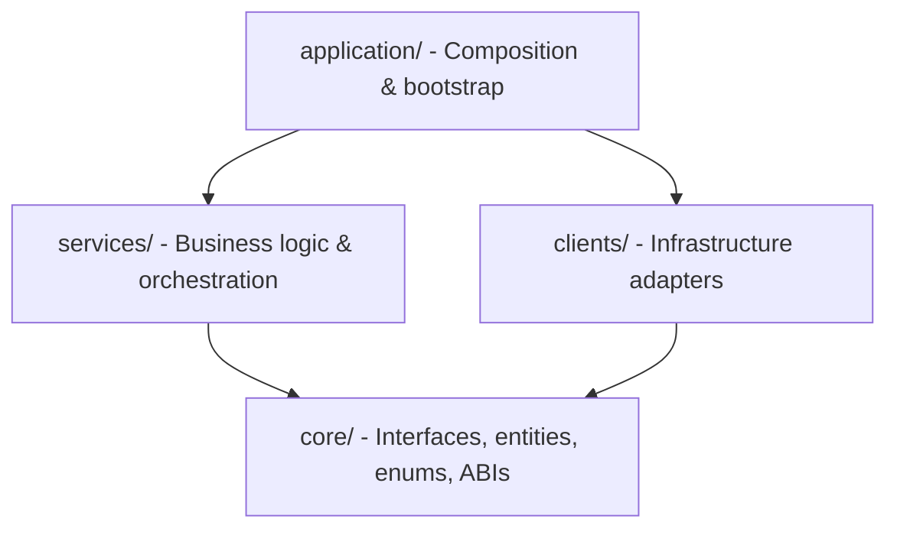
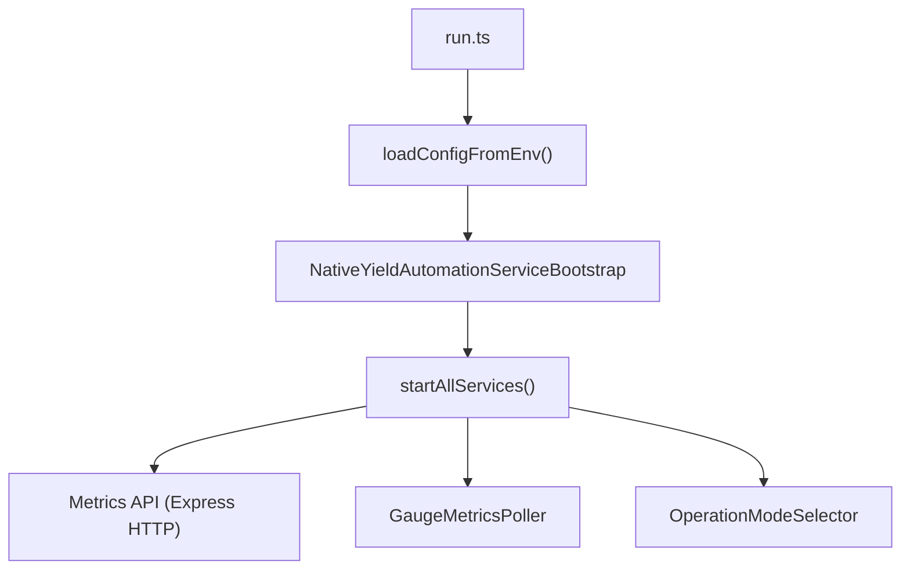
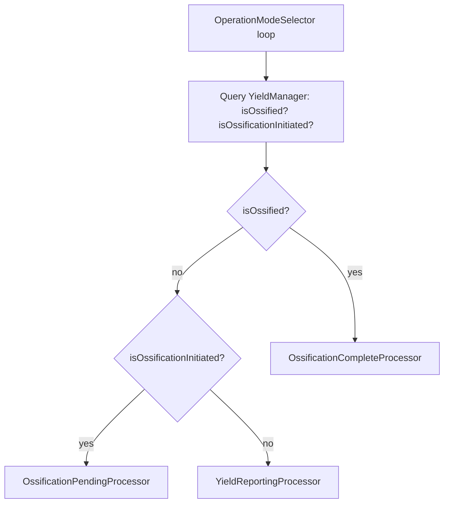
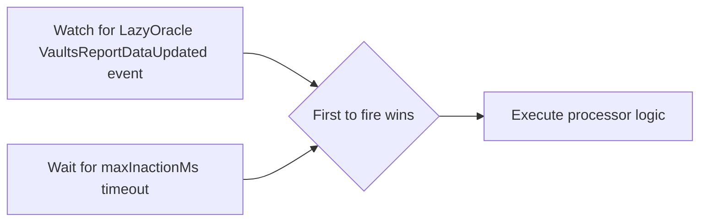

# Architecture

## Overview

The codebase follows a layered architecture with dependency inversion, incorporating concepts from hexagonal architecture (ports and adapters). Dependencies flow inward - the `application` layer composes `services` and `clients`, which depend only on interfaces defined in `core`. This keeps business logic independent of infrastructure, making the system testable and swappable at the adapter level.

- **`core/`** - Domain layer. Interfaces (ports), entities, enums, and ABIs. Zero internal dependencies.
- **`services/`** - Application layer. Business logic that orchestrates operations using `core/` interfaces.
- **`clients/`** - Infrastructure layer. Adapter implementations of `core/` interfaces (contract clients, API clients).
- **`application/`** - Composition layer. Wires dependencies and bootstraps the service.

## Service Entrypoint

Startup sequence: `run.ts` loads environment variables, calls `loadConfigFromEnv()` to build the config object, passes it to `NativeYieldAutomationServiceBootstrap`, then calls `startAllServices()`.

`startAllServices()` launches three concurrent services (non-blocking - none are awaited so they run in parallel):

1. **Metrics API** - Express HTTP server exposing Prometheus metrics
2. **GaugeMetricsPoller** - Background loop polling telemetry data (validator counts, balances, contract state)
3. **OperationModeSelector** - Main business logic loop that selects and executes operation modes

## Operation Mode Data Flow

The `OperationModeSelector` runs a continuous loop that queries the YieldManager contract for the yield provider's ossification state, then routes to one of three mode processors.

**YieldReportingProcessor** - Event-driven (triggered by LazyOracle `VaultsReportDataUpdated` event or timeout). Handles vault report submission, rebalancing (stake/unstake), mid-cycle drift detection, beacon chain withdrawals, yield reporting to L2, and staking pause/unpause.

**OssificationPendingProcessor** - Event-driven (same LazyOracle trigger). Winds down staking: performs max unstake, submits vault report, progresses ossification, and performs max withdrawal if ossification completes during the cycle.

**OssificationCompleteProcessor** - Timeout-driven (waits a fixed `maxInactionMs` delay between cycles). Extracts remaining funds by performing max withdrawal from yield provider and max unstake from beacon chain.

## Trigger Mechanisms

The `OperationModeSelector` queries the YieldManager contract to determine the yield provider's ossification state, then routes to one of three mode processors. Each processor uses its own trigger to pace cycles:

**Yield Reporting** and **Ossification Pending** modes are event-driven. The processor races a watch for the LazyOracle `VaultsReportDataUpdated` event against a configurable `maxInactionMs` timeout - whichever fires first starts the cycle.

**Ossification Complete** mode is timeout-only. The processor waits a fixed `maxInactionMs` delay between cycles (no event watching - there is nothing left to watch for).

After the trigger, each processor runs its mode-specific logic:

- **Yield Reporting** - Rebalancing, vault reports, beacon chain withdrawals, yield reporting to L2
- **Ossification Pending** - Max unstake, submit vault report, progress ossification
- **Ossification Complete** - Max withdraw + max unstake to extract remaining funds

## Dependency Relationships

### Contract clients

Port interfaces in `core/clients/contracts/` with adapter implementations in `clients/contracts/`:

| Port | Adapter | Purpose |
|------|---------|---------|
| `IYieldManager` | `YieldManagerContractClient` | Ossification state, rebalance, withdraw, stake/unstake |
| `ILazyOracle` | `LazyOracleContractClient` | Event watching (`VaultsReportDataUpdated`), oracle data |
| `IVaultHub` | `VaultHubContractClient` | Vault report submission, vault state queries |
| `IDashboard` | `DashboardContractClient` | Static singleton - dashboard data reads |
| `ISTETH` | `STETHContractClient` | stETH balance and share queries |
| `IStakingVault` | `StakingVaultContractClient` | Static singleton - staking vault operations |
| `ILineaRollupYieldExtension` | `LineaRollupYieldExtensionContractClient` | L1 rollup yield reporting |

### Domain clients

Port interfaces in `core/clients/` with adapter implementations in `clients/`:

| Port | Adapter | Purpose |
|------|---------|---------|
| `IBeaconChainStakingClient` | `BeaconChainStakingClient` | Beacon chain staking operations (unstake, withdrawal requests) |
| `ILidoAccountingReportClient` | `LidoAccountingReportClient` | Lido accounting report fetching and submission |
| `IValidatorDataClient` | `ConsensysStakingApiClient` | Validator data queries via GraphQL |

### Services

| Interface | Implementation | Purpose |
|-----------|---------------|---------|
| `IOperationModeProcessor` | `YieldReportingProcessor`, `OssificationPendingProcessor`, `OssificationCompleteProcessor` | Mode-specific business logic |
| `IRebalanceQuotaService` | `RebalanceQuotaService` | Tracks rebalance budget across cycles |
