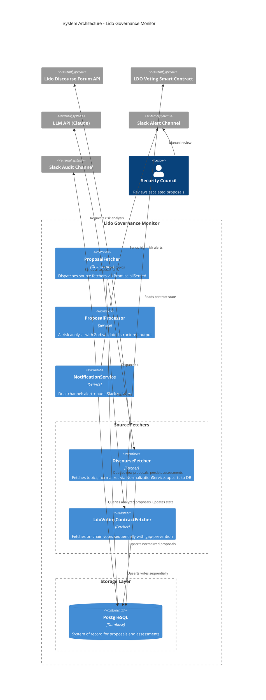
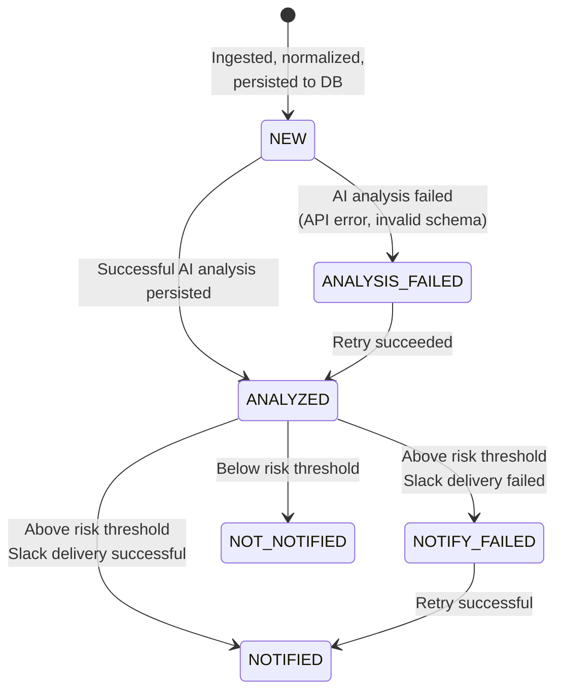
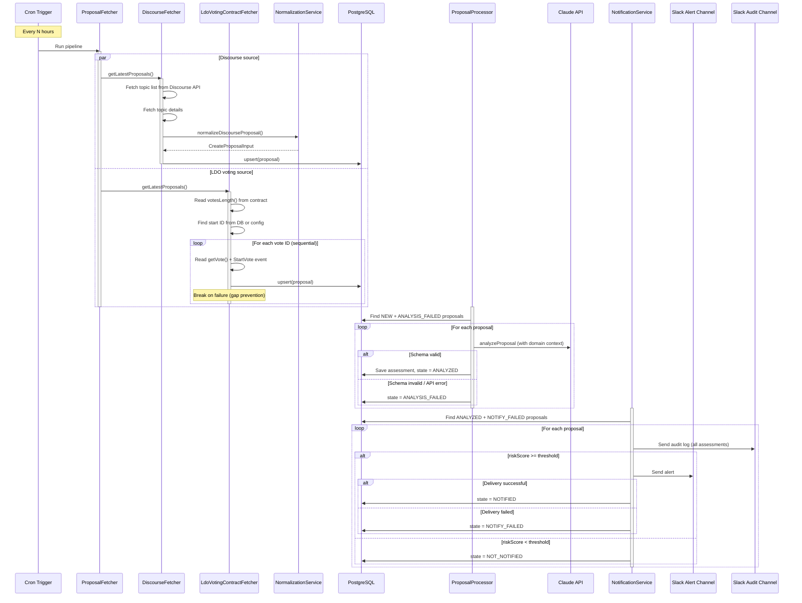

# Context & Goals

Linea's Yield Boost depends on Lido V3 StakingVaults, which are governed by **Lido's on-chain governance process**. Governance decisions - particularly contract upgrades, parameter changes, or governance process changes - represent a primary external risk vector for Yield Boost.

A malicious, compromised, or poorly designed governance change affecting the StakingVault or closely related contracts could materially impact Yield Boost operations, including withdrawal guarantees or yield accounting. Linea must gain early visibility into governance proposals *before execution*, with sufficient time for the Security Council to evaluate risk and take protective actions such as ossifying the vault.

The **Lido Governance Monitor** is an off-chain service that provides this early warning. It regularly checks the Lido governance proposal pipeline, evaluates proposals for risk to Yield Boost using an AI-assisted judge, and escalates proposals that may pose a material risk to the Security Council.

# Non-goals

- The system does not make governance decisions or take on-chain actions.
- The AI judge is advisory only; final judgment rests with the Security Council.
- The system does not predict proposal outcomes or voting behavior.
- The system does not replace manual security review of escalated proposals.

# Architecture Overview



The system ingests governance proposals from multiple sources, normalizes them into a unified internal format, enriches them with domain-specific context, and evaluates them through an AI-based risk analysis pipeline. Only proposals assessed as sufficiently risky are surfaced to human reviewers via the alert channel, while all assessments are logged to an audit channel.

This is achieved through four main components:

- **ProposalFetcher** orchestrates source fetchers (DiscourseFetcher, LdoVotingContractFetcher) via `Promise.allSettled`
- **ProposalProcessor** enriches proposals with curated domain context and performs AI-assisted risk analysis
- **NotificationService** delivers dual-channel Slack notifications (alert + audit)

PostgreSQL acts as the system of record and state machine for all processing stages, enabling idempotent execution, crash recovery, and full auditability.

# Core Architecture Decisions

## 1. Cronjob-triggered ingestion pipeline

A single job runs on a scheduled cron trigger (e.g., every 24 hours) that sequentially executes:

1. `ProposalFetcher`
2. `ProposalProcessor`
3. `NotificationService`

**Rationale**

- The system is idle most of the time; a long-running poller adds unnecessary runtime and infra cost.
- A push/webhook-based integration is not currently available.
- A delay of up to 24 hours between a new forum post and ingestion is acceptable.

## 2. Stateful processing

PostgreSQL is the system of record storing all proposals, their processing state, and AI assessments.



Each proposal moves through six processing states:

**`NEW`** - Ingested, normalized, and persisted. No AI analysis performed yet.

**`ANALYZED`** - AI judge completed successfully and produced schema-valid structured output, persisted to DB.

**`ANALYSIS_FAILED`** - AI analysis failed (API error or invalid schema output). Eligible for retry on subsequent runs.

**`NOT_NOTIFIED`** (terminal) - Analyzed and falls below the risk threshold. No alert sent.

**`NOTIFY_FAILED`** - Slack alert delivery failed. Eligible for retry on subsequent runs.

**`NOTIFIED`** (terminal) - Slack alert successfully sent and recorded.

**Rationale**

- Enables durable, strictly idempotent processing across retries, crashes, and restarts.
- Provides a complete and immutable audit trail of decisions, transitions, and model outputs.

## 3. AI judge with deterministic gating

An LLM classifies and summarizes proposals, but escalation decisions are made solely by deterministic service logic using outputs validated against strict schemas and risk thresholds.

**Rationale**

- Allows broad semantic screening of unstructured governance content.
- Reduces noise for human reviewers without delegating authority to the model.
- Preserves explainability through structured justifications.

**Tradeoffs**

- LLM outputs are probabilistic and may exhibit false positives or negatives.
- Requires continuous evaluation and tuning of thresholds and rubric.
- Adds dependency on external inference availability and latency.

# Safety & Liveness Properties

### Safety (nothing bad happens)

- **No notification without durable state** - Slack alerts are only sent after the corresponding assessment and escalation decision are committed to the database.
- **AI output cannot directly trigger side effects** - The LLM only produces structured assessments. All notification decisions are enforced by deterministic threshold logic in service code.
- **Full auditability** - All inputs, AI outputs, timestamps, and notification events are persisted.

### Liveness (something good eventually happens)

- **Eventual processing under transient failures** - State-based retries ensure temporary API outages do not permanently block proposal evaluation.
- **No permanent stuck states** - Proposals remain eligible for reprocessing until they reach terminal states (`NOTIFIED`, `NOT_NOTIFIED`).
- **Bounded alert latency** - Maximum detection delay is bounded by cronjob interval plus processing time.

---

# Operation Flow



# Component Details

## ProposalFetcher

**File:** `src/services/ProposalFetcher.ts`

Orchestrates all source fetchers by dispatching them via `Promise.allSettled`. If one source fails, the other still runs. Each source fetcher handles its own persistence.

## DiscourseFetcher

**File:** `src/services/fetchers/DiscourseFetcher.ts`

Fetches the latest topics from the Lido Governance Forum (https://research.lido.fi/c/proposals/9). For each topic:
1. Fetches topic details via `DiscourseClient`
2. Normalizes using `NormalizationService` (HTML stripping, text extraction)
3. Upserts to DB via `ProposalRepository`

Deduplication uses `(source=DISCOURSE, sourceId=topicId)`.

## LdoVotingContractFetcher

**File:** `src/services/fetchers/LdoVotingContractFetcher.ts`

Fetches on-chain LDO governance votes from the Aragon voting contract using `viem`. Reads `votesLength()` to find the latest vote ID, then fetches sequentially from the last persisted vote ID + 1.

**Gap-prevention:** Votes are persisted inside the fetch loop. If persistence fails for vote N, the loop breaks immediately to prevent vote N+1 from leapfrogging. On the next run, `findLatestSourceIdBySource` returns the highest persisted ID and fetching resumes from ID+1.

## NormalizationService

**File:** `src/services/NormalizationService.ts`

Converts raw Discourse API responses into the `CreateProposalInput` domain entity. Strips HTML to plain text using `html-to-text`. Called internally by `DiscourseFetcher`, not a standalone pipeline step.

## ProposalProcessor

**File:** `src/services/ProposalProcessor.ts`

Retrieves proposals in `NEW` and `ANALYSIS_FAILED` states, then for each:
1. Submits to `IAIClient.analyzeProposal()` with proposal text and domain context
2. The AI client validates the response against the Assessment Zod schema
3. Valid responses are persisted with assessment JSON, risk score, model name, prompt version, and threshold
4. Invalid/failed responses transition the proposal to `ANALYSIS_FAILED` for retry

The AI judge maps proposal sources to proposal types: `DISCOURSE` -> `"discourse"`, `LDO_VOTING_CONTRACT`/`STETH_VOTING_CONTRACT` -> `"onchain_vote"`.

## NotificationService

**File:** `src/services/NotificationService.ts`

Retrieves proposals in `ANALYZED` and `NOTIFY_FAILED` states, then for each:

1. **Audit channel** (unconditional) - Sends every assessment to the audit Slack channel via `sendAuditLog()`. Audit failures are logged but never block alert delivery.
2. **Threshold gate** - If `riskScore < riskThreshold`, marks the proposal `NOT_NOTIFIED` and stops.
3. **Alert channel** (conditional) - If above threshold, sends an alert via `sendProposalAlert()`. Successful delivery marks `NOTIFIED`; failed delivery marks `NOTIFY_FAILED` for retry.

# AI Risk Assessment

The risk assessment prompt (`src/prompts/risk-assessment-system.md`) defines the AI judge's behavior.

## Trigger Classifications (T1-T6)

The AI must pick the highest matching trigger as a baseline score:

| Trigger | Description | Baseline Score |
|---------|-------------|---------------|
| T1 | Direct upgrade / code execution on relevant contracts | 80-95 |
| T2 | Parameter change impacting solvency/liquidity | 60-85 |
| T3 | Oracle / accounting change | 55-80 |
| T4 | Governance execution / review-window change | 50-80 |
| T5 | StakingVault operator / operational policy change | 30-60 |
| T6 | Cosmetic / unrelated | 0-20 |

## Risk Modifiers (M1-M6)

Applied on top of the baseline score (clamped to 0-100):

| Modifier | Description | Adjustment |
|----------|-------------|-----------|
| M1 | Native Yield invariant threatened | +10 to +25 each |
| M2 | Permissionless bypass introduced/expanded | +10 to +20 |
| M3 | Reversibility / rollback difficulty | +5 to +15 |
| M4 | Time-to-execution / reduced review window | +0 to +15 |
| M5 | Blast radius | +5 to +15 |
| M6 | On-chain execution stage (onchain_vote only) | +5 to +10 |

## Score Calibration

| Range | Risk Level | Action |
|-------|-----------|--------|
| 0-30 | Low | No action needed |
| 31-60 | Medium | Monitor only |
| 61-80 | High | Comment or escalate |
| 81-100 | Critical | Immediate escalation |

## Assessment Output Schema

The AI returns a JSON object validated against the `Assessment` interface (`src/core/entities/Assessment.ts`):

```typescript
interface Assessment {
  riskScore: number;          // 0-100
  riskLevel: RiskLevel;       // "low" | "medium" | "high" | "critical"
  confidence: number;         // 0-100
  proposalType: ProposalType; // "discourse" | "snapshot" | "onchain_vote"
  impactTypes: ImpactType[];  // ["economic","technical","operational","governance-process"]
  affectedComponents: AffectedComponent[]; // StakingVault, VaultHub, LazyOracle, etc.
  whatChanged: string;
  nativeYieldInvariantsAtRisk: NativeYieldInvariant[];
  nativeYieldImpact: string[];
  recommendedAction: RecommendedAction; // "no-action" | "monitor" | "comment" | "escalate"
  urgency: Urgency;           // "none" | "routine" | "urgent" | "critical"
  supportingQuotes: string[];
  keyUnknowns: string[];
}
```

## Protected Invariants

The prompt instructs the AI to treat any proposal threatening these as HIGH risk:

- **A.** Yield reporting must exclude all accumulated system obligations
- **B.** User principal must never be used to settle obligations
- **C.** Beacon-chain deposits must be paused on deficit, liability, or ossification

# Database Schema

Single `proposals` table, defined in `prisma/schema.prisma`. Prisma model uses camelCase; DB column names are snake_case (via `@map`).

```
model Proposal {
  id                      String          @id @default(uuid())
  source                  ProposalSource  // DISCOURSE | SNAPSHOT | LDO_VOTING_CONTRACT | STETH_VOTING_CONTRACT
  sourceId                String          @map("source_id")
  createdAt               DateTime        @default(now()) @map("created_at")
  updatedAt               DateTime        @updatedAt @map("updated_at")

  url                     String
  title                   String
  author                  String?
  sourceCreatedAt         DateTime        @map("source_created_at")
  rawProposalText         String          @map("raw_proposal_text")
  sourceMetadata          Json?           @map("source_metadata")

  state                   ProposalState   @default(NEW)  // NEW | ANALYZED | ANALYSIS_FAILED | NOTIFY_FAILED | NOT_NOTIFIED | NOTIFIED
  stateUpdatedAt          DateTime        @default(now()) @map("state_updated_at")

  analysisAttemptCount    Int             @default(0) @map("analysis_attempt_count")
  llmModel                String?         @map("llm_model")
  riskThreshold           Int?            @map("risk_threshold")
  assessmentPromptVersion String?         @map("assessment_prompt_version")
  analyzedAt              DateTime?       @map("analyzed_at")
  assessmentJson          Json?           @map("assessment_json")
  riskScore               Int?            @map("risk_score")

  notifyAttemptCount      Int             @default(0) @map("notify_attempt_count")
  notifiedAt              DateTime?       @map("notified_at")

  @@unique([source, sourceId])
  @@index([state, stateUpdatedAt])
  @@index([source, sourceCreatedAt])
  @@map("proposals")
}
```

**Constraints:** `UNIQUE(source, sourceId)` for deduplication.

**Indexes:** `(state, stateUpdatedAt)` for work queue queries; `(source, sourceCreatedAt)` for source-filtered queries and `findLatestSourceIdBySource`.

# Security Considerations

### Prompt Injection / Adversarial Content

Forum and on-chain content is treated as untrusted input. Adversaries may craft content to manipulate model behavior.

**Mitigations**

- The LLM produces text output only; it is not granted tools or side-effectful capabilities.
- **Hard rule:** LLM output alone can never trigger notifications.
- All fetched content is treated strictly as data, never as executable instructions.
- Input is normalized, truncated, and sanitized before analysis.
- LLM must emit schema-constrained structured output; responses that fail validation are rejected.
- Notifications are delivered exclusively by deterministic service logic when validated model output exceeds predefined risk thresholds.

# Operational Considerations

**LLM access** - Service account API key for Anthropic Claude.

**Observability** - Structured logging via custom logger. Per-run metrics (items fetched, LLM calls, notifications sent).

**Failure handling** - Parsing or LLM failures are logged, persisted, and retried on subsequent runs. Audit failures never block alert delivery.

# Future Enhancements

- Model adapter abstraction to allow swapping LLM providers without coupling to a specific SDK.
- Track false positives/negatives via Slack reactions for iterative tuning.
