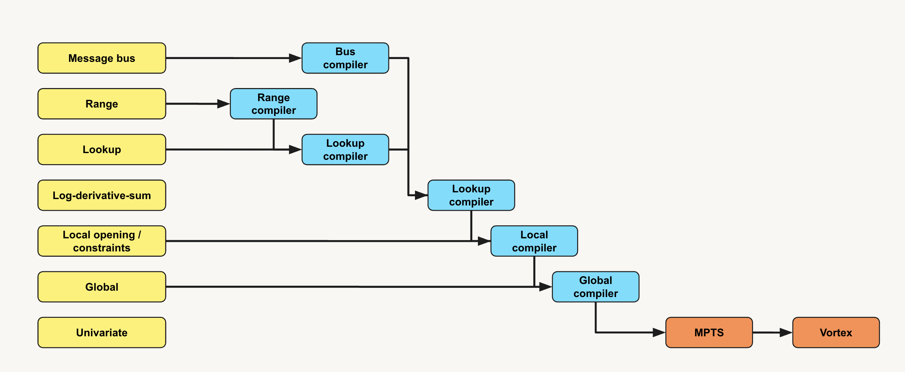

This document describes the Arcane compilation pipeline that turns a wizard protocol into a polynomial-IOP. The current document does not cover the polynomial-IOP to concrete protocol transformation. The Arcane pipeline is a sequence of atomic transformations, each eliminating one class of query.

# Overview of the WIOP framework

A wiop.System is the static, declarative description of an Interactive Oracle Proof protocol — think of it as the blueprint of a proof, built once at setup time and reused across many proving sessions.

It owns the protocol's hierarchy: a PrecomputedRound for offline data, an ordered sequence of interactive Rounds, and Modules that group Columns sharing the same domain size and padding. Inside this scaffolding, the user registers the protocol's predicates as Query values. The framework supports several query kinds — Vanishing, LagrangeEval, LocalOpening, TableRelation, LogDerivativeSum, and so on — each one referencing symbolic Expression trees that form arithmetic ASTs.

Crucially, a System contains no field-element data (except for precomputed columns). It is pure specification: every Column, Cell, and CoinField is just a typed handle with a human-readable path and a compact ObjectID. Concrete assignments live in a separate Runtime, which binds values to these handles for one proof run and drives the Fiat-Shamir transcript via AdvanceRound.

This split — spec vs. execution — is what lets compilers operate on a System: each pass rewrites high-level queries into simpler ones, marking the originals as reduced, until what remains is verifier-checkable. The same System can then be instantiated into many Runtimes without re-registering anything.

# Overview of the compiler suite

As mentioned above, the philosophy of the compiler suite is to incrementally eliminate classes of queries one after another.

The initial polynomial-IOP may feature queries of type (1) Inclusion/Lookup, (2) Log-derivative Sum, (3) Vanishing constraints. The compilation pipeline is summed up as follows: 

First, the message-bus, range and lookup constraints are compiled into a grand log-derivative sum constraint. This follows the approach of Logup. The compilation step eliminates all these constraints and generates global and local constraints. As an outline, the prover proves a lookup $S \subset T$ by checking that $$\sum_i \frac{1}{X - S[i]} = \sum_j \frac{M[j]}{X - T[j]}$$ as an equality between rational functions, where $M[j]$ denotes the multiplicity of $T[j]$ in $S$. The above equality is, in practice, checked at a random point $\gamma$ sampled by the verifier. The range-check and message-bus compilers follow similar tactics.

The local constraints are turned into global constraints thanks to an elementary trick: a local constraint at position $k$ is equivalent to a global constraint whose expression is multiplied by the Lagrange polynomial $L(\omega^k X) = \frac{X^N - 1}{N (\omega^k X - 1)}$, which vanishes everywhere on the domain except at $\omega^k$.

Global constraints are compiled using the now standard PLONK technique: the prover proves that the expression $C(P_1(X), P_2(X), \ldots) = Q(X) (X^N - 1)$ is satisfied such that the quotient $Q(X)$ is a polynomial (and not a rational function in the default case). In the above, $C$ is the multivariate polynomial representing the constraint and $P_i(X)$ is the polynomial interpolating column "i" in the root-of-unity domain whose size matches the size of the columns.

