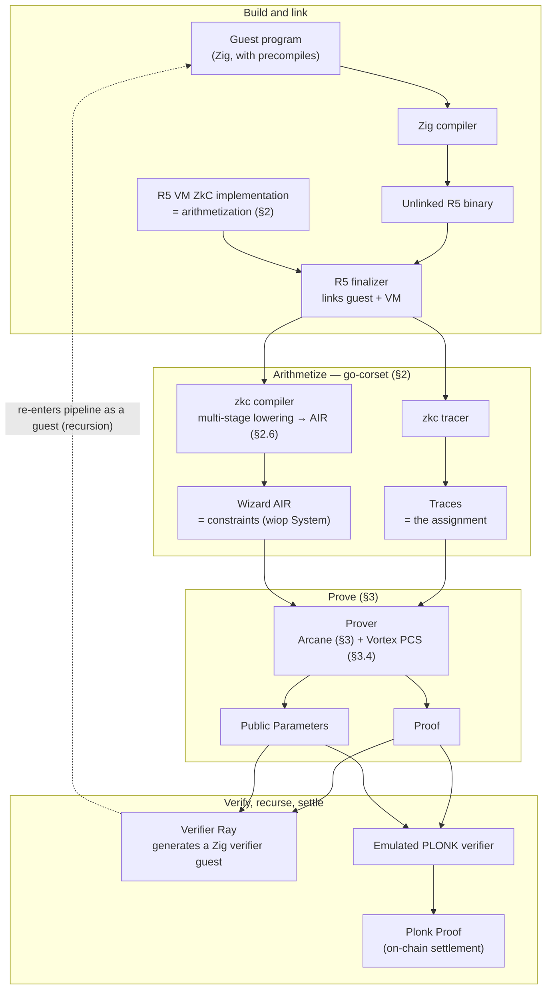

# 1. Goals and Objectives

## 1.1 Purpose

The system provides efficient cryptographic proofs of the correct execution of
programs running on a RISC-V virtual machine. Rather than requiring a verifier to
re-execute a computation, the system generates a succinct proof attesting to the
validity of that execution. A verifier can check the proof at a cost far below
that of re-running the program, which is what makes delegated, trustless
execution practical at scale.

## 1.2 Primary Objectives

### Scalable Execution Verification

The system enables **delegated execution**: a prover runs a workload and produces
a proof that can be verified far more cheaply than re-executing the computation.
The target setting is blockchain and rollup environments, where execution costs
are large, the same execution must be checked by many parties, and verification
must remain practical on constrained verifiers (including on-chain ones).

### Cost Efficiency

The system minimizes both proving cost and verification cost, so that proof
generation is economically viable for production workloads — large transaction
batches and complex smart-contract execution included. Cost efficiency is treated
as a first-class objective rather than a by-product, because it determines
whether the system is usable at rollup scale.

### Low Latency

The system targets proof generation within seconds of execution completion. Low
end-to-end latency is a core requirement, not an optimization: it is what allows
the proving system to serve real-time and near-real-time applications rather than
only batch settlement.

### Security

Soundness is the system's foundational guarantee: producing a proof for an
execution that did not happen, or whose result differs from the claim, must be
computationally infeasible. The strength of that guarantee is governed by an
explicit **security parameter** — the target soundness level, in bits — which the
proof system's parameters (field/extension size, code rate, query counts) are
chosen to meet. The concrete target level is to be fixed in the proving-system
specification; the per-pass soundness accounting in §3 is written in terms of it.

Two further security properties are objectives of the design, surfaced here and
developed later:

- **Post-quantum security.** The core proving stack is built on hash-based
  commitments (FRI / Vortex over a small field with Merkle hashing) rather than on
  assumptions a quantum computer would break (discrete log, pairings), so the
  proofs it produces are plausibly post-quantum. The post-quantum status of the
  final on-chain-verifiable wrapping (§1.6) is a separate consideration and is
  treated as an open item.
- **Formal-verification friendliness.** The architecture is intended to be
  amenable to auditing and, ultimately, machine-checked soundness proofs. The
  compiler is a sequence of small, independently analyzable, soundness-preserving
  passes (§3); the arithmetization is maintained as readable source rather than a
  hand-written circuit (§2); and complexity is kept local to each component. These
  choices are made deliberately to keep the trusted reasoning tractable.

### Modular Architecture

The architecture cleanly separates four concerns so that each can evolve
independently:

- VM execution and trace generation;
- constraint generation and arithmetization;
- specialized cryptographic constraints (precompiles);
- proof generation and aggregation.

This separation is load-bearing for the rest of the specification. In particular,
arithmetization and proving are decoupled across a single, well-defined interface
(an algebraic constraint system plus its assignment), so that the proof system
can be reasoned about and replaced without touching the VM semantics, and vice
versa. The boundary is made concrete in Sections 2 and 3.

## 1.3 Target Execution Environment

The initial target ISA is **RISC-V RV64IM** — the 64-bit integer base together
with the integer multiplication/division extension — extended with the
unprivileged-ISA features required to run realistic toolchain output:

- **RV64I**: the 64-bit integer base (subsuming RV32I, with the `*W`
  word-width variants);
- **M**: integer multiplication, division, and remainder;
- **Zicsr** and **Zifencei**: control/status-register access and the
  instruction-fetch fence;
- **Zicclsm**: misaligned loads and stores are supported as a behavioural
  guarantee (no new opcodes).

The concrete compilation target is `riscv64im_zicclsm-unknown-none-elf`. This ISA
was selected because it is expressive enough to represent demanding workloads —
notably EVM execution — while remaining simple enough to reason about and
arithmetize. The authoritative per-opcode encoding and semantics are maintained
alongside the arithmetization (see §2).

## 1.4 Cryptographic Acceleration

Many blockchain workloads are dominated by expensive cryptographic primitives.
Expressing those primitives entirely through generic VM instructions would be
prohibitively costly to prove. The system therefore supports **specialized
execution paths** — precompiles — for operations such as:

- Keccak hashing;
- elliptic-curve arithmetic;
- signature verification;
- other cryptographic primitives.

Rather than being unrolled into ordinary VM steps, these operations are detected
and routed to dedicated, specialized constraint systems, preserving soundness
while avoiding the cost of a generic-instruction encoding. The mechanism is
specified in §5.

## 1.5 Extensibility

While the initial implementation targets RV64IM (with the extensions above), the
architecture is designed so that additional ISAs, VM models, or specialized
execution environments can be incorporated without fundamental changes to the
proving framework. Because arithmetization is decoupled from proving (§1.2,
"Modular Architecture"), a new front end need only emit the same algebraic
constraint-system interface to reuse the entire proving pipeline unchanged.

## 1.6 System Overview: the End-to-End Pipeline

This section gives the complete picture before the detailed treatment that
follows. The system is a pipeline that turns a guest program and its inputs into a
single, on-chain-verifiable proof, with each stage owned by a later section.

The stages, and where each is specified:

1. **Guest program (§2).** A workload is written in Zig — including any
   precompiles — and compiled to a RISC-V (`riscv64im_zicclsm`) binary. The
   guest programs include not only application workloads but the
   proof-recursion programs themselves (execution-proof, compression-proof, and
   aggregation-proof programs).
2. **Finalization.** The `R5 finalizer` links the compiled guest against the
   **R5 VM ZkC implementation** — the RISC-V interpreter written in ZkC that
   *is* the arithmetization (§2) — producing the artifact the proving stack
   consumes.
3. **Constraints and assignment (§2.5).** go-corset processes the finalized
   artifact along two paths that meet the `(constraints, assignment)` interface:
   the **zkc tracer** emits the execution **Traces** (the assignment), and the
   **zkc compiler** lowers the program through several internal intermediate
   representations into its final arithmetization layer, **AIR** — the
   **Wizard AIR** (the `wiop.System`). The intermediate stages are go-corset
   implementation details (see §2.6); AIR is the stable boundary the proving
   pipeline depends on. Both `Traces` and `Wizard AIR` feed the prover.
4. **Proving (§3).** The **Prover** runs the Arcane compiler — reducing the
   Wizard-IOP to a Poly-IOP (§3.1–§3.3) — and closes it with the Vortex
   polynomial commitment scheme (§3.4) under a continuously applied Fiat–Shamir
   transform (§3.5), emitting a **Proof** and its **Public Parameters**.
5. **Recursion and aggregation.** Verification is performed by **Verifier Ray**,
   which is a *code generator*: it emits Zig source for the procedure that
   verifies a `(Proof, Public Parameters)` pair. Because that generated verifier
   is itself a Zig guest program, it re-enters the pipeline at stage 1 — so
   *verifying a proof is itself a provable execution*. This is the mechanism by
   which proofs compose: each layer's generated verifier checks the layer below,
   realizing the execution → compression → aggregation chain. Distribution across
   an orchestrator and multiple provers (instruction-block allocation, per-prover
   tracing, and final aggregation) is the subject of the proving-architecture
   section.
6. **On-chain settlement.** The final layer is wrapped by an **emulated PLONK
   verifier**, which produces a succinct **PLONK proof** suitable for on-chain
   verification. This is the terminal artifact submitted for settlement.

> **Open items in this overview.** Two points remain genuinely open and are
> flagged where they recur: whether "precompiles" in the Zig guest are
> ZkC-implemented routines the guest calls through to or Zig itself (§2.7, §5);
> and the post-quantum status of the terminal PLONK wrap (§1.2, "Security").