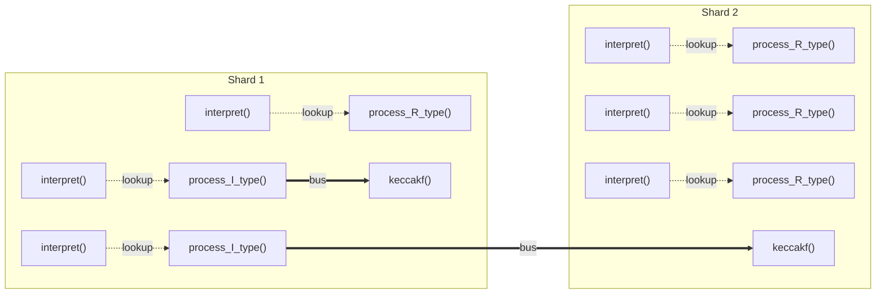
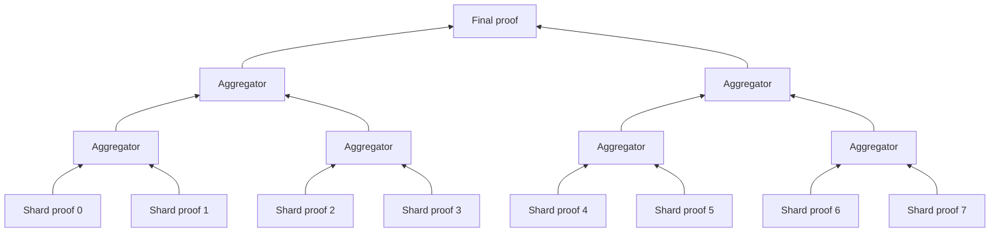

# 4. Proof Composition

A proof of execution for a workload on the R5 zkVM is not produced by a single
prover running a single end-to-end protocol. Three concerns force a
different architecture:

- **Trace size.** Realistic workloads produce traces with $10^8$–$10^9$
  rows of arithmetization-level activity. No single proof of that size
  meets the latency target of §1.2.
- **Parallelism.** Generating that proof in seconds, even at the lower end
  of the target, requires distributing the prover workload across many
  machines.
- **Determinism of shared coins.** Some coins drawn by the proving system
  are not local to a piece of the trace — they must bind data spanning the
  entire trace. The most prominent is the log-derivative coin used by the
  message bus (§2.2): the bus's correctness is a single global identity
  that any partition of the trace must contribute to consistently, and
  that identity is randomized by a coin whose derivation depends on every
  contributing shard's data.

This section addresses these together. The trace is split into uniform
**shards** (§4.1); shard proofs are combined by **recursive aggregation**
(§4.2); and the verifier procedure that makes aggregation possible is
emitted by **Verifier Ray** (§4.3), the code-generation component that turns
the proof system into a Zig guest program that re-enters the pipeline.

---

## 4.1 Sharding and Distributed Proving

### 4.1.1 Uniform Shards

The trace is partitioned into shards. Every shard contains **the same set
of modules**: there are no specialized "Keccak shards" or "ALU shards" —
only shards with all modules, differing only in the per-module sizes of
their columns. The dynamic-size capability of §3.2.1 absorbs that
variation.

Two consequences make this load-bearing:

- **Aggregation tractability.** Every shard proof has the same shape:
  same modules, same constraint set, same verifier procedure. The
  aggregator (§4.2) verifies "two proofs of the same circuit," not "two
  proofs of different circuits." A heterogeneous-shard design would
  force the aggregator to handle every shard type and every combination,
  defeating the simplification recursion is supposed to provide.
- **Load-balancing across shards.** Within a shard, the relative cost of
  different work is uneven: R-type and I-type RISC-V instructions are
  roughly equal in arithmetization cost, but Keccak (and other
  precompiles) are an order of magnitude more expensive. Because every
  shard contains every module, expensive work like Keccak can be **moved
  across shards by the bus** (§4.1.2) to balance their total cost, rather
  than being concentrated in dedicated shards.

Cyclic-shift views (§3.2.5) at shard boundaries are clipped by the same
wrap-around cancellation that applies at column boundaries; no new
constraint primitive is introduced.

> **Caveat on the diagrams.** The diagrams below show Keccak as the
> representative expensive precompile because it surfaces first when
> discussing load balance, but the system has and will have other
> precompiles (SHA-256, elliptic-curve operations, others — see §5). The
> bus-mobility property applies to all of them.

### 4.1.2 The Bus / Lookup Distinction Revisited

Section 2.2 established the two constraint mechanisms used to wire tables
together — the **message bus** for inter-instruction control transfer
and **lookup (inclusion) constraints** for intra-instruction helpers.
With sharding in place, the same distinction acquires a sharper meaning.

**Architectural meaning.** Bus connections are *cross-shard portable*: a
sender in one shard can deliver to a receiver in another shard, so the
work named by a bus call can be allocated to whichever shard balances the
load best. Lookup connections are *shard-local*: the looked-up table must
be in the same shard as the looking row, so the work named by a lookup
remains co-located with its caller.

In the illustration, two `process_I_type` calls in shard 1 invoke
`keccakf`. One Keccak instance is allocated to shard 1; the other is
routed across the shard boundary by the bus to shard 2, balancing the
expensive work. The `interpret() → process_*_type` calls are shard-local
lookups; no cross-shard mobility, no preflight cost.

**Security meaning.** Any bus-routed data must enter the **shared
randomness** binding (§4.1.3). The justification, stated rigorously: any
data not bound by the shared randomness must be deterministically
derivable from the data that *is* bound, shard-by-shard, from the
program input and the bus contents. Local-lookup data is exempt from
this binding because it represents a deterministic local computation on
data the same shard already owns. Bus data is not exempt: by
construction, what one shard emits affects what another shard receives,
and only the bus content visible to all shards can make that consistent.

**Cost meaning.** Preflight cost — the work every prover does to derive
shared randomness — scales with bus content. Forcing intra-instruction
helpers (sign extension, signed comparison, multiplication by helper
tables) onto the bus would inflate preflight work for no benefit, since
those helpers are perfectly shard-local. So the bus / lookup decision is
both an architectural choice and a budget knob.

**Where the decision is made.** Each call site in the ZkC source is
annotated by the author as bus or lookup, with the contract that the
annotation matches the call's cross-shard mobility requirement. The
author is the right decision-maker because the right answer depends on
the program, not on the compiler.

> *[TODO: Confirm with the go-corset team that the per-call-site
> bus/lookup annotation is the design and that go-corset reads it
> without overriding.]*

### 4.1.3 Shared Randomness and Preflight

The bus's correctness reduces to a single global identity — the sum of a
log-derivative expression over all shards must equal a target value
(§3.3.2). The verifier randomizes this identity with a coin $\gamma$
drawn in the extension field $\mathbb{F}_{p^6}$. For soundness, $\gamma$
must be drawn *after* every shard's bus contribution has been committed.
In a multi-prover deployment this becomes a coordination problem: no
single prover sees all shards' bus contributions, yet every prover must
end up using the same $\gamma$.

The system resolves this by **full preflight on every prover**. Every
prover runs preflight for the **entire workload**, not just for its
assigned shards. Preflight produces exactly the data needed to derive
$\gamma$ — the bus contributions of every shard, committed (§4.1.4) —
and $\gamma$ is then derived deterministically from those commitments.
Once $\gamma$ is in hand, each prover proceeds independently to the
proving step for its own shards, with no cross-prover communication.

The bet underlying this choice is that **the preflight workload is small
relative to the proving workload**, so the per-prover overhead of
running the full preflight is manageable. The size of the bus
contribution data (and hence the cost of preflight) is one of the
dominant motivators for limiting how much work is bus-routed (§4.1.2).

### 4.1.4 Two-Round Commitment Structure: Commitment 0 and Commitment 1

Shared randomness derivation (§4.1.3) needs a concrete cryptographic
binding to the bus contents of every shard. The protocol provides this
by structuring each shard proof's commitments into **two distinct
rounds** — call them **commitment 0** and **commitment 1** — and
deriving $\gamma$ from the commitment-0 roots of every shard.

What is committed at each round is the prover's set of **columns** —
specifically, the FRI commitment roots of those columns (§3.4). Columns,
not constraints and not messages: the FRI commitment is over the
Reed–Solomon encoding of a column's evaluations, and what enters the
transcript and the public input is the root of the corresponding paired-
leaf Merkle tree (§3.4.1).

The two rounds are:

- **Commitment 0** holds the shard's **bus-bound columns** — the columns
  that participate in the cross-shard message bus, including the bus
  send/receive payloads and any associated multiplicities. The FRI
  commitment root for commitment 0 is exposed as a public input of the
  shard proof.
- **Commitment 1** holds the rest of the shard's committed columns —
  everything else, including the bus log-derivative running-sum columns
  that consume $\gamma$ as their challenge (§3.3.3).

The split is artificial: nothing in the proof system requires two
rounds rather than one. The purpose is to make the binding clean —
commitment 0 fixes the bus content before $\gamma$ is sampled, and
commitment 1 happens after.

**Shared randomness derivation.** Once every shard has produced its
commitment-0 root, $\gamma$ is derived deterministically as a hash of
all of them:

$$
\gamma \;=\; \mathrm{hash}\bigl(\mathrm{root}_0^{(0)},\, \mathrm{root}_0^{(1)},\, \dots,\, \mathrm{root}_0^{(k-1)}\bigr),
$$

where $\mathrm{root}_0^{(j)}$ is shard $j$'s commitment-0 root. This
ties $\gamma$ to the actual bus contents of every shard, in a way every
prover can compute identically from preflight output.

At aggregation (§4.2), each shard proof carries its commitment-0 root
up the tree. The aggregation root verifier hashes the collected
commitment-0 roots and checks that the result equals the $\gamma$ used
in every shard proof (§4.2.3).

### 4.1.5 Striping for Prover Assignment

The mapping of shards to provers is **striping**. Given $n$ provers and
$k$ shards (with $k$ possibly much larger than $n$), prover $i$ proves
every shard with index congruent to $i$ modulo $n$. Each prover
therefore handles roughly $k / n$ shards, possibly non-contiguous in
execution order.

Prover assignment is decided by a **master orchestrator** in an offline
node-discovery phase: provers register with the master, the master fixes
$n$ and assigns each prover its index $i$ before any shard work begins.
Striping is the assignment rule; orchestration is the mechanism. Provers
do not volunteer for specific shards.

Striping is structurally distinct from **shard allocation** (§4.1.6),
which decides what work goes into which shard. Shard allocation is
upstream of striping — it happens once, deterministically, before
provers know their indices.

> *[TODO: The orchestration layer — node discovery, prover registration,
> the master process driving shard dispatch — is being designed in
> parallel by the architecture and platform teams. The description above
> reflects the proving-system contract on what orchestration must
> provide ($n$ fixed offline, each prover knows its index $i$); the
> concrete orchestrator protocol is to be specified separately.]*

### 4.1.6 Shard Allocation

Shard allocation is performed by **go-corset**. Given the program
inputs, go-corset generates the execution trace and decides, at
trace-generation time, which work goes in which shard.

For shard allocation to be compatible with the full-preflight scheme of
§4.1.3, it must be a **deterministic function of the program input**.
Otherwise, two provers running preflight independently would produce
different shard layouts, different bus contributions, and disagree on
$\gamma$. The shared-randomness contract therefore requires:

> Shard allocation is a pure function of the program input and the
> arithmetization. No prover-side state, randomness, or scheduling
> influences which shard contains which work.

> *[TODO: Confirm with the go-corset team that deterministic shard
> allocation is a design commitment of the toolchain.]*

The allocation policy itself is not yet fully specified; the broad
rules under consideration are:

- **Per-module-group policy.** Different module families get different
  allocation rules. Modules associated with cheap, frequent work (R5
  instruction handlers) are filled in execution order: shard 0 covers
  the first chunk of the trace, shard 1 the next, and so on. Modules
  associated with expensive precompile work (Keccak, EC operations) are
  spread across shards to balance their per-shard cost, independent of
  execution order.
- **Maximum-rows ceiling.** No module's per-shard column may exceed
  $2^{22}$ rows (about 4 million). This bounds the FFT-domain size: the
  KoalaBear field's two-adicity limits the size of multiplicative
  subgroups, and arithmetization steps that rely on FFTs (Reed–Solomon
  encoding, polynomial multiplication) break above this ceiling.

> *[TODO: The detailed allocation policy is to be filled in once the
> implementation lands.]*

### 4.1.7 Separating Local Constraints

Local constraints (§3.2.5) pin an arithmetic predicate to a specific
row of a column's domain. In a monolithic trace this row is
unambiguous. In a sharded trace it becomes ambiguous: every shard has
its own row indexing, so a row position has two natural readings — the
position in *this shard's* trace, or the position in the *entire*
trace. Most local constraints want the former (each shard has its own
log-derivative running-sum initialization, for example, and that
initialization must fire on each shard's first row independently). But
some — the genuinely **global initial-state constraints**: initial
program counter, initial register state, program-input binding — want
the latter (they must fire exactly once, on the first row of shard 0).

The mechanism: every shard receives **the same circuit**, with the
shard's index passed as a **public input**. Local constraints that
need trace-global semantics are encoded as local constraints predicated
on `shard_index == 0`. No new constraint primitive is introduced. The
first-row case is the most common but the principle is general: any
local constraint can be predicated on the shard index to select which
shards it fires on.

This approach has two downstream consequences:

- **The shard index is bound by the shared randomness binding** of
  §4.1.4 automatically, because it is a public input. No additional
  mechanism is needed to prevent a prover from claiming the wrong
  index.
- **Aggregation needs the shard index too** — to verify the shard-set
  coverage check (§4.2.2), each shard proof must expose its index.
  Carrying it through is therefore not an imposition specific to
  local-constraint scoping; it has other uses downstream.

> *[TODO: This resolution has been chosen but has not yet been written
> back to the go-corset team. The go-corset side may want to model the
> shard index more explicitly than as a generic public input.]*

---

## 4.2 Recursive Aggregation

A workload sharded into $k$ pieces produces $k$ shard proofs
(distributed across the assigned provers per §4.1.5). The system reduces
these to a single proof through **binary recursive aggregation**: pairs
of proofs are combined into one new proof, which can itself be combined
with another, and the process repeats until one proof remains.

The mechanism that performs each combination is an **aggregator
program**: a guest program (§4.3) that takes two proofs as input,
verifies them both, emits a new proof attesting to that combined
verification, and propagates public inputs that downstream aggregations
need.

The shape of the tree is **not** required to be balanced or left-leaning;
aggregations may combine any two proofs in any order, subject to the
public-input compatibility constraints below. This order-independence is
a deliberate choice — proofs are aggregated as they arrive, with no
scheduling constraint on the orchestrator.

### 4.2.1 Aggregator Public Inputs

Each proof at any level of the tree — shard proof or aggregator output —
exposes the following public inputs:

- **$\gamma$** — the shared randomness coin for the bus. Aggregation
  requires the two child proofs to agree on $\gamma$; an aggregator that
  combines proofs with different $\gamma$ values would not produce a
  meaningful joint statement.
- **Commitment-0 root list (or its hash)** — the running collection of
  shard-level commitment-0 roots accumulated so far. Combining a left
  and a right child concatenates their lists.
- **Shard-set multiset hash** — a multiset hash over the shard indices
  covered by the proof so far (§4.2.2). A shard proof for shard $i$
  initializes this with the singleton $\{i\}$.
- **Bus-LogUp partial sum** — the sum of bus-contribution running-sum
  endpoints for the shards covered so far (§4.2.4). For balanced bus
  semantics this sum at the root must be zero.

The two child proofs entering an aggregator are required to agree on
$\gamma$ and on the program identity (the latter being part of the
verification key — see §4.2.5); they are *not* required to be adjacent
in shard index.

### 4.2.2 Multiset Commitment for Coverage and Anti-Replay

Recursive aggregation must prevent two failure modes:

- **Replay** — the same shard proof being incorporated more than once.
  Without prevention, an adversary could produce a small number of
  shard proofs and re-aggregate them to construct a tree whose bus sum
  happens to fall on the target value (a lattice-style attack on the
  aggregator).
- **Missing coverage** — a complete-looking tree that omits some
  shards. Each missing shard's bus contribution is silently dropped
  from the global sum.

Both are addressed by carrying a **multiset hash** over the shard
indices through the tree. Each shard proof for shard $i$ initializes its
multiset hash to a representation of $\{i\}$. Each aggregator step
combines its children's multisets via the multiset-hash union
operation. At the root, the verifier checks that the final multiset
hash equals the **reference hash** of $\{0, 1, \dots, k-1\}$.

The multiset hash construction enforces unique-coverage by its algebra:
if each shard index hashes to a distinct element and the union
operation is the appropriate algebraic combiner, equality with the
reference hash for $\{0, \dots, k-1\}$ holds iff each index appears in
the union exactly once. This is the standard property of additive or
elliptic-curve-based multiset hashes.

> *[TODO: Specify the concrete multiset hash construction. Candidates:
> sum of Poseidon2 hashes of indices, polynomial-commitment-based,
> elliptic-curve-based. The choice depends on the verifier's
> arithmetization cost when verified inside the Verifier Ray guest
> (§4.3).]*

### 4.2.3 Shared-Randomness Binding at the Root

The shared randomness $\gamma$ that all shard proofs are bound against
is derived, by definition, from a hash of every shard's commitment-0
root (§4.1.4). For an honest prover, this derivation is
straightforward: run preflight, hash the commitment-0 roots, obtain
$\gamma$. The aggregation tree's job is to verify, at the root, that
**the $\gamma$ used by every shard proof is consistent with the
collected commitment-0 roots of every shard proof**.

The mechanism: each shard proof exposes its commitment-0 root as a
public input; each aggregator combines its children's commitment-0
root lists into one (concatenation, or equivalent); the root verifier
hashes the combined list and checks that the hash equals $\gamma$.
This closes the binding loop. A prover that picked an arbitrary
$\gamma$ and produced shard proofs against it would fail this root
check.

### 4.2.4 Bus Sum at the Root

Each shard proof exposes its **bus-LogUp running-sum endpoint** —
$\sum_{i} f_{\text{bus},i}$, the contribution of this shard's bus
messages to the global identity of §3.3.2 — as a public-input scalar.
Each aggregator adds the two children's endpoints. At the root the
verifier checks the total equals the protocol's target (zero for the
balanced bus configuration).

### 4.2.5 Program Identity in the Verification Key

The aggregator must also enforce that the two children prove the same
program. This binding lives **outside the proof's public inputs**: the
program is embedded into the arithmetization as a **static ROM module**
(§2.5) whose contents are precomputed and committed offline. The
resulting precomputed commitment becomes part of the
**verification key** of the proof. Two proofs of the same program share
the same verification key; the aggregator's verification step rejects
any child whose verification key does not match the expected program.

### 4.2.6 Open: Total Shard Count and the Binding Cycle

The shard count $k$ enters the root verifier in two distinct ways: it
is needed to compute the reference multiset hash of $\{0, \dots, k-1\}$
(§4.2.2), and it has to be bound by the shared randomness derivation
so an adversary cannot inflate the count after preflight.

These two roles create a binding cycle: $k$ is determined only at the
*end* of preflight, after the shard layout is fixed; but $k$ is a public
input that the shared randomness $\gamma$ must bind, and $\gamma$ is
derived from commitment-0 roots that are computed during shard proving —
which uses $\gamma$ as a challenge.

Two natural directions for resolution:

- **Make $k$ deterministic from the program inputs and setup.** If the
  shard count is a known function of inputs and arithmetization, then
  $k$ is determined before $\gamma$ is sampled, and binding $k$ via
  shared randomness is straightforward.
- **Bind $k$ into preflight directly.** Include $k$ in the preimage of
  $\gamma$ alongside the commitment-0 roots, treating it as a
  preflight-time quantity rather than a proof-time public input.

> *[Open item: the binding mechanism for $k$ is under design. The two
> resolutions above are not exclusive; a hybrid is possible.]*

---

## 4.3 Verifier Ray

Recursive aggregation of §4.2 depends on the existence of a guest
program that verifies a shard proof (or an aggregator output) and is
itself a provable execution. **Verifier Ray** is the component that
produces such guests.

### 4.3.1 Code Generation

Verifier Ray is a **code generator**: given a compiled instance of the
proof system — a specific arithmetization paired with the Arcane
compilation choices it produces — Verifier Ray emits Zig source code
for the procedure that verifies a `(Proof, Public Parameters)` pair
against that instance.

The generated Zig source is then itself a guest program: it compiles
through the same Zig → RISC-V toolchain (§1.6) into a guest binary,
runs through the R5 zkVM, and produces a proof of *having verified* the
input proof. This is what closes the recursion. A shard proof is
produced by the prover; its verification is performed by a
Verifier-Ray-generated guest; that guest's execution is itself proved;
pairs of those proofs are aggregated by aggregator guests (themselves
Verifier-Ray-generated); the process continues to the root.

Verifier Ray is therefore not a single program but the *generator* of
the family of programs the aggregation tree uses. The choice to make
it a code generator rather than a parametric runtime is deliberate:
the verifier's shape — number of rounds, number and order of
commitments, which queries to perform — is fixed by the compiled
proof system, so the emitted Zig can be a straight-line procedure with
no protocol-level generality, and is much cheaper to prove than a
runtime that interprets a protocol specification.

### 4.3.2 Recursion in Practice

The architectural ideal — "verify a Zig-emitted procedure that
re-enters the pipeline as a guest" — has to navigate three practical
caveats. The common motivation behind all of them is that
**aggregation sits on the critical latency path of the whole system**:
every aggregator must be proved before the next layer of the tree can
proceed, and the final proof is unavailable until the root aggregator
is proved. The cost of proving an aggregator therefore directly bounds
end-to-end latency. The caveats below are each a way to keep that cost
small.

**Recursion runs without sharding.** The Verifier Ray guest must
itself be proved as a single shard, not as a sharded execution. If
aggregation were itself sharded, combining two proofs would produce
$n$ child shards rather than one parent proof, inflating the proof
count rather than reducing it. Non-sharded mode is not a runtime flag
on the prover but a property of how the Verifier Ray guest's
arithmetization is **constructed**: the recursion guest is built
without the shared-randomness binding machinery of §4.1.4, since
there is nothing to bind across shards. The orchestration of
recursion is correspondingly a separate code path from the
shard-distribution orchestration of §4.1.5.

**Verifier-internal operations need precompiles.** A pure-RISC-V
emulation of the verifier would be too expensive to prove. The
verifier is dominated by hash computation (every Fiat–Shamir step,
every Merkle authentication path) and by structural polynomial
operations (evaluating the folded evaluation quotient $\Phi_N$ at
FRI query points, §3.4.2, requires reconstructing $|I_N|$
Lagrange-evaluation terms per query). Generic RISC-V proves all of
this at a high constant cost. The recursion guest therefore reaches
for **precompiles** (§5):

- **Poseidon2** — a dedicated precompile, decided.
- **Folded evaluation quotient reconstruction** — a candidate.
- **Other verifier-internal operations** to be identified.

The precompile mechanism is the same one used for application
precompiles (§1.4 / §2.7): the recursion guest's caller routes the
operation through dedicated arithmetization rather than through
generic instructions.

**Global-quotient evaluation may need a dedicated precompile.** The
PLONK quotient check of §3.3.5 is $O(\text{rows})$ asymptotically. In
practice, with a large number of constraints contributing to the
merge, the constant becomes significant for the recursion guest. A
ZkC-written precompile that implements the quotient evaluation
directly — without going through RISC-V emulation — would mitigate
this. Whether this lands as a precompile or as a structural
optimization elsewhere in the recursion guest's arithmetization is
open.

> *[TODO: The full list of recursion-side precompiles is to be filled
> in once §5 (Precompiles) is written. This subsection should
> cross-reference §5's precompile catalog.]*

---

### Open items carried into this section

- **§4.1.2 bus/lookup annotation** — the per-call-site annotation in
  ZkC source is the intended design point; confirmation with the
  go-corset team is pending.
- **§4.1.6 deterministic shard allocation** — design commitment of
  go-corset; confirmation pending.
- **§4.1.6 allocation policy** — the per-module-group rules and the
  maximum-rows ceiling are noted; the full detailed policy is to be
  specified once the implementation lands.
- **§4.1.7 first-row semantics** — chosen resolution (shard index as
  a public input, branched on); to be written back to the go-corset
  team.
- **§4.2.2 multiset hash construction** — concrete construction to be
  selected; the choice depends on Verifier Ray's verification cost.
- **§4.2.6 shard count binding** — binding $k$ into shared
  randomness has a dependency cycle that is under design.
- **§4.3.2 recursion precompiles** — Poseidon2 decided; folded
  evaluation quotient and global-quotient precompiles are candidates;
  full list to be filled in once §5 lands.
