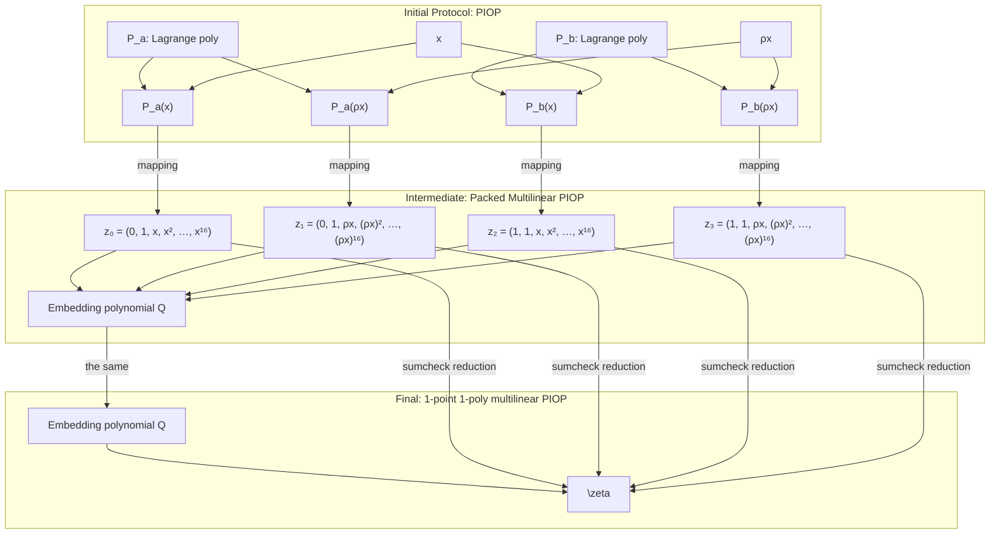

# Multilinear compilation

This packages implements a POC implementation of MPTS + Vortex using multilinear
techniques like sumcheck.

## Overview

The input of the compilation pipeline is a polynomial IOP of the form described in the diagram below. Essentially, we assume that every combination poly-xpoint is possible. We assume that the PIOP structure does not allow for evaluation claims over shifted polynomials. This is a common feature of univariate-PIOP protocol and they can be reduced to evaluation claim over the non-shifted columns by shifting the point instead. In the older version of Vortex, this was done by the naturalization step of the compilation pipeline. Here we assume this step has been cleared and that we do not need to address theses. We also assume that all evaluation claims are relating to pure-base-field columns. An ad-hoc reduction step also exists in the older Vortex implementation; the splitextension compiler.



And the goal is to reduce the above into an equivalent multilinear-PIOP featuring a single embedding multilinear polynomial collecting all the information of the many Lagrange polynomials together and being evaluated at a single random point. The resulting multilinear-PIOP protocol can then be instantiated in the standard or ROM models using the Vortex polynomial commitment scheme. Vortex has been described as univariate commitment scheme but it can easily be reformulated into a multilinear polynomial commitment scheme.

## The packing algorithm

This section delineates the transition from the initial PIOP protocol to the intermediate packed multilinear-PIOP. In this steps, we need to solve 2 problems. First, we need to explicit how to construct the polynomials $Q$ from $P_a$ and $P_b$. We use a monomial-basis conversion mapping combine with the inverse-NTT transform to map $P_a$, $P_b$ into equivalent multilinear polynomials. These are then optimally packed using a simple sorting layout technique within the boolean hypercube evaluation representation of $Q$.

### Mapping univariate and multilinear polynomials

Let us fix $x$ and $y \in \mathbb{F}$ and let $P$ be a univariate polynomial of degree $2^n - 1$, and let us assume we are given its representation in Lagrange basis $(\lambda_0, \lambda_1, \ldots, \lambda_{n-1})$ over the subgroup of the roots of unity $\Omega = \{ \omega \in \mathbb{F} : \omega^{2^n} = 1\}$. We additionally assume that we have a claim 

$$C: P(x) = y = \frac{x^n - 1}{n} \sum_{i = 0}^{2^n-1} \frac{\lambda_i}{X - \omega^i}$$

Unfortunately, we do not know how to directly map this claim onto a multilinear polynomial with coefficients $(\lambda_i)_{i=0}^{2^n -1}$. This is a byproduct of the coefficients $\frac{1}{X - \omega^i}$ not having a nice tensoral structure. Thus, we start with a preliminary monomial basis conversion using the inverse-NTT (Number Theoric Transform). It returns coefficients $(p_i)_{i=0}^{2^n-1}$ and runs in $n2^n$ steps. The claim can be rewritten equivalently as:

$$C: y = \sum_{i=0}^{2^n-1} p_i x^i$$

This makes it much simpler to map $P$ and the claim $C$ into the multilinear world. In what follows, we delineate this mapping. Let $\sigma$ be the *monomial correspondance* map, mapping univariate polynomials of degree less than $2^n$ to $n$-linear polynomials coefficient-by-coefficient.

$$\sigma \colon \mathbb{F}_{\leq 2^n - 1}[X] \to \mathcal{M}_\mathbb{F}[Z_0, \ldots, Z_{n-1}]$$
$$\sum_{i < 2^n-1} p_i X^i \to \sum_{\mathbf{b} \in \mathcal{H}_n} p_{r(\mathbf{b})} \prod_{k<n} Z_k^{b_k}$$

Where $\mathcal{H}_n = \{0, 1\}^n$ is the boolean hypercube of dimension $n$ is the bit-recomposition function used to map the coefficients of $P$ to the one of $\bar{P}$ 

$$r \colon \mathcal{H}_n \to [[0; 2^n-1]]$$
$$\mathbf{b} \to \sum_k b_k 2^k$$

Using this correspondance, we can transfer evaluation claims in the univariate world to the multilinear world via the following equivalence.

$$P(x) = y \Leftrightarrow \bar{P}(1, x, x^2, x^4, \ldots, x^{n-1}) = y$$

The idea is that the prover claims many instances of the form $P(x) = y$ and then proves $\bar{P}(1, x, x^2, x^4, \ldots, x^{n-1}) = y$. 

The technique allows us to map a univariate-PIOP into a multilinear-PIOP. In what remains, we explain how the packing procedure allows grouping the potentially many polynomials occuring the PIOP into an large embedding one.

## Packing multilinear polynomials

We are given a list of polynomials as above, of the form:

$$P_i(Z) = \sum_{\mathbf{b} \in \mathcal{H}_{n_i}} p_{r(\mathbf{b})} \prod_{k<n_i} Z_k^{b_k}$$

A very subtle but nonetheless terribly important point is that $n_i$ depends on $i$. Note that this is also not a compile-time parameter The first thing we do is to sort $P_i$ by descending $n_i$. In the following, we assume without loss of generality that they are already sorted. We stress again, that since $n_i$ is a runtime parameter, the exact order also runtime dependant (it changes at every proof generation).

We set $N$ such that $2^N > \sum_i 2^{n_i}$ to be the number of variable of the embedding multilinear polynomial $Q$. We also define the polynomial:

$$\mathsf{eq}_N(Z, T) = \prod_{k<N} Z_i T_i + (1- Z_i)(1 - T_i)$$

Let us now specify the packing algorithm. We do it by exploiting the natural boolean hypercube structure of the evaluation spaces of multilinear polynomials. Namely, the idea is that we construct $Q$ such that for all $i$: $P_i(z_0, z_1, \ldots, z_{n_i - 1}) = Q(b_{i,0}, b_{i,1}, \ldots, b_{i,N-n_{i}-1}, z_0, z_1, \ldots, z_{n_i - 1})$ where the $b_i = (b_{i,k})_{k=0}^{N-n_{i}-1}$ are binary locator coefficients indicating the localization of $P_i$ in the representation of $Q$. For each $i$, the locator are prefix-exclusive: e.g. no locator can be the prefix of another locator. This ensures that the $P_i$ do not overlap on $Q$. This also implies that the locators define a binary tree in which the $P_i$ are arranged. $Q$ can be rewritten as follows:

$$Q(h) = \sum_{i} \mathsf{eq}(b_i \| 0, h_{[:N-n_i]} \| 0) \cdot P_i(h[N-n_i])$$

The conversion of the claims is immediately given by the equivalence:

$$ C_i : P(\zeta_i) = y_i \Leftrightarrow Q(b_i, \zeta_i) = y_i$$

This concludes the packing algorithm. Some notes on the implementations:

* In the prover, we never want to layout the coefficients of $Q$. It has a sparse representation by construction and we already allocate memory for the $P_i$.  
* We do not want to represent it with a column for that reason. This is one reason why merging MPTS and Vortex in a single compilation step.

# The sumcheck reduction claim

The above-described packing technique tells us how to construct multilinear-PIOP with a single polynomial and many evaluation claims at $I$ different points. In order to be able to apply Vortex on it, we apply an extra reduction technique to reduce this into a single-evaluation point protocol using an instance of the sumcheck protocol. The verifier open the protocol by sending a random challenge $r$, and then the prover and the verifier engage in an instance of the sumcheck protocol.

$$y_r = \sum_{i<I} y_i r^i = \sum_{h \in \mathcal{H}_N} Q(h) \sum_{i < I} r^i \mathsf{eq}(h, z_i)$$

At the end of the sumcheck, the prover and verifier are left with a claim of the form:

$$y' = Q(h') \sum_{i<I} r^i \mathsf{eq}(h', z_i)$$

The verifier can recompute the term $\sum_i r^i \mathsf{eq}(h', z_i)$ on its own as this is evaluable in time $O(N \cdot I)$, logarithmic in the witness-size. With this, it suffices for the verifier to get access to an authenticated value for $Q(h')$ to complete the final check. The Vortex polynomial commitment scheme can be used for the sumcheck. As an implementation detail, but still relevant for efficiency, the prover-time can be optimized by leveraging the internal structure of $Q$. We also absolutely want to avoid laying out the terms $\sum_i r^i \mathsf{eq}(h, z_i)$ in memory as it is massive too.

## Sumcheck algorithm with Sparse data

Earlier, we have described how sumcheck can be implemented when the summand is an expression over multilinears represented in evaluation form over the boolean hypercube and of the same size. Here, the polynomials that we manipulate have heterogeneous sizes and have a very sparse structure.

One thing we could do obtain the evaluation form of $P$. This means that the transformation pipeline from univariate to multilinear is as follows.


This adds pressure on the prover as this is more work. But, there are 2 things worth noting.

* The iNTT algorithm is a later faster if we are happy with bit-reversed values. For the sumcheck it is not so bad
* The toEval and the iNTT could potentially by fused into a single operation as they have compatible structures.

Namely, the iNTT grossly work in a divide and conquer way

```python
def intt(vec : list[Field]):
    mid = len(vec) / 2
    left, right = vec[:mid], vec[mid:]
    right = twiddles * right
    left, right = left + right, left - right
    intt(lift)
    intt(right)
```

and the toEval map is implemented as follows

```python
def multilin_to_eval(vec : list[Field]):
    mid = len(vec) / 2
    left, right = vec[:mid], vec[mid:]
    right = left + right
```

