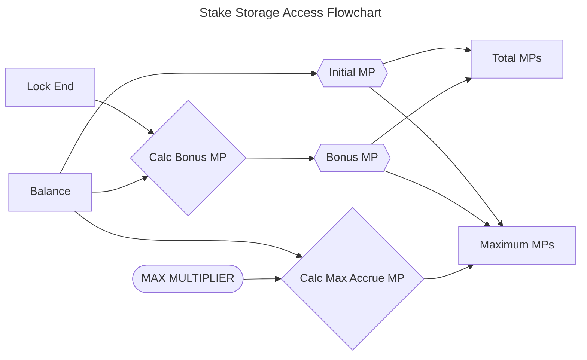
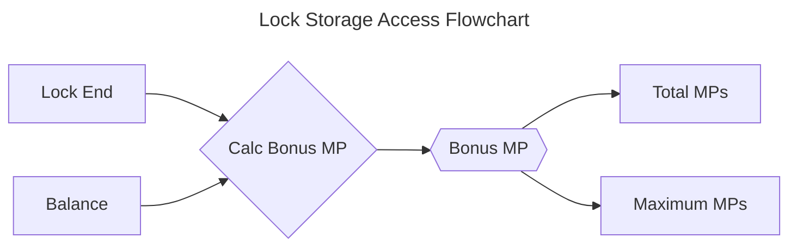
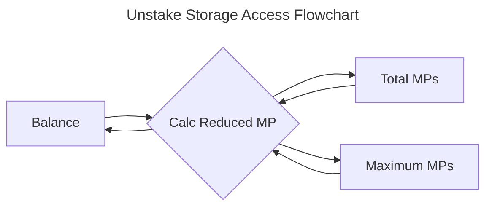
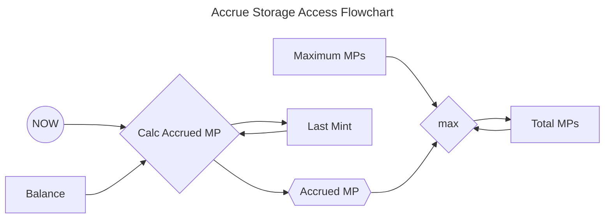

## Table of Contents

## Mathematical Specification of Staking Protocol

<!-- prettier-ignore -->
> [!IMPORTANT] 
> All values in this document are expressed as unsigned integers.

### Summary

### Constants

| Symbol                      | Source                                                                  | Value                   | Unit              | Description                                                                                                       |
| --------------------------- | ----------------------------------------------------------------------- | ----------------------- | ----------------- | ----------------------------------------------------------------------------------------------------------------- |
| $SCALE_{FACTOR}$            |                                                                         | $\pu{1 \times 10^{18}}$ | (1)               | Scaling factor to maintain precision in calculations.                                                             |
| $M_{MAX}$                   |                                                                         | $\pu{4 \mathrm{(1)}}$   | (1)               | Maximum multiplier of annual percentage yield.                                                                    |
| $\mathtt{APY}$              |                                                                         | 100                     | percent           | Annual percentage yield for multiplier points.                                                                    |
| $\mathsf{MPY}$              | $M_{MAX} \times \mathtt{APY}$                                           | 400                     | percent           | Multiplier points accrued maximum percentage yield.                                                               |
| $\mathsf{MPY}^\mathit{abs}$ | $100 + (2 \times M_{\text{MAX}} \times \mathtt{APY})$                   | 900                     | percent           | Multiplier points absolute maximum percentage yield.                                                              |
| $T_{RATE}$                  | (minimal blocktime)                                                     | 12                      | seconds           | The accrue rate period of time over which multiplier points are calculated.                                       |
| $T_{DAY}$                   |                                                                         | 86400                   | seconds           | One day.                                                                                                          |
| $T_{YEAR}$                  | $\lfloor365.242190 \times T_{DAY}\rfloor$                               | 31556925                | seconds           | One (mean) tropical year.                                                                                         |
| $A_{MIN}$                   | $\lceil\tfrac{T_{YEAR} \times 100}{T_{RATE} \times \mathtt{APY}}\rceil$ | 2629744                 | tokens per period | Minimal value to generate 1 multiplier point in the accrue rate period ($T_{RATE}$). ($A_{MIN} \propto T_{RATE}$) |
| $A_{MAX}$                   | $\frac{2^{256} - 1}{\text{APY} \times T_{\text{RATE}}}$                 |                         | tokens per period | Maximum value to not overflow unsigned integer of 256 bits.                                                       |
| $T_{MIN}$                   | $90 \times T_{DAY}$                                                     | 7776000                 | seconds           | Minimum lockup period, equivalent to 90 days.                                                                     |
| $T_{MAX}$                   | $M_{MAX} \times T_{YEAR}$                                               | 126227700               | seconds           | Maximum of lockup period.                                                                                         |

### Variables

#### System and User Parameters

##### $\Delta a\rightarrow$ Amount Difference

Difference in amount, can be either reduced or increased depending on context.

---

##### $\Delta t\rightarrow$ Time Difference of Last Accrual

---

The time difference defined as:

$$
\Delta t = t_{now} - t_{last}, \quad \text{where}  \Delta t > T_{RATE}
$$

---

##### $t_{lock}\rightarrow$ Time Lock Duration

A user-defined duration for which $a_{bal}$ remains locked.

---

##### $t_{now}\rightarrow$ Time Now

The current timestamp seconds since the Unix epoch (January 1, 1970).

---

##### $t_{lock, \Delta}\rightarrow$ Time Lock Remaining Duration

Seconds $a_{bal}$ remains locked, expressed as:

$$
\begin{align} &t_{lock, \Delta} = max(t_{lock,end},t_{now}) - t_{now}  \\
\text{ where: }\quad & t_{lock, \Delta} = 0\text{ or }T_{MIN} \le t_{lock, \Delta} \le (M_{MAX} \times T_{YEAR})\end{align}
$$

---

#### State Related

##### $a_{bal}\rightarrow$ Amount of Balance

Amount of tokens in balance, where $a_{bal} \ge A_{MIN}$.

---

##### $t_{lock,end}\rightarrow$ Time Lock End

Timestamp marking the end of the lock period, its state can be defined as:

$$
t_{lock,end} = \max(t_{now}, t_{lock,end}) + t_{lock}
$$

The value of $t_{lock,end}$ can be updated only within the functions:

- $\mathcal{f}^{stake}(\mathbb{Acc}, \Delta a, \Delta t_{lock})$;
- $\mathcal{f}^{lock}(\mathbb{Acc}, \Delta t_{lock})$;

---

##### $t_{last}\rightarrow$ Time of Accrual

Timestamp of the last accrued time, its state can be defined as:

$$
t_{last} = t_{now}
$$

The value of $t_{last}$ is updated by all functions that change state:

- $f^{accrue}(\mathbb{Acc}, a_{bal},\Delta t)$,
- $\mathcal{f}^{stake}(\mathbb{Acc}, \Delta a, \Delta t_{lock})$;
- $\mathcal{f}^{lock}(\mathbb{Acc}, \Delta t_{lock})$;
- $\mathcal{f}^{unstake}(\mathbb{Acc}, \Delta a)$;

---

##### $mp_\mathcal{M}\rightarrow$ Maximum Multiplier Points

Maximum value that $mp_\Sigma$ can reach.

Relates as $mp_\mathcal{M} \propto a_{bal} \cdot (t_{lock} + \mathsf{MPY})$.

Altered by functions that change the account state:

- $\mathcal{f}^{stake}(\mathbb{Acc}, \Delta a, \Delta t_{lock})$;
- $\mathcal{f}^{lock}(\mathbb{Acc}, \Delta t_{lock})$;
- $\mathcal{f}^{unstake}(\mathbb{Acc}, \Delta a)$.

It's state can be expressed as the following state changes:

###### Increase in Balance and Lock

$$
\begin{aligned}
mp_\mathcal{M} &= mp_\mathcal{M} + mp_\mathcal{A}(\Delta a, M_{MAX} \times T_{YEAR}) \\
&\quad + mp_\mathcal{B}(\Delta a, t_{lock,\Delta} + t_{lock}) \\
&\quad + mp_\mathcal{B}(a_{bal}, t_{lock}) \\
&\quad + mp_\mathcal{I}(\Delta a)
\end{aligned}
$$

###### Increase in Balance only

$$
\begin{aligned}
mp_\mathcal{M} &= mp_\mathcal{M} + mp_\mathcal{A}(\Delta a, M_{MAX} \times T_{YEAR}) \\
&\quad + mp_\mathcal{B}(\Delta a, t_{lock,\Delta}) \\
&\quad + mp_\mathcal{I}(\Delta a)
\end{aligned}
$$

###### Increase in Lock only

$$
mp_\mathcal{M} = mp_\mathcal{M} + mp_\mathcal{B}(a_{bal}, t_{lock})
$$

###### Decrease in Balance

$$
mp_\mathcal{M} = mp_\mathcal{M} - mp_\mathcal{R}(mp_\mathcal{M}, a_{bal}, \Delta a)
$$

---

##### $mp_{\Sigma}\rightarrow$ Total Multiplier Points

Altered by all functions that change state:

- $\mathcal{f}^{stake}( \mathbb{Acc}, Delta a, t_{lock}) \longrightarrow$ Stake Amount With Lock
- $\mathcal{f}^{lock}(\mathbb{Acc}, t_{lock}) \longrightarrow$ Increase Lock;
- $\mathcal{f}^{unstake}( \mathbb{Acc}, Delta a)\longrightarrow$ Unstake Amount Unlocked;
- $\mathcal{f}^{accrue}(\mathbb{Acc}) \longrightarrow$ Accrue Multiplier Points.

The state can be expressed as the following state changes:

###### For every $T_{RATE}$

$$
mp_{\Sigma} = min(\mathcal{f}mp_\mathcal{A}(a_{bal},\Delta t), mp_\mathcal{M} -  mp_\Sigma)
$$

###### Increase in Balance and Lock

$$
\begin{aligned}
mp_{\Sigma} &= mp_{\Sigma} + mp_\mathcal{B}(\Delta a, t_{lock, \Delta} + t_{lock}) \\
&\quad + mp_\mathcal{B}(a_{bal}, t_{lock}) \\
&\quad + mp_\mathcal{I}(\Delta a)
\end{aligned}
$$

###### Increase in Balance only

$$
mp_{\Sigma} = mp_{\Sigma} + mp_\mathcal{B}(\Delta a, t_{lock, \Delta}) + mp_\mathcal{I}(\Delta a)
$$

###### Increase in Lock only

$$
mp_{\Sigma} = mp_{\Sigma} + mp_\mathcal{B}(a_{bal}, t_{lock})
$$

###### Decrease in Balance

$$
mp_{\Sigma} = mp_{\Sigma} - mp_\mathcal{R}(mp_{\Sigma}, a_{bal}, \Delta a)
$$

---

##### $\mathbb{Acc}\rightarrow$ Account Storage Schema

Defined as following:

$$
\begin{gather}
	\mathbb{Acc}  \\
	\overbrace{
		\begin{align}
			a_{bal} & : \text{balance},  \\
			t_{lock,end} & : \text{lock end}, \\
			t_{last} & : \text{last accrual}, \\
			mp_\Sigma & : \text{total MPs}, \\
			mp_\mathcal{M} & : \text{maximum MPs}
		\end{align}
	}
\end{gather}
$$

---

##### $\mathbb{Acc} \cdot W \rightarrow$ Account Weight

The **account weight** for an individual account $j$ combines its staked balance and accumulated Multiplier Points. This
weight determines the proportion of rewards the account is entitled to.

$$
\mathbb{Acc} \cdot W = \mathbb{Acc} \cdot a_{\text{bal}} + \mathbb{Acc} \cdot mp_{\Sigma}
$$

Where:

- $\mathbb{Acc} \cdot a_{\text{bal}}$: Staked balance of account $j$.
- $\mathbb{Acc} \cdot mp_{\Sigma}$: Total Multiplier Points of account $j$.

##### $\mathbb{System}\rightarrow$ System Storage Schema

Defined as following:

$$
\begin{gather}
	 \mathbb{Sys}  \\
	\overbrace{
		\begin{align}
			\mathbb{Acc}\mathrm{[]} & : \text{accounts}, \\
			a_{bal} & : \text{total staked}, \\
			mp_\Sigma & : \text{MP supply}, \\
			mp_\mathcal{M} & : \text{MP supply max}
		\end{align}
	}
\end{gather}
$$

---

##### $\mathbb{Sys} \cdot W \rightarrow$ Total Weight

The **total weight** of the system is the aggregate of all staked tokens and Multiplier Points (MP) across all accounts.
It serves as the denominator in reward distribution calculations.

$$
\mathbb{Sys} \cdot W = \mathbb{Sys} \cdot a_{\text{bal}} + \mathbb{Sys} \cdot mp_{\Sigma}
$$

Where:

- $\mathbb{Sys} \cdot a_{\text{bal}}$: Total tokens staked in the system.
- $\mathbb{Sys} \cdot mp_{\Sigma}$: Total Multiplier Points accumulated in the system.

---

##### $R_i \rightarrow$ Cumulative Reward Index

The **reward index** represents the cumulative rewards distributed per unit of total weight (staked balance plus
Multiplier Points) in the system. It is a crucial component for calculating individual rewards.

$$
R_i = R_i + \left( \frac{R_{\text{new}} \times SCALE_{FACTOR}}{\mathbb{Sys} \cdot W} \right)
$$

Where:

- $R_{\text{new}}$: The amount of new rewards added to the system.
- $\mathbb{Sys} \cdot W$: The total weight in the system, calculated as the sum of all staked balances and total
  Multiplier Points.
- $SCALE_{FACTOR}$: Scaling factor to maintain precision.

---

### Pure Mathematical Functions

<!-- prettier-ignore -->
> [!NOTE] 
> This function definitions represent direct mathematical input -> output methods, which don't change state.

#### $\mathcal{f}{mp_\mathcal{I}}(\Delta a) \longrightarrow$ Initial Multiplier Points

Calculates the initial multiplier points based on the balance change $\Delta a$. The result is equal to the amount of
balance added.

$$
\boxed{
	\begin{equation}
		\mathcal{f}{mp_\mathcal{I}}(\Delta a) = \Delta a
	\end{equation}
}
$$

Where

- **$\Delta a$**: Represents the change in balance.

---

#### $\mathcal{f}{mp_\mathcal{A}}(a_{bal}, \Delta t) \longrightarrow$ Accrue Multiplier Points

Calculates the accrued multiplier points over a time period **$\Delta t$**, based on the account balance **$a_{bal}$**
and the annual percentage yield $\mathtt{APY}$.

$$
\boxed{
	\begin{equation}
		\mathcal{f}mp_\mathcal{A}(a_{bal}, \Delta t) = \dfrac{a_{bal} \times \Delta t \times \mathtt{APY}}{100 \times T_{YEAR}}
	\end{equation}
}
$$

Where

- **$a_{bal}$**: Represents the current account balance.
- **$\Delta t$**: The time difference or the duration over which the multiplier points are accrued, expressed in the
  same time units as the year (typically days or months).
- **$T_{YEAR}$**: A constant representing the duration of a full year, used to normalize the time difference
  **$\Delta t$**.
- **$\mathtt{APY}$**: The Annual Percentage Yield (APY) expressed as a percentage, which determines how much the balance
  grows over a year.

---

#### $\mathcal{f}{mp_\mathcal{B}}(\Delta a, t_{lock}) \longrightarrow$ Bonus Multiplier Points

Calculates the bonus multiplier points earned when a balance **$\Delta a$** is locked for a specified duration
$t_{lock}$. It is equivalent to the $\mathcal{f}{mp_\mathcal{A}}(a_{bal}, \Delta t) \longrightarrow$ Accrue Multiplier
Points but specifically applied in the context of a locked balance, using $\Delta t$ as $t_{lock}$.

$$
\begin{aligned}
	&\mathcal{f}mp_\mathcal{B}(\Delta a, t_{lock})  = \mathcal{f}mp_\mathcal{A}(\Delta a, t_{lock}) \\
	&\boxed{
		\begin{equation}
			\mathcal{f}mp_\mathcal{B}(\Delta a, t_{lock})  = \dfrac{\Delta a \times t_{lock} \times \mathtt{APY}}{100 \times T_{YEAR}}
		\end{equation}
	}
\end{aligned}
$$

Where:

- **$\Delta a$**: Represents the amount of the balance that is locked.
- **$t_{lock}$**: The duration for which the balance **$\Delta a$** is locked, measured in units of seconds.
- **$T_{YEAR}$**: A constant representing the length of a year, used to normalize the lock period **$t_{lock}$** as a
  fraction of a full year.
- **$\mathtt{APY}$**: The Annual Percentage Yield (APY), expressed as a percentage, which indicates the yearly interest
  rate applied to the locked balance.

---

#### $\mathcal{f}{mp_\mathcal{R}}(mp, a_{bal}, \Delta a) \longrightarrow$ Reduce Multiplier Points

Calculates the reduction in multiplier points when a portion of the balance **$\Delta a$** is removed from the total
balance **$a_{bal}$**. The reduction is proportional to the ratio of the removed balance to the total balance, applied
to the current multiplier points **$mp$**.

$$
\boxed{
	\begin{equation}
		\mathcal{f}{mp_\mathcal{R}}(mp, a_{bal}, \Delta a) = \dfrac{mp \times \Delta a}{ a_{bal}}
	\end{equation}
}
$$

Where:

- **$mp$**: Represents the current multiplier points.
- **$a_{bal}$**: The total account balance before the removal of **$\Delta a$**.
- **$\Delta a$**: The amount of balance being removed or deducted.

---

### State Functions

These function definitions represent methods that modify the state of both **$\mathbb{System}$** and **$\mathbb{Acc}$**.
They perform various pure mathematical operations to implement the specified state changes, affecting either the system
as a whole and the individual account states.

#### $\mathcal{f}^{stake}(\mathbb{Acc},\Delta a, t_{lock}) \longrightarrow$ Stake Amount With Lock

_Purpose:_ Allows a user to stake an amount $\Delta a$ with an optional lock duration $t_{lock}$.



##### Steps

###### Accrue Existing Multiplier Points (MPs)

Call the $\mathcal{f}^{accrue}(\mathbb{Account}) \longrightarrow$ Accrue Multiplier Points function to update MPs and
last accrual time.

###### Calculate the New Remaining Lock Period ($\Delta t_{lock}$)

$$
\Delta t_{lock} = max(\mathbb{Acc} \cdot t_{lock,end}, t_{now}) + t_{lock} - t_{now}
$$

###### Verify Constraints

Ensure new balance ($a_{bal}$ + $\Delta a$) meets the minimum amount ($A_{MIN}$):

$$
\mathbb{Acc} \cdot a_{bal} + \Delta a > A_{MIN}
$$

Ensure the New Remaining Lock Period ($\Delta t_{lock}$) is within Allowed Limits

$$
\Delta t_{lock} = 0 \lor T_{MIN} \le \Delta t_{lock} \le T_{MAX}
$$

###### Calculate Increased Bonus MPs

For the new amount ($\Delta a$) with the New Remaining Lock Period ($\Delta t_{lock}$):

$$
\Delta \hat{mp}^\mathcal{B} = \mathcal{f}mp_\mathcal{B}(\Delta a, \Delta t_{lock})
$$

For extending the lock ($t_{lock}$) on the existing balance ($\mathbb{Acc} \cdot a_{bal}$):

$$
\Delta \hat{mp}^\mathcal{B} = \Delta \hat{mp}^\mathcal{B} + \mathcal{f}mp_\mathcal{B}(\mathbb{Acc} \cdot a_{bal}, t_{lock})
$$

###### Calculate Increased Maximum MPs ($\Delta mp_\mathcal{M}$)

$$
\Delta mp_\mathcal{M} = \mathcal{f}mp_\mathcal{I}(\Delta a) + \Delta \hat{mp}^\mathcal{B} + \mathcal{f}mp_\mathcal{A}(\Delta a, M_{MAX} \times T_{YEAR})
$$

###### Calculate Increased Total MPs ($\Delta mp_\Sigma$)

$$
\Delta mp_\Sigma = \mathcal{f}mp_\mathcal{I}(\Delta a) + \Delta \hat{mp}^\mathcal{B}
$$

###### Verify Constraints

Ensure the New Maximum MPs ($\mathbb{Acc} \cdot mp_\mathcal{M} + \Delta mp_\mathcal{M}$) is within the Absolute Maximum
MPs:

$$
\mathbb{Acc} \cdot mp_\mathcal{M} + \Delta mp_\mathcal{M} \le \frac{a_{bal} \times \mathsf{MPY}^\mathit{abs}}{100}
$$

###### Update account State

Maximum MPs:

$$
\mathbb{Acc} \cdot mp_\mathcal{M} = \mathbb{Acc}\cdot mp_\mathcal{M} + \Delta mp_\mathcal{M}
$$

Total MPs:

$$
\mathbb{Acc} \cdot mp_\Sigma = \mathbb{Acc} \cdot mp_\Sigma + \Delta mp_\Sigma
$$

Balance:

$$
\mathbb{Acc} \cdot a_{bal} = \mathbb{Acc} \cdot a_{bal} + \Delta a
$$

Lock end time:

$$
\mathbb{Acc} \cdot t_{lock,end} = max(\mathbb{Acc} \cdot t_{lock,end}, t_{now}) + t_{lock}
$$

###### Update System State

Maximum MPs:

$$
\mathbb{Sys} \cdot mp_\mathcal{M} = \mathbb{Sys} \cdot mp_\mathcal{M} + \Delta mp_\mathcal{M}
$$

Total MPs:

$$
\mathbb{Sys} \cdot mp_\Sigma = \mathbb{Sys} \cdot mp_\Sigma + \Delta mp_\Sigma
$$

Total staked amount:

$$
\mathbb{Sys} \cdot a_{bal} = \mathbb{Sys} \cdot a_{bal} + \Delta a
$$

---

#### $\mathcal{f}^{lock}(\mathbb{Acc}, t_{lock}) \longrightarrow$ Increase Lock

<!-- prettier-ignore -->
> [!NOTE] 
> Equivalent to: 
> ```math 
> \mathcal{f}_{stake}(\mathbb{Acc},0, t_{lock}) 
> ```

_Purpose:_ Allows a user to lock the $\mathbb{Acc} \cdot a_{bal}$ with a lock duration $t_{lock}$.



##### Steps

###### Accrue Existing Multiplier Points (MPs)

Call the $\mathcal{f}^{accrue}(\mathbb{Account}) \longrightarrow$ Accrue Multiplier Points function to update MPs and
last accrual time.

###### Calculate the New Remaining Lock Period ($\Delta t_{lock}$)

$$
\Delta t_{lock} = max(\mathbb{Acc} \cdot t_{lock,end}, t_{now}) + t_{lock} - t_{now}
$$

###### Verify Constraints

Ensure the New Remaining Lock Period ($\Delta t_{lock}$) is within allowed limits:

$$
\Delta t_{lock} = 0 \lor T_{MIN} \le \Delta t_{lock} \le T_{MAX}
$$

###### Calculate Bonus MPs for the Increased Lock Period

$$
\Delta \hat{mp}^\mathcal{B} = mp_\mathcal{B}(\mathbb{Acc} \cdot a_{bal}, t_{lock})
$$

###### Verify Constraints

Ensure the New Maximum MPs ($\mathbb{Acc} \cdot mp_\mathcal{M} + \Delta \hat{mp}^\mathcal{B}$) is within the Absolute
Maximum MPs:

$$
\mathbb{Acc} \cdot mp_\mathcal{M} + \Delta \hat{mp}^\mathcal{B} \le \frac{a_{bal} \times \mathsf{MPY}^\mathit{abs}}{100}
$$

###### Update account State

Maximum MPs:

$$
\mathbb{Acc} \cdot mp_\mathcal{M} = \mathbb{Acc} \cdot mp_\mathcal{M} + \Delta \hat{mp}^\mathcal{B}
$$

Total MPs:

$$
\mathbb{Acc} \cdot mp_\Sigma = \mathbb{Acc} \cdot mp_\Sigma + \Delta \hat{mp}^\mathcal{B}
$$

Lock end time:

$$
\mathbb{Acc} \cdot t_{lock,end} = max(\mathbb{Acc} \cdot t_{lock,end}, t_{now}) + t_{lock}
$$

###### Update System State

Maximum MPs:

$$
\mathbb{Sys} \cdot mp_\mathcal{M} = \mathbb{Sys} \cdot mp_\mathcal{M} + \Delta mp_\mathcal{B}
$$

Total MPs:

$$
\mathbb{Sys} \cdot mp_\Sigma = \mathbb{Sys} \cdot mp_\Sigma + \Delta mp_\mathcal{B}
$$

---

#### $\mathcal{f}^{unstake}(\mathbb{Acc}, \Delta a) \longrightarrow$ Unstake Amount Unlocked

Purpose: Allows a user to unstake an amount $\Delta a$.



##### Steps

###### Accrue Existing Multiplier Points (MPs)

Call the $\mathcal{f}^{accrue}(\mathbb{Account}) \longrightarrow$ Accrue Multiplier Points function to update MPs and
last accrual time.

###### Verify Constraints

Ensure the account is not locked:

$$
\mathbb{Acc} \cdot t_{lock,end} < t_{now}
$$

Ensure that account have enough balance:

$$
\mathbb{Acc} \cdot a_{bal} > \Delta a
$$

Ensure that new balance ($\mathbb{Acc} \cdot a_{bal} - \Delta a$) will be zero or more than minimum allowed:

$$
\mathbb{Acc} \cdot a_{bal} - \Delta a = 0 \lor \mathbb{Acc} \cdot a_{bal} - \Delta a > A_{MIN}
$$

###### Calculate Reduced Amounts

Maximum MPs:

$$
\Delta mp_\mathcal{M} =\mathcal{f}mp_\mathcal{R}(\mathbb{Acc} \cdot mp_\mathcal{M}, \mathbb{Acc} \cdot a_{bal}, \Delta a)
$$

Total MPs:

$$
\Delta  mp_\Sigma = \mathcal{f}mp_\mathcal{R}(\mathbb{Acc} \cdot mp_\Sigma, \mathbb{Acc} \cdot a_{bal}, \Delta a)
$$

###### Update account State

Maximum MPs:

$$
\mathbb{Acc} \cdot mp_\mathcal{M} = \mathbb{Acc} \cdot mp_\mathcal{M} - \Delta mp_\mathcal{M}
$$

Total MPs:

$$
\mathbb{Acc} \cdot mp_\Sigma = \mathbb{Acc} \cdot mp_\Sigma - \Delta mp_\Sigma
$$

Balance:

$$
\mathbb{Acc} \cdot a_{bal} = \mathbb{Acc} \cdot a_{bal} - \Delta a
$$

###### Update System State

Maximum MPs:

$$
\mathbb{Sys} \cdot mp_\mathcal{M} = \mathbb{Sys} \cdot mp_\mathcal{M} - \Delta mp_\mathcal{M}
$$

Total MPs:

$$
\mathbb{Sys} \cdot mp_\Sigma = \mathbb{Sys} \cdot mp_\Sigma - \Delta mp_\Sigma
$$

Total staked amount:

$$
\mathbb{Sys} \cdot a_{bal} = \mathbb{Sys} \cdot a_{bal} - \Delta a
$$

---

#### $\mathcal{f}^{accrue}(\mathbb{Acc}) \longrightarrow$ Accrue Multiplier Points

Purpose: Accrue multiplier points (MPs) for the account based on the elapsed time since the last accrual.



##### Steps

###### Calculate the time Period since Last Accrual

$$
\Delta t = t_{now} - \mathbb{Acc} \cdot t_{last}
$$

###### Verify Constraints

Ensure the accrual period is greater than the minimum rate period:

$$
\Delta t > T_{RATE}
$$

###### Calculate Accrued MP for the Accrual Period

$$
\Delta \hat{mp}^\mathcal{A} = min(\mathcal{f}mp_\mathcal{A}(\mathbb{Acc} \cdot a_{bal},\Delta t) ,\mathbb{Acc} \cdot mp_\mathcal{M} - \mathbb{Acc} \cdot mp_\Sigma)
$$

###### Update account State

Total MPs:

$$
\mathbb{Acc} \cdot mp_\Sigma = \mathbb{Acc} \cdot mp_\Sigma + \Delta \hat{mp}^\mathcal{A}
$$

Last accrual time:

$$
\mathbb{Acc} \cdot t_{last} = t_{now}
$$

###### Update System State

Total MPs:

$$
\mathbb{Sys} \cdot mp_\Sigma = \mathbb{Sys} \cdot mp_\Sigma + \Delta \hat{mp}^\mathcal{A}
$$

---

#### Reward Index Update

The **reward index** is updated whenever new rewards are added to the system. This update ensures that rewards are
accurately tracked and distributed based on the current total weight.

1. **Calculate New Rewards:**

$$
R_{\text{new}} = R_{\text{bal}} - R_{\text{accounted}}
$$

Where:

- $R_{\text{bal}}$: Current balance of reward tokens in the contract.
- $R_{\text{accounted}}$: Total rewards that have already been accounted for.

2. **Update Reward Index:**

$$
R_i = R_i + \left( \frac{R_\text{new} \times SCALE_{FACTOR}}{\mathbb{Sys} \cdot W} \right)
$$

3. **Account for Distributed Rewards:**

$$
R_\text{accounted} = R_\text{accounted} + R_\text{new}
$$

---

#### Reward Calculation for Accounts

Each account's rewards are calculated based on the difference between the current reward index and the account's last
recorded reward index. This ensures that rewards are distributed proportionally and accurately.

1. **Calculate Reward Index Difference:**

$$
\Delta \mathbb{Acc} \cdot R_i = \mathbb{Sys} \cdot R_i - \mathbb{Acc} \cdot R_i
$$

2. **Calculate Reward for Account $j$:**

$$
\text{reward}^j = \frac{\mathbb{Acc} \cdot W \times \Delta \mathbb{Acc} \cdot R_i}{SCALE_{FACTOR}}
$$

3. **Update Account Reward Index:**

$$
\mathbb{Acc} \cdot R_i = R_i
$$

---

#### Distribute Rewards

When distributing rewards to an account, ensure that the reward does not exceed the contract's available balance. Adjust
the accounted rewards accordingly to maintain consistency.

1. **Determine Transfer Amount:**

$$
\text{amount} = \min(\text{reward}^j, R_{\text{bal}})
$$

1. **Adjust Accounted Rewards:**

$$
R_{\text{accounted}} = R_{\text{accounted}} - \text{amount}
$$

3. **Transfer Reward Tokens:**

$$
\text{RewardToken.transfer}(j, \text{amount})
$$

#### Reward Calculation

At any given point, the **total reward** accumulated by an account $j$ is calculated as follows:

$$
\text{reward}^j = \frac{(\mathbb{Acc} \cdot a_{\text{bal}} + \mathbb{Acc} \cdot mp_{\Sigma}) \times (R_i - \mathbb{Acc} \cdot R_i)}{SCALE_{FACTOR}}
$$

This formula ensures that rewards are distributed proportionally based on both the staked tokens and the accrued
Multiplier Points, adjusted by the changes in the global reward index since the last reward calculation for the account.

---

#### $\mathcal{f}^{\text{updateRewardIndex}}(\mathbb{Sys}) \longrightarrow$ Update Reward Index

Calculates and updates the global reward index based on newly added rewards and the current total weight in the system.

$$
\boxed{
\begin{equation}
\mathcal{f}^{\text{updateRewardIndex}}(\mathbb{Sys}) = R_i + \left( \frac{R_{\text{new}} \times SCALE_{FACTOR}}{\mathbb{Sys} \cdot W} \right)
\end{equation}
}
$$

Where:

- $R_{\text{new}}$: Calculated as $R_{\text{bal}} - R_{\text{accounted}}$.
- $\mathbb{Sys} \cdot W$: Defined as $\mathbb{Sys} \cdot a_{\text{bal}} + \mathbb{Sys} \cdot mp_{\Sigma}$.

---

#### $\mathcal{f}^{\text{calculateReward}}(\mathbb{Acc} \cdot a_{\text{bal}}, \mathbb{Acc} \cdot mp_{\Sigma}, R_i, \mathbb{Acc} \cdot R_i) \longrightarrow$ Calculate Account Reward

Calculates the reward for an account $j$ based on its staked balance, Multiplier Points, and the change in the global
reward index.

$$
\boxed{
\begin{equation}
\mathcal{f}^{\text{calculateReward}}(\mathbb{Acc} \cdot a_{\text{bal}}, \mathbb{Acc} \cdot mp_{\Sigma}, R_i, \mathbb{Acc} \cdot R_i) = \frac{(\mathbb{Acc} \cdot a_{\text{bal}} + \mathbb{Acc} \cdot mp_{\Sigma}) \times (R_i - \mathbb{Acc} \cdot R_i)}{SCALE_{FACTOR}}
\end{equation}
}
$$

Where:

- $\mathbb{Acc} \cdot a_{\text{bal}}$: Staked balance of account $j$.
- $\mathbb{Acc} \cdot mp_{\Sigma}$: Total Multiplier Points of account $j$.
- $R_i$: Current cumulative reward index.
- $\mathbb{Acc} \cdot R_i$: Reward index at the last update for account $j$.
- $SCALE_{FACTOR}$: Scaling factor to maintain precision.

---

### Support Functions

#### Maximum Total Multiplier Points

The maximum total multiplier points that can be generated for a determined amount of balance and lock duration.

$$
\boxed{
	\begin{equation}
		\hat{\mathcal{f}}mp_{\mathcal{M}}(a_{bal}, t_{\text{lock}}) = a_{bal} + \frac{a_{bal} \times \mathtt{APY} \times \left( T_{\text{MAX}} + t_{\text{lock}} \right)}{100 \times T_{\text{YEAR}}}
	\end{equation}
}
$$

#### Maximum Accrued Multiplier Points

The maximum multiplier points that can be accrued over time for a determined amount of balance. It's
$\mathcal{f}{mp_\mathcal{A}}(a_{bal}, Delta t) \longrightarrow$ Accrue Multiplier Points using
$\Delta t = M_{MAX} \times T_{YEAR}$

$$
\boxed{
	\begin{equation}
		\hat{\mathcal{f}}mp_{A}^{max}(a_{bal}) = \frac{a_{bal} \times \mathsf{MPY}}{100}
	\end{equation}
}
$$

#### Maximum Absolute Multiplier Points

The absolute maximum multiplier points that some balance could have, which is the sum of the maximum lockup time bonus
and the maximum accrued multiplier points.

$$
\boxed{
	\begin{equation}
		\hat{\mathcal{f}}mp_\mathcal{M}^\mathit{abs}(a_{bal}) = \frac{a_{bal} \times \mathsf{MPY}^\mathit{abs}}{100}
	\end{equation}
}
$$

#### Retrieve Bonus Multiplier Points

Returns the Bonus Multiplier Points from the Maximum Multiplier Points and Balance.

$$
\boxed{
\begin{equation}
\hat{\mathcal{f}}\hat{mp}^\mathcal{B}(mp_\mathcal{M}, a_{bal}) = mp_\mathcal{M} - \left(a_{\text{bal}} + \hat{\mathcal{f}}mp_{A}^{max}(a_{bal}) \right)
\end{equation}
}
$$

#### Retrieve Accrued Multiplier Points

Returns the accrued multiplier points from Total Multiplier Points, Maximum Multiplier Points and Balance.

$$
\boxed{
\begin{equation}
\hat{\mathcal{f}}\hat{mp}^\mathcal{A}(mp_\Sigma, mp_\mathcal{M}, a_{bal}) =  mp_\Sigma + \hat{\mathcal{f}}mp_{A}^{max}(a_{bal})  - mp_\mathcal{M}
\end{equation}
}
$$

#### Time to Accrue Multiplier Points

Retrieves how much seconds to a certain $a_{bal}$ would reach a certain $mp$

$$
\boxed{
	\begin{equation}
		t_{rem}(a_{bal},mp_ {target}) = \frac{mp_{target} \times 100 \times T_{YEAR}}{a_{bal} \times \mathtt{APY}}
	\end{equation}
}
$$

#### Locked Time ($t_{lock}$)

<!-- prettier-ignore -->
> [!CAUTION]
> Use for reference only. If implemented with integers, for $a_{bal} < T_{YEAR}$,  due precision loss, the result may be an approximation.

Estimates the time an account set as locked time.

$$
\boxed{
	\begin{equation}
		\hat{\mathcal{f}}\tilde{t}_ {lock}(mp_{\mathcal{M}}, a_{bal}) \approx \left\lceil \frac{(mp_{\mathcal{M}} - a_{bal}) \times 100 \times T_{YEAR}}{a_{bal} \times \mathtt{APY}}\right\rceil - T_{\text{MAX}}
	\end{equation}
}
$$

Where:

- $mp_{\mathcal{M}}$: Maximum multiplier points calculated the $a_{bal}$
- $a_{bal}$: Account balance used to calculate the $mp_{\mathcal{M}}$

#### Remaining Time Lock Available to Increase

<!-- prettier-ignore -->
> [!CAUTION]
> Use for reference only. If implemented with integers, for $a_{bal} < T_{YEAR}$,  due precision loss, the result may be an approximation.

Retrieves how much time lock can be increased for an account.

$$
\boxed{
	\begin{equation}
		t_{rem}^{lock}(a_{bal},mp_\mathcal{M}) \approx \frac{\left(\hat{\mathcal{f}}mp_\mathcal{M}^\mathit{abs}(a_{bal}) - mp_\mathcal{M}\right)\times T_{YEAR}}{a_{bal}}
	\end{equation}
}
$$
