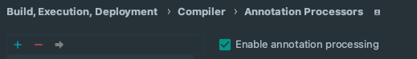
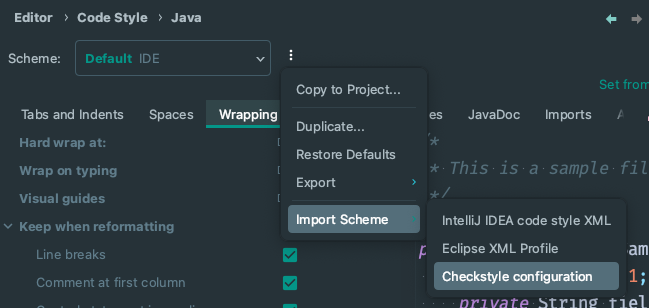

# Linea Arithmetization (zkEVM)

A Linea tracing implementation for [Hyperledger Besu](https://github.com/hyperledger/besu) based on
an [existing implementation in Go](https://github.com/Consensys/zk-evm/).

## Development Setup

### Install Java 17

```
brew install openjdk@17
```

### Install the Go toolchain

### Install Go-Corset

```shell
go install github.com/consensys/go-corset/cmd/go-corset@latest
```

### Install [pre-commit](https://pre-commit.com/)

```shell
pip install --user pre-commit

# For macOS users.
brew install pre-commit
```

Then run `pre-commit install` to set up git hook scripts.
Used hooks can be found [here](.pre-commit-config.yaml).

______________________________________________________________________

NOTE

> `pre-commit` aids in running checks (end of file fixing,
> markdown linting, linting, runs tests, json validation, etc.)
> before you perform your git commits.

______________________________________________________________________

### Run tests

```shell
# Run unit tests
./gradlew tracer:arithmetization:test

# Run replay tests
./gradlew tracer:arithmetization:fastReplayTests

# Run EVM test suite BlockchainTests
./gradlew tracer:reference-tests:referenceBlockchainTests

# Run single reference test via gradle, e.g for net.consensys.linea.generated.blockchain.BlockchainReferenceTest_339
./gradlew tracer:reference-tests:referenceBlockchainTests --tests "net.consensys.linea.generated.blockchain.BlockchainReferenceTest_339"
```

## IntelliJ IDEA Setup

### Enable Annotation Processing

- Go to `Settings | Build, Execution, Deployment | Compiler | Annotation Processors` and tick the following
  checkbox:

  

______________________________________________________________________

NOTE

> This setting is required to avoid IDE compilation errors because of the [Lombok](https://projectlombok.org/features/)
> library used for code generation of boilerplate Java code such as:
>
> - Getters/Setters (via [`@Getter/@Setter`](https://projectlombok.org/features/GetterSetter))
> - Class log instances (via [`@Slf4j`](https://projectlombok.org/features/log))
> - Builder classes (via [`@Builder`](https://projectlombok.org/features/Builder))
> - Constructors (
>   via [`@NoArgsConstructor/@RequiredArgsConstructor/@AllArgsConstructor`](https://projectlombok.org/features/constructor))
> - etc.
>
> Learn more about how Java annotation processing
> works [here](https://www.baeldung.com/java-annotation-processing-builder).

______________________________________________________________________

### Set Up IDE Code Re-formatting

- Install [Checkstyle](https://plugins.jetbrains.com/plugin/1065-checkstyle-idea) plugin and set IDE code
  reformatting to comply with the project's Checkstyle configuration:

  - Go to `Settings | Editor | Code Style | Java | <hamburger menu> | Import Scheme | Checkstyle configuration`:

    

    and select `<project_root>/config/checkstyle.xml`.

### Install Optional Plugins

- Install [Spotless Gradle](https://plugins.jetbrains.com/plugin/18321-spotless-gradle) plugin to re-format through
  the IDE according to spotless configuration.

## Debugging Traces

- JSON files can be debugged with the following command:

```shell
go-corset check --report <LT/JSON FILE> tracer/linea-constraints/zkevm_osaka.bin
```

See [here](https://github.com/Consensys/go-corset) for more options when running `go-corset` directly.

## Plugins

Plugins are documented [here](PLUGINS.md).

## Release Process

Here are the steps for releasing a new version of the plugins:

1. Update [tracer/build.gradle](../tracer/build.gradle) property `targetReleaseVersion`with the release version number's expected tag in the format vX.Y.Z (e.g., v0.2.0 creates a release version 0.2.0).
2. Launch [Linea tracer release Github action](https://github.com/Consensys/linea-monorepo/actions/workflows/linea-tracer-plugin-release.yml) with the chosen tag
3. Once the release workflow completes, check and update the release notes.

Note: Release tags (of the form v\*) are protected and can only be pushed by organization and/or repository owners.
